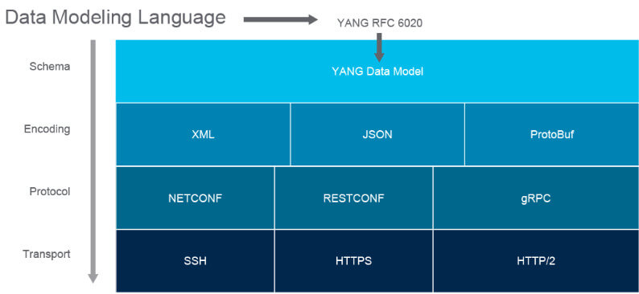

## Introduction

As network automation becomes more and more important, it's important to be familiar with the key concepts involved. One of the most important concepts is model-driven programmability.

## What is model-driven programmability?

Model-driven programmability is a way of representing network devices and their capabilities in a standardized way. This makes it easier to automate tasks on network devices, as we can use a single model to represent all of the devices in wer network.

## Why is model-driven programmability important?

Traditionally, network devices have been managed using a CLI (command-line interface). This approach is not very well-suited for automation, as it's difficult to extract information from the unstructured text output of the CLI.

Model-driven programmability solves this problem by providing a standardized way to represent network devices and their capabilities. This makes it easier to write automation scripts that can interact with network devices in a consistent way.

Data models describe the syntax and semantics of working with specific data objects. They answer questions such as:

- How is a VLAN object structured? What properties does it have?
- What is the range of a valid VLAN ID?
- Can a VLAN name have spaces in it?
- Is the value a string or an integer?

A data model is like a standardized framework used to describe a data object of an environment. The thought behind the data model is to provide a consistent and reliable format to communicate the data objects we are working with on wer device.

One misconception is that data models handle the exchange of data, which is not the case. Data models are just standardized frameworks that describe wer environment. Data models have nothing to do with data transmission. Instead, protocols such as Network Configuration Protocol (NETCONF) and RESTCONF send structured data (e.g., XML or JSON) encoded documents using a framework a given model governs.

As models focus on what is the content and not so much on how it is exchanged, data models allow the API to do the following:

- Provide efficient and easy-to-use tooling to consume it (programming libraries).
- Support extensible and open interfaces (REST-based, NETCONF, and so on).
- Add flexibility and support for different encoding formats (XML and JSON).
- Support different types of transport (SSH, HTTPS, HTTP/2, etc.).

Now that we understand a little more about model-driven programmability, it can be taken a step further and discuss how model-driven programmability fits into the larger concepts of APIs and network programmability. 

The core structure of a device API, therefore, consists of the following:

- **Data models**: The foundation of the API consists of data models. Data models define the syntax and semantics, including constraints of working with the API. YANG is a data model used by NETCONF, RESTCONF, and gRPC.
- **Transport**: Model-driven APIs support several transport methods, including SSH, TLS, and HTTP or HTTPS.
- **Encoding**: Model-driven APIs support the choice of encoding, including XML and JSON, and custom encodings such as Google protocol buffers.
- **Protocols**: Model-driven APIs also support multiple options for protocols, with the three core protocols being NETCONF, RESTCONF, and gRPC

Now that we have an idea of what a data model is and the role model-driven programmability plays in API architecture, then this would be a good time to take the 50,000-foot overview of model-driven programmability's role in network automation. Consider the following figure:

Applications can now use programming libraries or development kits that leverage data models to simplify access to the API. Behind the scenes, different protocols using various encodings and transports may be used to exchange data but the application does not need to concern itself with that. It only needs to operate on the data models. Likewise, the API server uses the same model, regardless of the protocol, allowing the server to support as many protocols as required.

Imagine that an application has requested to retrieve an IP address on an interface of a network device. The data request is structured according to the application's YANG data model. The application then sends a request to the API server on the network device. The network device can identify what data the request asks and constructs a response for the application. The response is formatted in an expected structure or model that the application is expecting based on YANG. For example, if the request were for an IP address on an interface, it would use the proper data model for interface IP addresses. The network device sends the response back and is received by the application. The data structure is in a format that the application expects since both sides are using the YANG data model. The figure demonstrates the role of data models in network automation in action.

The two main data encoding formats commonly used are XML and JSON. Each provides a structured way of data formatting to send data between two computer systems. Since data conforms to the model, it is easier to navigate and extract relevant information programmatically. This is in stark contrast to using Secure Shell (SSH) issuing CLI commands in which data is sent as raw strings (text).

Sometimes the concept of data models gets confused with data encoding formats like XML and JSON. The data encoding formats involve the serialization format of how the data is transmitted. More simply stated, XML and JSON are not about the framework of how wer model is presented but the way the data is formatted for transport. 

XML and JSON are used for data transmission because they have these features:

- Human readable because they are self-describing
- Hierarchical, because they store values within values
- Parsable and used by many programming languages

As we finish up, it is worth mentioning YANG, which is a data modeling language we will likely encounter on wer network automation journey. 

There are whole courses and even books dedicated to YANG, but for now, it is important to understand that YANG is a data modeling language used by protocols like NETCONF, RESTCONF, and gRPC. The YANG data modeling language was published in October 2010 as RFC 6020 to serve as a data modeling language for the protocol NETCONF. So to finally put it all together, the image below illustrates the YANG model-driven programmability stack.

As we can see, data models are not really new but are getting more attention as a building block of model-driven APIs.

## References
- The YANG Data Modeling Language: https://tools.ietf.org/html/rfc7950
- NETCONF and RESTCONF: https://www.ietf.org/rfc/rfc6241.txt
- gRPC: https://grpc.io/