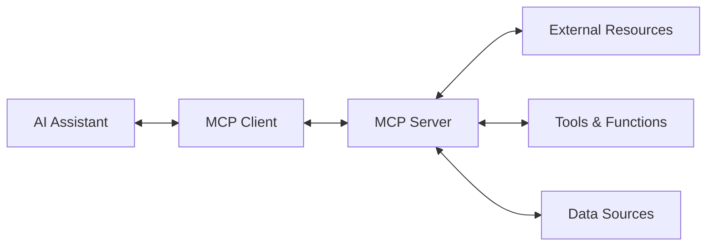

# MCP (Model Context Protocol) Introduction

**Model Context Protocol (MCP)** is an open protocol that enables AI assistants like Claude to securely connect to external data sources and tools, extending their capabilities beyond their training data.

## 🎯 What is MCP?

MCP allows AI models to:
- **Access External Data** - Connect to databases, APIs, file systems
- **Use External Tools** - Execute commands, run scripts, interact with services
- **Maintain Context** - Keep track of conversation context across tools
- **Security** - Controlled, permission-based access to resources

## 🏗️ MCP Architecture



### Components

1. **MCP Client** - Integrated into AI assistants (like Claude Desktop)
2. **MCP Server** - Provides tools and resources to the client
3. **Transport Layer** - Communication protocol (stdio, WebSocket, HTTP)
4. **Resources** - External data sources (files, databases, APIs)
5. **Tools** - Executable functions and capabilities

## 🚀 Getting Started

### Prerequisites
- **Node.js 18+** or **Python 3.8+**
- Basic understanding of APIs and JSON
- Familiarity with command line tools

### Installation

#### TypeScript/Node.js
```bash
npm install @modelcontextprotocol/sdk
```

#### Python
```bash
pip install mcp
```

## 📦 Your First MCP Server

### Simple Echo Server (TypeScript)

```typescript
import { Server } from '@modelcontextprotocol/sdk/server/index.js';
import { StdioServerTransport } from '@modelcontextprotocol/sdk/server/stdio.js';

const server = new Server({
  name: 'echo-server',
  version: '1.0.0'
}, {
  capabilities: {
    tools: {}
  }
});

// Define a simple echo tool
server.setRequestHandler('tools/list', async () => {
  return {
    tools: [{
      name: 'echo',
      description: 'Echoes back the provided text',
      inputSchema: {
        type: 'object',
        properties: {
          message: {
            type: 'string',
            description: 'The message to echo back'
          }
        },
        required: ['message']
      }
    }]
  };
});

server.setRequestHandler('tools/call', async (request) => {
  if (request.params.name === 'echo') {
    const message = request.params.arguments?.message;
    return {
      content: [{
        type: 'text',
        text: `Echo: ${message}`
      }]
    };
  }
  throw new Error('Unknown tool');
});

// Start the server
const transport = new StdioServerTransport();
await server.connect(transport);
```

### Simple File Server (Python)

```python
import asyncio
import json
from mcp.server import Server
from mcp.server.stdio import stdio_server
from mcp.types import Tool, TextContent

app = Server("file-server")

@app.list_tools()
async def list_tools() -> list[Tool]:
    return [
        Tool(
            name="read_file",
            description="Read contents of a file",
            inputSchema={
                "type": "object",
                "properties": {
                    "filepath": {
                        "type": "string",
                        "description": "Path to the file to read"
                    }
                },
                "required": ["filepath"]
            }
        )
    ]

@app.call_tool()
async def call_tool(name: str, arguments: dict) -> list[TextContent]:
    if name == "read_file":
        filepath = arguments["filepath"]
        try:
            with open(filepath, 'r') as file:
                content = file.read()
                return [TextContent(type="text", text=content)]
        except Exception as e:
            return [TextContent(type="text", text=f"Error: {str(e)}")]
    
    raise ValueError(f"Unknown tool: {name}")

if __name__ == "__main__":
    asyncio.run(stdio_server(app))
```

## 🔧 MCP Server Configuration

### Claude Desktop Integration

Add to `claude_desktop_config.json`:

```json
{
  "mcpServers": {
    "echo-server": {
      "command": "node",
      "args": ["path/to/your/echo-server.js"]
    },
    "file-server": {
      "command": "python", 
      "args": ["path/to/your/file-server.py"]
    }
  }
}
```

### Server Capabilities

```typescript
const server = new Server({
  name: 'my-server',
  version: '1.0.0'
}, {
  capabilities: {
    tools: {},           // Provides executable tools
    resources: {},       // Provides data resources
    prompts: {},         // Provides prompt templates
    logging: {}          // Supports logging
  }
});
```

## 🛠️ Advanced Features

### Resource Providers

```typescript
// List available resources
server.setRequestHandler('resources/list', async () => {
  return {
    resources: [{
      uri: 'file://docs/readme.md',
      name: 'Project README',
      description: 'Main project documentation'
    }]
  };
});

// Read specific resource
server.setRequestHandler('resources/read', async (request) => {
  const uri = request.params.uri;
  // Implementation to read resource
  return {
    contents: [{
      uri: uri,
      mimeType: 'text/markdown',
      text: 'Resource content...'
    }]
  };
});
```

### Error Handling

```typescript
server.setRequestHandler('tools/call', async (request) => {
  try {
    // Tool implementation
    return { content: [{ type: 'text', text: 'Success!' }] };
  } catch (error) {
    return {
      content: [{
        type: 'text',
        text: `Error: ${error.message}`
      }],
      isError: true
    };
  }
});
```

## 📊 Testing Your MCP Server

### Manual Testing with MCP Inspector

```bash
npx @modelcontextprotocol/inspector
```

### Unit Testing

```typescript
import { describe, it, expect } from 'vitest';
import { MockTransport } from '@modelcontextprotocol/sdk/testing';

describe('Echo Server', () => {
  it('should echo messages correctly', async () => {
    const transport = new MockTransport();
    // Test implementation
  });
});
```

## 🎓 Best Practices

1. **Security First** - Validate all inputs, limit file access
2. **Error Handling** - Provide clear error messages
3. **Documentation** - Well-documented tool schemas
4. **Performance** - Async operations, timeout handling
5. **Logging** - Comprehensive logging for debugging

## 🎓 Next Steps

- [Advanced MCP Tools](./mcp-advanced-tools)
- [MCP Security Best Practices](./mcp-security)
- [Building AI Agents with MCP](../ai-agents-agentics/agents-with-mcp)

---

*Extend AI capabilities with MCP! 🔌*