import React from 'react';
import Tabs from '@theme/Tabs';
import TabItem from '@theme/TabItem';
import CodeBlock from '@theme/CodeBlock';

export const Highlight = ({children, color}) => (
  <span
    style={{
      backgroundColor: color,
      borderRadius: '8px',
      color: '#fff',
      padding: '0.4rem 0.8rem',
      fontWeight: 'bold',
    }}>
    {children}
  </span>
);

export const AlertBox = ({type, title, children}) => {
  const styles = {
    success: { backgroundColor: '#d4edda', borderColor: '#c3e6cb', color: '#155724' },
    warning: { backgroundColor: '#fff3cd', borderColor: '#ffeaa7', color: '#856404' },
    error: { backgroundColor: '#f8d7da', borderColor: '#f5c6cb', color: '#721c24' },
    info: { backgroundColor: '#d1ecf1', borderColor: '#bee5eb', color: '#0c5460' }
  };

  return (
    <div style={{
      ...styles[type],
      border: `1px solid ${styles[type].borderColor}`,
      borderRadius: '8px',
      padding: '15px',
      margin: '15px 0'
    }}>
      {title && <strong style={{display: 'block', marginBottom: '8px'}}>{title}:</strong>}
      {children}
    </div>
  );
};

# Python Descriptor Pattern: Dynamic IPv4/IPv6 Selection

<div style={{
  background: 'linear-gradient(135deg, #667eea 0%, #764ba2 100%)',
  padding: '15px 25px',
  borderRadius: '10px',
  color: 'white',
  fontSize: '1.2rem',
  fontWeight: 'bold',
  textAlign: 'center',
  margin: '20px 0',
  boxShadow: '0 4px 15px rgba(102, 126, 234, 0.3)'
}}>
  Real-World Case Study: IPv6 Migration with Zero Code Changes
</div>

## Problem Statement

### The Challenge

During IPv6 migration in a large-scale infrastructure project, we faced a critical challenge:

<AlertBox type="warning" title="Legacy Codebase Issue">
  Thousands of application scripts and libraries access a `connection.ip_address` attribute expecting a single IP address. How do we support **dual-stack (IPv4/IPv6)** without modifying all existing code?
</AlertBox>

**Requirements:**
- Support IPv4-only, IPv6-only, and dual-stack deployment modes
- Per-deployment IPv6 policies with fine-grained control
- **Zero changes** to existing scripts accessing `connection.ip_address`
- Backward compatibility with IPv4-only systems
- Dynamic IP selection based on infrastructure configuration

### Traditional Approaches (and Why They Failed)

<Tabs>
  <TabItem value="approach1" label="❌ Find & Replace" default>

```python
# BAD: Manual code changes everywhere
# Old code:
connection.ip_address  # Returns IPv4

# New code (requires changing 1000+ files):
connection.ipv4_address  # Explicit IPv4
connection.ipv6_address  # Explicit IPv6
connection.get_ip(family='v6')  # API change
```

**Problems:**

<ul>
<li>Manual changes to thousands of test scripts</li>
<li>Risk of breaking existing tests</li>
<li>Maintenance nightmare</li>
<li>No dynamic policy enforcement</li>
</ul>

  </TabItem>
  <TabItem value="approach2" label="❌ Property Method">

```python
# BAD: Requires code changes to use method
class Connection:
    def get_ip(self, prefer='v4'):
        """Get IP with preference"""
        if prefer == 'v6' and self.ipv6:
            return self.ipv6
        return self.ipv4

# All existing code breaks:
connection.ip_address  # AttributeError
connection.get_ip()  # Requires code changes
```

**Problems:**

<ul>
<li>Breaks attribute access syntax</li>
<li>Every script needs updates</li>
<li>Not transparent</li>
</ul>

  </TabItem>
  <TabItem value="approach3" label="❌ Property with Hardcoded Logic">

```python
# BAD: No flexibility for different policies
class Connection:
    @property
    def ip_address(self):
        # Hardcoded: always prefer IPv4
        return self.ipv4 or self.ipv6

# Issues:
# - Can't enforce strict IPv6 requirements
# - Can't adapt to different deployment modes
# - No per-deployment policies
```

**Problems:**

<ul>
<li>No policy-based selection</li>
<li>Can't handle complex requirements</li>
<li>Inflexible</li>
</ul>

  </TabItem>
</Tabs>

## The Solution: Python Descriptor Pattern

### Why Descriptors?

<div style={{
  border: '2px solid #667eea',
  borderRadius: '12px',
  padding: '20px',
  margin: '20px 0',
  backgroundColor: 'var(--ifm-background-surface-color)'
}}>

**Python Descriptors** allow you to customize attribute access (`__get__`, `__set__`, `__delete__`) at the **class level**.

**Key Advantages:**
1. **Transparent** - Existing code using `connection.ip_address` works unchanged
2. **Dynamic** - Selection logic runs at access time, not definition time
3. **Policy-Driven** - Can query external configuration for each access
4. **Centralized** - All logic in one reusable descriptor class

</div>

### Architecture & Workflow Diagram

```mermaid
graph TD
    %% --- CSS Class Definitions ---
    classDef process fill:#667eea,stroke:#333,stroke-width:2px,color:#fff
    classDef data fill:#e8f4f8,stroke:#4ecdc4,stroke-width:2px,color:#000,stroke-dasharray: 5 5
    classDef logic fill:#fff3cd,stroke:#ffeaa7,stroke-width:2px,color:#000
    classDef result fill:#25c2a0,stroke:#333,stroke-width:2px,color:#fff
    classDef cluster fill:#f9f9f9,stroke:#333,stroke-width:1px,color:#333

    %% --- 1. The Trigger Phase ---
    %% Added quotes ["..."] for safety
    Start(["🔍 Application Code<br/>connection.ip_address"]):::process -->|Attribute Access| Intercept
    
    Intercept[/"⚡ IPAddressDescriptor.__get__<br/>(Intercept Method)"/]:::process

    %% --- 2. Data Collection Phase (Subgraph) ---
    subgraph DataCollection ["📂 Phase 1: Data Gathering"]
        direction TB
        Intercept --> Collect{{📋 Collect Information}}:::process
        
        Collect -->|Retrieve| ConnAttr[("🎯 Attributes<br/>(Location, Meta)")]:::data
        Collect -->|Retrieve| ModeConfig[("⚙️ Config<br/>(v4/v6 Mode)")]:::data
        Collect -->|Retrieve| PolicyRules[("🗺️ Rules<br/>(Constraints)")]:::data
    end

    %% --- 3. Logic Engine Phase (Subgraph) ---
    subgraph LogicEngine ["🧠 Phase 2: Decision Logic"]
        ConnAttr & ModeConfig & PolicyRules --> ComputePolicy{{"🔧 Compute Policy"}}:::process
        
        ComputePolicy -->|"allowed=['v4']"| SelectV4>"IPv4 Only"]:::logic
        ComputePolicy -->|"allowed=['v6']"| SelectV6>"IPv6 Only"]:::logic
        ComputePolicy -->|"allowed=['v4','v6']"| SelectDual>"Dual Mode"]:::logic
    end

    %% --- 4. Execution Phase ---
    %% FIX: Added quotes around the text inside [[ ... ]]
    SelectV4 & SelectV6 & SelectDual --> Execute[["🎲 _select_ip()<br/>Validate & Return"]]:::process

    Execute -->|Return| Result(["📤 Result IP"]):::result
    Result --> Code["✨ Application Continues"]:::result

    %% --- Apply formatting to Subgraphs ---
    class DataCollection,LogicEngine cluster
```



**Key Points:**
1. **Descriptor intercepts** - `__get__` called automatically on attribute access
2. **Policy-driven** - Selects IPv4/IPv6 based on configuration
3. **Transparent** - Existing code unchanged, zero modifications needed

## Implementation

### Core Descriptor Class

<CodeBlock language="python" title="connection_ip_descriptor.py" showLineNumbers>
{`import logging
from typing import Dict, Any, Optional

logger = logging.getLogger(__name__)


class IPAddressDescriptor:
    """
    Property descriptor that dynamically selects ip_address based on policy.

    Intercepts attribute access and returns IPv4 or IPv6 based on:
    - Deployment mode (v4, v6, dual)
    - Location-specific policies
    - System configuration
    """

    def __get__(self, obj, objtype=None):
        """Called when accessing connection.ip_address"""
        if obj is None:
            return self

        # Get stored addresses
        v4 = getattr(obj, '_ipv4_address', None)
        v6 = getattr(obj, '_ipv6_address', None)

        # Get selection policy
        policy = self._get_policy(obj)

        # Select and return appropriate IP
        return self._select_ip(obj, v4, v6, policy)

    def __set__(self, obj, value):
        """Called when setting connection.ip_address = "x.x.x.x" """
        import ipaddress

        try:
            ip_obj = ipaddress.ip_address(value)
            if ip_obj.version == 4:
                setattr(obj, '_ipv4_address', value)
            else:
                setattr(obj, '_ipv6_address', value)
        except ValueError:
            # Backward compatibility: assume IPv4
            setattr(obj, '_ipv4_address', value)

    def _get_policy(self, obj) -> Dict[str, Any]:
        """Get IP selection policy (implementation in next section)."""
        pass

    def _select_ip(self, obj, v4, v6, policy) -> Optional[str]:
        """Select IP based on policy (implementation in next section)."""
        pass`}
</CodeBlock>

### Policy Resolution Logic

<Tabs groupId="policy-logic">
  <TabItem value="get-policy" label="Get Policy">

<CodeBlock language="python" showLineNumbers>
{`def _get_policy(self, connection) -> Dict[str, Any]:
    """
    Compute IP selection policy based on:
    - Deployment mode: v4, v6, dual
    - Location configuration
    """
    # Get configuration
    config = getattr(connection, 'config', None)

    # Get connection location
    location = getattr(connection, 'location', '')

    # Get deployment mode
    mode = getattr(config, 'deployment_mode', None)

    # Compute policy using config engine
    policy = config.compute_ip_selection_policy(location, mode)

    # Returns: {
    #   'allowed': ['v4'] or ['v6'] or ['v4', 'v6'],
    #   'prefer': 'v4' or 'v6' or None,
    #   'strict': True/False,
    #   'fallback_ok': True/False
    # }
    return policy`}
</CodeBlock>

  </TabItem>
  <TabItem value="select-ip" label="Select IP">

<CodeBlock language="python" showLineNumbers>
{`def _select_ip(self, connection, v4, v6, policy) -> Optional[str]:
    """Select IP based on policy."""
    allowed = policy.get('allowed', ['v4'])
    prefer = policy.get('prefer')
    fallback_ok = policy.get('fallback_ok', False)

    connection_name = getattr(connection, 'name', 'unknown')

    # IPv4 ONLY mode
    if allowed == ['v4']:
        if v4:
            return v4
        raise RuntimeError(
            f"IPv4 required by policy but not available for {connection_name}"
        )

    # IPv6 ONLY mode
    if allowed == ['v6']:
        if v6:
            return v6
        raise RuntimeError(
            f"IPv6 required by policy but not available for {connection_name}"
        )

    # DUAL mode with preference
    if prefer == 'v6':
        if v6:
            return v6
        if v4 and fallback_ok:
            logger.info(f"Prefer IPv6, falling back to IPv4")
            return v4
        if v4:  # No fallback allowed, but have IPv4
            return v4
    else:  # prefer v4 or None (default to v4)
        if v4:
            return v4
        if v6 and fallback_ok:
            logger.info(f"Prefer IPv4, falling back to IPv6")
            return v6
        if v6:  # No fallback allowed, but have IPv6
            return v6

    # No IP available at all
    raise RuntimeError(
        f"No valid IP available for {connection_name}. "
        f"Policy: {policy}, IPv4: {v4}, IPv6: {v6}"
    )`}
</CodeBlock>

  </TabItem>
</Tabs>

### Patching the Device Class

<AlertBox type="info" title="Dynamic Class Patching">
  We patch the `Connection` class at runtime to install our descriptor, making it available to all connection instances.
</AlertBox>

<CodeBlock language="python" title="Patching Logic" showLineNumbers>
{`def patch_connection_class():
    """
    Patch Connection class with dynamic ip_address property.
    Called once during initialization.
    """
    from your_module import Connection

    # Save original if exists
    if hasattr(Connection, 'ip_address'):
        Connection._original_ip_address = Connection.ip_address

    # Install descriptor
    Connection.ip_address = IPAddressDescriptor()

    # Add explicit access properties
    Connection.ipv4_address = property(
        lambda self: getattr(self, '_ipv4_address', None),
        lambda self, val: setattr(self, '_ipv4_address', val)
    )

    Connection.ipv6_address = property(
        lambda self: getattr(self, '_ipv6_address', None),
        lambda self, val: setattr(self, '_ipv6_address', val)
    )

    logger.info("✓ Connection class patched with dynamic ip_address")`}
</CodeBlock>

## Policy Configuration Examples

### Deployment Mode Configuration

<Tabs groupId="deployment-modes">
  <TabItem value="v4-only" label="IPv4 Only" default>

```json title="config.json"
{
  "deployment_mode": "v4"
}
```

**Behavior:**

<ul>
<li><code>connection.ip_address</code> → Always returns IPv4</li>
<li>Error if IPv4 not available</li>
<li>IPv6 addresses ignored</li>
</ul>

  </TabItem>
  <TabItem value="v6-only" label="IPv6 Only">

```json title="config.json"
{
  "deployment_mode": "v6"
}
```

**Behavior:**

<ul>
<li><code>connection.ip_address</code> → Always returns IPv6</li>
<li>Error if IPv6 not available</li>
<li>IPv4 addresses ignored</li>
</ul>

  </TabItem>
  <TabItem value="dual-stack" label="Dual Mode">

```json title="config.json"
{
  "deployment_mode": "dual"
}
```

**Behavior:**

<ul>
<li><code>connection.ip_address</code> → Returns IPv4 or IPv6 based on <strong>location policy</strong></li>
<li>Supports per-location configuration</li>
<li>Enables gradual IPv6 migration</li>
</ul>

  </TabItem>
</Tabs>

### Location-Level Configuration

<CodeBlock language="json" title="policy_config.json" showLineNumbers>
{`{
  "location_policies": {
    "default": "v4",              // Default: IPv4 only, no fallback
    "loc_A": "v6",                // Location A: IPv6 only, no fallback
    "loc_C": "v4"                 // Location C: IPv4 only
  }
}`}
</CodeBlock>

### Policy Matrix

<div style={{overflowX: 'auto'}}>

| Deployment Mode | Location Policy | Allowed | Prefer | Fallback | Behavior |
|-----------------|-----------------|---------|--------|----------|----------|
| `v4` | any | `['v4']` | - | No | IPv4 only, error if missing |
| `v6` | any | `['v6']` | - | No | IPv6 only, error if missing |
| `dual` | `default=v4` | `['v4']` | - | No | IPv4 only (no fallback) |
| `dual` | `default=v6` | `['v6']` | - | No | IPv6 only (no fallback) |
| `dual` | `loc_A=v6` | `['v4','v6']` | `v6` | Yes | Prefer IPv6, fallback to IPv4 |
| `dual` | `loc_B=v4` | `['v4','v6']` | `v4` | Yes | Prefer IPv4, fallback to IPv6 |

</div>

## Usage Examples

### Transparent Access (No Code Changes)

```python title="existing_application.py"
# Existing application code works unchanged!
from your_module import get_connection

# Get connection object
connection = get_connection('api_server')

# This line works with ZERO changes:
ip_address = connection.ip_address  # ✓ Returns IPv4 or IPv6 based on policy

# Use IP in API calls, connections, etc.
response = requests.get(f"https://{ip_address}/api/v1/data")
```

### Explicit Access When Needed

```python title="advanced_usage.py"
# When you specifically need IPv4 or IPv6:

# Get IPv4 explicitly
ipv4 = connection.ipv4_address  # '10.1.1.1'

# Get IPv6 explicitly
ipv6 = connection.ipv6_address  # '2001:db8::1'

# Dynamic (policy-based)
ip = connection.ip_address  # Selected based on policy
```

### Setting IP Addresses

```python title="connection_initialization.py"
# Automatic IP family detection
connection.ip_address = "10.1.1.1"        # → Stored as IPv4
connection.ip_address = "2001:db8::1"     # → Stored as IPv6

# Or explicit:
connection.ipv4_address = "10.1.1.1"
connection.ipv6_address = "2001:db8::1"
```

## Real-World Scenario Walkthrough

### Scenario: Gradual IPv6 Migration

<div style={{
  background: 'linear-gradient(135deg, #25c2a0 0%, #667eea 100%)',
  padding: '25px',
  borderRadius: '12px',
  color: 'white',
  margin: '20px 0'
}}>

**Migration Plan:**
1. **Phase 1:** Dual-mode deployment, all locations use IPv4 (default)
2. **Phase 2:** Enable IPv6 on Location A (pilot)
3. **Phase 3:** All locations to IPv6

</div>

<Tabs>
  <TabItem value="phase1" label="Phase 1: IPv4 Default" default>

```json title="Configuration"
{
  "deployment_mode": "dual",
  "location_policies": {
    "default": "v4"
  }
}
```

```python title="Behavior"
# All connections use IPv4
connection_locA.ip_address  # → '10.1.1.1' (IPv4)
connection_locB.ip_address  # → '10.1.2.1' (IPv4)

# No application code changes needed!
```

  </TabItem>
  <TabItem value="phase2" label="Phase 2: Location A Pilot">

```json title="Configuration"
{
  "deployment_mode": "dual",
  "location_policies": {
    "default": "v4",
    "loc_A": "v6"  // ← Enable IPv6 for Location A
  }
}
```

```python title="Behavior"
# Location A prefers IPv6, falls back to IPv4
connection_locA.ip_address  # → '2001:db8::1' (IPv6) ✓
# Fallback if IPv6 not ready:
connection_locA.ip_address  # → '10.1.1.1' (IPv4 fallback) ✓

# Other locations unchanged
connection_locB.ip_address  # → '10.1.2.1' (IPv4)

# Still no code changes!
```

  </TabItem>
  <TabItem value="phase3" label="Phase 3: All IPv6">

```json title="Configuration"
{
  "deployment_mode": "v6",  // ← System-wide IPv6
  "location_policies": {
    "default": "v6"
  }
}
```

```python title="Behavior"
# All connections use IPv6
connection_locA.ip_address  # → '2001:db8::1'
connection_locB.ip_address  # → '2001:db8:2::1'
connection_locC.ip_address  # → '2001:db8:3::1'

# Migration complete - zero application changes!
```

  </TabItem>
</Tabs>

## Key Benefits

<div style={{
  display: 'grid',
  gridTemplateColumns: 'repeat(auto-fit, minmax(250px, 1fr))',
  gap: '20px',
  margin: '30px 0'
}}>

<div style={{
  border: '2px solid #25c2a0',
  borderRadius: '12px',
  padding: '20px',
  backgroundColor: 'var(--ifm-background-surface-color)'
}}>

### Zero Code Changes
No modifications to existing applications or libraries. `connection.ip_address` just works.

</div>

<div style={{
  border: '2px solid #667eea',
  borderRadius: '12px',
  padding: '20px',
  backgroundColor: 'var(--ifm-background-surface-color)'
}}>

### Policy-Driven
Centralized configuration controls IP selection across entire test suite.

</div>

<div style={{
  border: '2px solid #ff6b6b',
  borderRadius: '12px',
  padding: '20px',
  backgroundColor: 'var(--ifm-background-surface-color)'
}}>

### Gradual Migration
Per-site policies enable incremental IPv6 rollout with safety nets.

</div>

<div style={{
  border: '2px solid #4ecdc4',
  borderRadius: '12px',
  padding: '20px',
  backgroundColor: 'var(--ifm-background-surface-color)'
}}>

### Backward Compatible
Defaults to IPv4-only behavior when configuration is absent.

</div>

</div>

## Python Descriptor Deep Dive

### How Descriptors Work

<AlertBox type="info" title="Python Data Model">
  Descriptors implement the **descriptor protocol** by defining `__get__`, `__set__`, and/or `__delete__` methods. When you access an attribute on an instance, Python checks if the class has a descriptor for that attribute and calls its methods.
</AlertBox>

#### Descriptor Protocol in Action

```python title="descriptor_protocol.py"
# When you access: connection.ip_address
# Python calls:    IPAddressDescriptor.__get__(connection, Connection)
# And returns:     '10.1.1.1' or '2001:db8::1'

# When you set:    connection.ip_address = '192.168.1.1'
# Python calls:    IPAddressDescriptor.__set__(connection, '192.168.1.1')
# And stores in:   connection._ipv4_address

# When you access: Connection.ip_address (at class level)
# Python calls:    IPAddressDescriptor.__get__(None, Connection)
# And returns:     <IPAddressDescriptor object>
```

This automatic delegation enables our transparent policy-driven IP selection!

### Descriptor vs Property

<Tabs>
  <TabItem value="property" label="@property (Simple)" default>

```python
class Connection:
    def __init__(self):
        self._ip = "10.1.1.1"

    @property
    def ip_address(self):
        """Simple property - static logic"""
        return self._ip

    @ip_address.setter
    def ip_address(self, value):
        self._ip = value

# Limitation: Logic is instance-specific,
# can't share behavior across classes
```

**Use when:**

<ul>
<li>Simple attribute access</li>
<li>No shared logic needed</li>
<li>No external configuration</li>
</ul>

  </TabItem>
  <TabItem value="descriptor" label="Descriptor (Advanced)">

```python
class IPAddressDescriptor:
    """Descriptor - reusable across classes"""
    def __get__(self, obj, objtype=None):
        if obj is None:
            return self
        # Complex logic with external config
        policy = self._get_policy(obj)
        return self._select_ip(obj, policy)

    def __set__(self, obj, value):
        # Automatic IP family detection
        ...

# Apply to class
Connection.ip_address = IPAddressDescriptor()

# All instances share descriptor logic
```

**Use when:**

<ul>
<li>Complex access logic</li>
<li>Policy-driven behavior</li>
<li>Reusable across classes</li>
<li>External configuration needed</li>
</ul>

  </TabItem>
</Tabs>

## Testing Strategy

### Unit Tests

<CodeBlock language="python" title="test_descriptor.py" showLineNumbers>
{`import pytest
from ip_descriptor import IPAddressDescriptor, patch_connection_class

def test_ipv4_only_mode():
    """Test IPv4-only deployment mode."""
    # Setup
    connection = create_mock_connection(
        location='loc_A',
        deployment_mode='v4',
        ipv4='10.1.1.1',
        ipv6='2001:db8::1'
    )

    # Test
    result = connection.ip_address

    # Assert
    assert result == '10.1.1.1'  # IPv4 selected
    assert result != '2001:db8::1'  # IPv6 ignored

def test_dual_mode_fallback():
    """Test dual-mode with fallback."""
    connection = create_mock_connection(
        location='loc_C',
        policy_mode='v6',  # Prefer v6
        deployment_mode='dual',
        ipv4='10.1.1.1',
        ipv6=None  # Missing, should fallback
    )

    result = connection.ip_address
    assert result == '10.1.1.1'  # Fell back to IPv4`}
</CodeBlock>

### Integration Tests

<CodeBlock language="python" title="test_integration.py" showLineNumbers>
{`def test_real_connection_loading():
    """Test with actual connection objects."""
    from your_module import get_connection

    # Patch Connection class
    patch_connection_class()

    # Get connection
    connection = get_connection('api_endpoint')

    # Verify descriptor installed
    assert isinstance(Connection.ip_address, IPAddressDescriptor)

    # Verify dynamic selection
    ip = connection.ip_address
    assert ip in [connection.ipv4_address, connection.ipv6_address]

def test_backward_compatibility():
    """Ensure existing applications still work."""
    # Old application code that uses connection.ip_address
    connection.ip_address = "10.1.1.1"

    # Should still work
    assert connection.ip_address == "10.1.1.1"

    # Should auto-detect as IPv4
    assert connection.ipv4_address == "10.1.1.1"
    assert connection.ipv6_address is None`}
</CodeBlock>

## Lessons Learned

### What Worked Well

<Highlight color="#25c2a0">Backward Compatibility</Highlight> - Zero changes to existing codebase saved months of work.

<Highlight color="#667eea">Policy-Driven Design</Highlight> - Centralized configuration made migration manageable.

<Highlight color="#4ecdc4">Gradual Rollout</Highlight> - Per-site policies enabled safe incremental migration.


## Alternative Approaches Considered

### Metaclass

```python
class DeviceMeta(type):
    def __new__(mcs, name, bases, dct):
        # Modify class at creation time
        ...
```

**Rejected:** Too invasive, harder to debug, metaclass conflicts.

### Proxy Pattern

```python
class DeviceProxy:
    def __init__(self, connection):
        self._connection = connection

    @property
    def ip_address(self):
        # Proxy access
        ...
```

**Rejected:** Requires wrapping all devices, breaks type checking.

### Monkey Patching Property

```python
Connection.ip_address = property(lambda self: select_ip(self))
```

**Rejected:** Can't store state (descriptor instance), less clean.

## Conclusion

<div style={{
  background: 'linear-gradient(135deg, #667eea 0%, #764ba2 100%)',
  padding: '30px',
  borderRadius: '15px',
  color: 'white',
  margin: '30px 0'
}}>

### Key Takeaways

**Python descriptors** are a powerful tool for:
- Transparent attribute access customization
- Policy-driven behavior without code changes
- Clean separation of concerns
- Backward compatibility during migrations

**When to use:**
- Need to intercept attribute access
- Complex selection logic based on external config
- Zero-change migration requirements
- Shared behavior across many classes

**When NOT to use:**
- Simple attribute access (`@property` is enough)
- Performance-critical tight loops
- When explicit is better than implicit

</div>

## References and Resources

<div style={{
  border: '2px solid #764ba2',
  borderRadius: '12px',
  padding: '25px',
  margin: '20px 0',
  backgroundColor: 'var(--ifm-background-surface-color)'
}}>

### Documentation
- [Python Descriptor HowTo Guide](https://docs.python.org/3/howto/descriptor.html)
- [Python Data Model - Descriptors](https://docs.python.org/3/reference/datamodel.html#descriptors)

### Related Patterns
- **Proxy Pattern** - Similar abstraction but different implementation
- **Strategy Pattern** - Policy-based behavior selection
- **Decorator Pattern** - Transparent behavior extension

### Tools Used
- **Python 3.8+** - For type hints and modern syntax
- **pytest** - Testing framework

</div>


