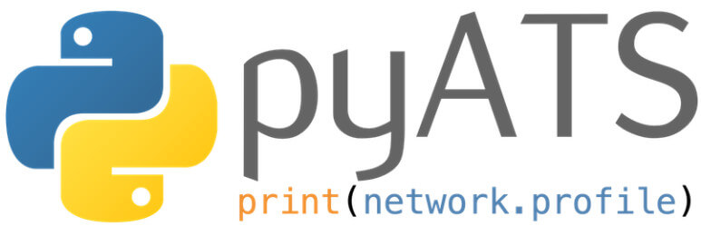
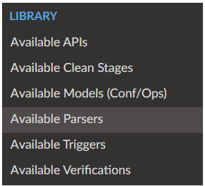
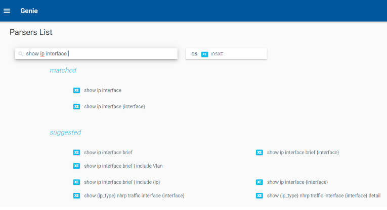

import Highlight from '@site/src/components/Highlight.js';
import Tabs from '@theme/Tabs';
import TabItem from '@theme/TabItem';
import CodeBlock from '@theme/CodeBlock';

## What is pyATS?


Originally developed for internal Cisco engineering use, pyATS is at the core of the Cisco test automation solution. pyATS was made available, for free, to the general public in 2017.-

It's currently used:

- As the de facto test framework for internal Cisco engineers across different platforms and functions, running millions of CI/CD, sanity, regression, scale, high availability, and solution tests on a monthly basis
- By thousands of network engineers and developers worldwide, outside of Cisco
- In Cisco to provide sanity, feature, solution, system, and scale test and verification automation for products ranging from routers and switches to access points, firewalls, and cable CPEs

In this tutorial, we will be first be using pyATS from the CLI and then creating a pyATS job using a Python script.


## How to Create a Python 3 Virtual Environment
pyATS is best run inside a Python 3 virtual environment. Virtual environments are isolated environments that can be used to install dependencies, known as packages, in isolation from the main operating system and other virtual environments.

First, install venv for Python 3.10:

```bash
apt install -y python3.10-venv
```

After venv has been installed, create a virtual environment:

```bash
$ python3 -m venv pyats-env
```

Now, activate the virtual environment:

```bash
$ source pyats-env/bin/activate
(pyats-env) $
```

## Install pyATS
Inside the activated Python 3 virtual environment, use the Python package manager, pip, to install pyATS:

```bash
(pyats-env) $ pip install pyats[full]
(pyats-env) $ pip install tabulate
```

## How to create a pyATS Testbed

pyATS uses the concept of a "testbed" to describe devices, including their connectivity requirements. Testbeds also include some additional information such as the platform's operating system. Create an SSH-based pyATS testbed for the Cisco DevNet Always-On IOS XE Sandbox. Launch VS Code and create the following YAML file:

```yaml
---

devices:
    csr1000v-1:
        alias: 'DevNet_Sandbox_CSR1000v'
        type: 'router'
        os: 'iosxe'
        platform: isr
        credentials:
            default:
                username: developer
                password: C1sco12345
        connections:
            cli:
                protocol: ssh
                ip: sandbox-iosxe-latest-1.cisco.com
                port: 22
                arguments:
                    connection_timeout: 360
```

Save the file as `testbed_ssh.yaml`.

## Validate the testbed file
pyATS has a validation command you can use to validate the structure and syntax of the testbed file.

Validate your testbed file:

```bash
(pyats-env) $ pyats validate testbed --testbed-file testbed_ssh.yaml
```

Review and correct any Lint messages found by pyATS validate before moving on to the next step.

## How to Use pyATS Learn Models from the CLI
Now that we have a testbed, we can use pyATS at the CLI to learn about the state of the device using pyATS models.

pyATS models are platform-agnostic and can be used to collect CLI output and transform it into structured JavaScript Object Notation (JSON).

Use the `pyats learn interface` command to learn about the IOS XE Sandbox interfaces by referencing the testbed_ssh.yaml file:

```bash
(pyats-env) $ pyats learn interface --testbed-file testbed_ssh.yaml
```

Three files will be created by this command:

- `connection_csr1000v-1.txt`

A log of the SSH connection:

- `interface_iosxe_csr1000v-1_console.txt`

A log of the raw standard CLI output that would normally be displayed on the console using SSH:

- `interface_iosxe_csr1000v-1_ops.txt`

A JSON-structured version of the CLI output; pay particularly close attention to the "info" section where the JSON structured output of the interface state is found.

Use VS Code to examine each of these three files.

There are 32 available models that you can learn using pyATS. Try some of the other models:

Visit [pyATS Models](https://developer.cisco.com/docs/genie-docs/) and select **Available Models(Conf/Ops)** to view the list of models.


## How to Use pyATS Parse from the CLI

Similar to pyATS learn, pyATS parse can be used from the CLI to transform common `show` commands into structured JSON. There are thousands of available parsers.

Visit [pyATS Parsers](https://developer.cisco.com/docs/genie-docs/) and select `Available Parsers` to view the list of models.



By default, all available parsers will be displayed, but you can filter by operating system—for example, `IOS XE`.


You can use the search to filter the results—for example, `show ip interface`.



Use the following command to pyATS parse the `show ip interface brief` command from the CLI:

```bash
(pyats-env) $ pyats parse "show ip interface brief" --testbed-file testbed_ssh.yaml
```
This command will display the parsed JSON version of the CLI command to the screen. If you want to save the output, you can add the `--output` flag, which will create a folder that contains the three files (the connection log, the raw CLI output, and the parsed JSON):

```bash
(pyats-env) $ pyats parse "show ip interface brief" --testbed-file testbed_ssh.yaml --output show_ip_interface_brief
```

Use VS Code to explore the files.

Try some other `show` commands from the available IOS XE parsers.

## How to Create a pyATS Job

Now that we have demonstrated the power of the pyATS parsers and models using a simple testbed file, we can create tests against the JSON keys and values. pyATS jobs are Python 3 scripts that use the testbed file that can be used for testing, documentation, snapshots, differentials, and even configuration management.

pyATS jobs are made up of three files: the testbed, a job file, and the Python 3 script. The job file is a control file that loads the testbed file and the Python logic file and utilizes the pyATS framework. In our example, our script will be called "always_on_ios_xe_ssh.py".

Create the following Python (.py) file called always_on_ios_xe_ssh_job.py:

```python
import os
from genie.testbed import load

def main(runtime):

  # Load the testbed
  if not runtime.testbed:
    # If no testbed is provided, load the default testbed
    # Load the default location of the testbed
    testbedfile = os.path.join('testbed_ssh.yaml')
    testbed = load(testbedfile)
  else:
    # Use the one provided
    testbed = runtime.testbed

  # Find the location of the script in relation to the job file
  testscript = os.path.join(os.path.dirname(__file__), 'always_on_ios_xe_ssh.py')

  # Run the script
  runtime.tasks.run(testscript=testscript, testbed=testbed)
```

## How to create a pyATS Script

pyATS test scripts have a universal approach that can be used to help users develop their test scripts:

- **Common Setup**: Establish connectivity to the device setup loops for testbeds with multiple devices
- **Testcase(s)**: User-defined Boolean pass/fail tests
- **Common Cleanup**: Gracefully disconnect from devices any required cleanup activities

Let's start our pyATS test script with the common setup and common cleanup sections first and then write some tests. We will be using pyATS AEtest, the core testing harness and banner for pretty output, as well as the Python tabulate package to create a tabular output of our tests in the pyATS logging. Tabulate is optional but is used here to create easy-to-read tables of the test results.

Create the always_on_ios_xe_ssh.py file as follows:

```python
import logging
from pyats import aetest
from pyats.log.utils import banner
from tabulate import tabulate

# Get logger for script
log = logging.getLogger(__name__)

# AE Test Setup
class common_setup(aetest.CommonSetup):
  """Common Setup Section"""

# Connect to devices
    @aetest.subsection
    def connect_to_devices(self, testbed):
        """Connect to all the devices"""
        testbed.connect()

# Mark the loop for interface tests
# If you add more than 1 device to the testbed this will mark the testcases to be looped over each device
    @aetest.subsection
    def loop_mark(self, testbed):
        aetest.loop.mark(Test_IOS_XE_Interfaces, device_name=testbed.devices)

# AE Test Cleanip
class CommonCleanup(aetest.CommonCleanup):
    @aetest.subsection
    def disconnect_from_devices(self, testbed):
        testbed.disconnect()

# for running as its own executable
if __name__ == '__main__':
    aetest.main()
```

## How to test interface counters

Now that we have our common setup and common cleanup defined, we can write the tests for interface counters. As specified in the common setup loop, we want to create the class and test case called "Test_IOS_XE_Interfaces" between the common setup and common cleanup classes.

```python
class Test_IOS_XE_Interfaces(aetest.Testcase):
    """Parse the pyATS Learn Interface Data"""

    @aetest.test
    def setup(self, testbed, device_name):
        """ Testcase Setup section """
        # connect to device
        self.device = testbed.devices[device_name]
        # Loop over devices in tested for testing

    @aetest.test
    def get_pre_test_interface_data(self):
        self.parsed_interfaces = self.device.learn("interface")

    @aetest.test
    def test_interface_input_errors(self):
        # Test for input discards
        in_errors_threshold = 0
        self.failed_interfaces = {}
        table_data = []
        for intf,value in self.parsed_interfaces.info.items():
            if 'counters' in value:
                counter = value['counters']['in_errors']
                table_row = []
                table_row.append(self.device.alias)
                table_row.append(intf)
                table_row.append(counter)
                if int(counter) > in_errors_threshold:
                    table_row.append('Failed')
                    self.failed_interfaces[intf] = int(counter)
                    self.interface_name = intf
                    self.error_counter = self.failed_interfaces[intf]
                else:
                    table_row.append('Passed')
                table_data.append(table_row)

        # display the table
        log.info(tabulate(table_data,
            headers=['Device', 'Interface',
                    'Input Errors Counter',
                    'Passed/Failed'],
                    tablefmt='orgtbl'))

        # should we pass or fail?
        if self.failed_interfaces:
            self.failed('Some interfaces have input errors')
        else:
            self.passed('No interfaces have input errors')
```

Now that we have a complete pyATS job, with a job file and a test script that tests for input errors on interfaces, we can run the job:

```bash
(pyats-env) $ pyats run job always_on_ios_xe_ssh_job.py
```

If there are any interface key-value pairs for input errors that are greater than 0, the test on that interface will fail, and the test case will be marked as failed. Otherwise, the test per interface will pass, and if all interfaces pass, the test case will pass.

Using the pyATS learn interface JSON, you can add more test cases. You can add more tests by copying and pasting the **test_interface_input_errors(self)** function and changing the key value to, for example, CRC errors. Go ahead and add another test for** CRC errors** and re-run the job file.

## How to View pyATS Logs

At the end of the pyATS job, it will notify you that the log file is available for viewing in the on-demand HTML log viewer. Type pyats logs view, which will launch a local web server. You can click the link and launch to view the logs in a rich HTML page.

```bash
pyats logs view
```

Examine the logs of your pyATS job in the log viewer.

## References:

- [Accelerating Your DevOps with pyATS](https://developer.cisco.com/pyats/)
- [pyATS Documentation](https://developer.cisco.com/docs/pyats/)
- [Genie Documentation](https://developer.cisco.com/docs/genie-docs/)
- [Test-Driven Automation pyATS Starter Kit](https://developer.cisco.com/codeexchange/github/repo/automateyournetwork/bubo)
