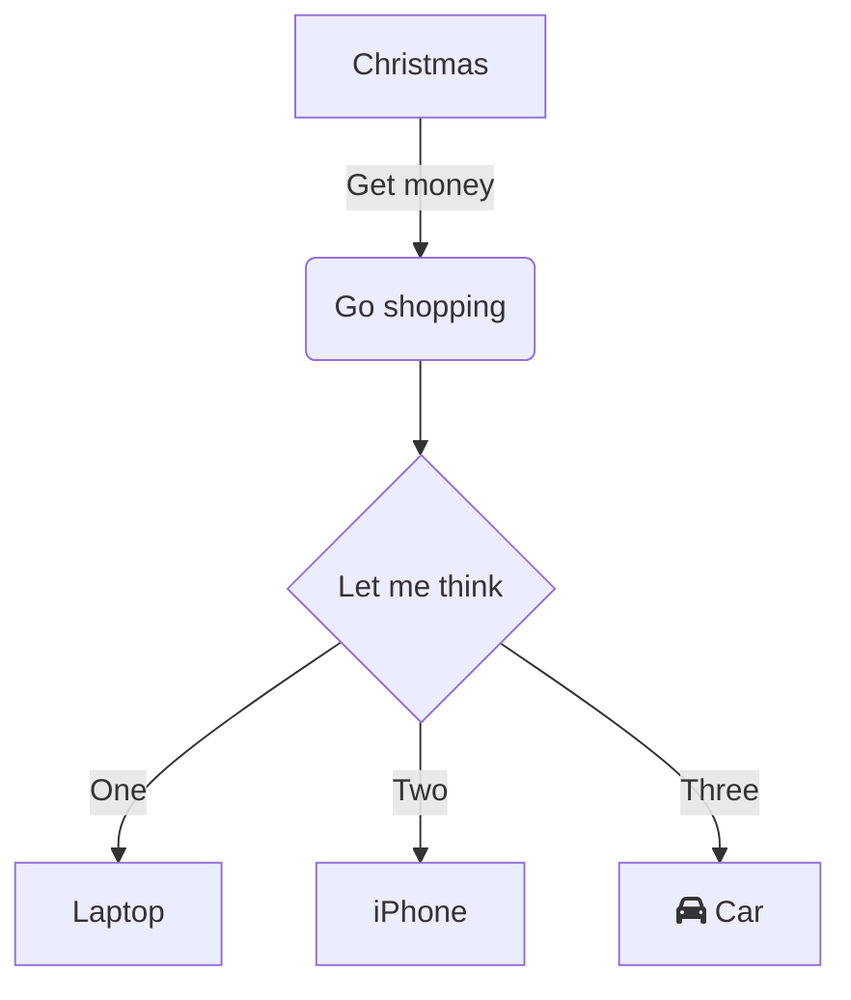
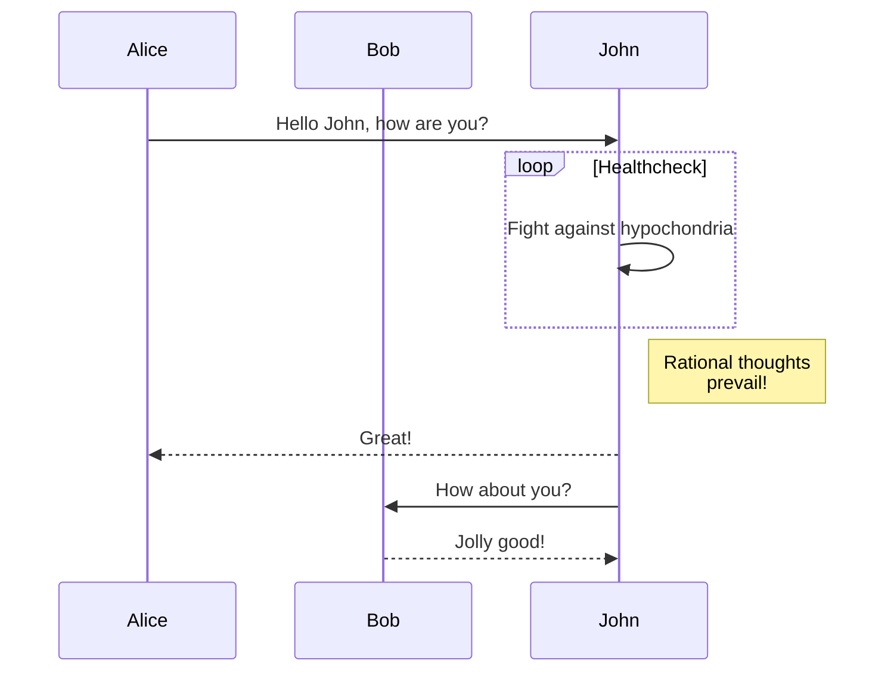
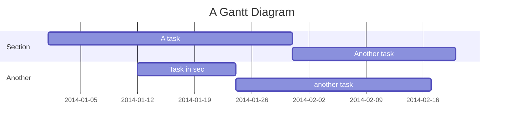

# Markdown Features Demo 📝

This page demonstrates **ALL** the Markdown features available in Docusaurus.

## Table of Contents

- [Basic Text Formatting](#basic-text-formatting)
- [Headers](#headers)
- [Lists](#lists)
- [Links and Images](#links-and-images)
- [Code Blocks](#code-blocks)
- [Tables](#tables)
- [Admonitions](#admonitions)
- [Math Equations](#math-equations)
- [Mermaid Diagrams](#mermaid-diagrams)
- [HTML Elements](#html-elements)

## Basic Text Formatting

**Bold text** and *italic text* and ***bold italic text***

~~Strikethrough text~~

`Inline code` with backticks

> Blockquote example
> 
> Multiple lines in blockquote

Horizontal rule below:

---

## Headers

### This is H3
#### This is H4
##### This is H5
###### This is H6

## Lists

### Unordered Lists

- Item 1
- Item 2
  - Nested item 2.1
  - Nested item 2.2
    - Double nested item 2.2.1
- Item 3

### Ordered Lists

1. First item
2. Second item
   1. Nested numbered item
   2. Another nested item
3. Third item

### Task Lists

- [x] Completed task
- [ ] Incomplete task
- [x] Another completed task

## Links and Images

### Links

[External link to Google](https://google.com)

[Internal link to intro](/docs/intro)

[Link with title](https://docusaurus.io "Docusaurus Homepage")

### Images


## Code Blocks

### Basic Code Block

```
Plain text code block
No syntax highlighting
```

### JavaScript with Syntax Highlighting

```javascript
function greetUser(name) {
  console.log(`Hello, ${name}!`);
  return `Welcome ${name}`;
}

greetUser("World");
```

### Code Block with Title

```python title="hello.py"
def fibonacci(n):
    if n <= 1:
        return n
    return fibonacci(n-1) + fibonacci(n-2)

# Calculate fibonacci sequence
for i in range(10):
    print(f"F({i}) = {fibonacci(i)}")
```

### Code Block with Line Numbers

```jsx showLineNumbers
import React from 'react';

function WelcomeComponent({ name }) {
  return (
    <div className="welcome">
      <h1>Welcome {name}!</h1>
      <p>This is a React component</p>
    </div>
  );
}

export default WelcomeComponent;
```

### Code Block with Line Highlighting

```bash {2,4-6}
# Install Docusaurus
npm create docusaurus@latest my-website classic
cd my-website
npm start
# Your site starts at http://localhost:3000
# Edit docs/intro.md and save to reload
```

### Code Block with Comments Highlighting

```typescript
interface User {
  id: number;
  name: string;
  // highlight-next-line
  email: string;
}

// highlight-start
function createUser(userData: Partial<User>): User {
  return {
    id: Math.random(),
    name: userData.name || 'Anonymous',
    email: userData.email || 'no-email@example.com'
  };
}
// highlight-end

const newUser = createUser({ name: 'John Doe' });
```

## Tables

| Feature | Supported | Notes |
|---------|-----------|-------|
| Markdown | ✅ | Full support |
| MDX | ✅ | With React components |
| Math | ✅ | KaTeX support |
| Mermaid | ✅ | Diagram support |
| Syntax Highlighting | ✅ | Prism.js |

### Advanced Table

| Left Aligned | Center Aligned | Right Aligned |
|:-------------|:--------------:|--------------:|
| Item 1 | Item 2 | Item 3 |
| **Bold** | *Italic* | `Code` |
| [Link](/) |  | 123 |

## Admonitions

:::note
This is a note admonition. It's useful for general information.
:::

:::tip Pro Tip
This is a tip admonition with a custom title. Use it for helpful advice!
:::

:::info
This is an info admonition. Great for additional context.
:::

:::warning
This is a warning admonition. Use it to alert users about important considerations.
:::

:::danger Take Care
This is a danger admonition with custom title. Use it for critical warnings!
:::

### Nested Admonitions

:::tip Complex Example

This tip contains a nested warning:

:::warning
Be careful when using nested admonitions!
:::

And you can use **markdown** inside admonitions:

- Lists work
- *Formatting* works  
- `Code` works
- [Links](/) work

:::

## Math Equations

### Inline Math
The quadratic formula is $x = \frac&#123;-b \pm \sqrt&#123;b^2-4ac&#125;&#125;&#123;2a&#125;$

### Block Math
$$
\int_0^\infty e^&#123;-x^2&#125; dx = \frac&#123;\sqrt&#123;\pi&#125;&#125;&#123;2&#125;
$$

### More Complex Equations

$$
\begin&#123;aligned&#125;
\nabla \times \vec&#123;\mathbf&#123;B&#125;&#125; -\, \frac&#123;1&#125;&#123;c&#125;\, \frac&#123;\partial\vec&#123;\mathbf&#123;E&#125;&#125;&#125;&#123;\partial t&#125; &= \frac&#123;4\pi&#125;&#123;c&#125;\vec&#123;\mathbf&#123;j&#125;&#125; \\
\nabla \cdot \vec&#123;\mathbf&#123;E&#125;&#125; &= 4 \pi \rho \\
\nabla \times \vec&#123;\mathbf&#123;E&#125;&#125;\, +\, \frac&#123;1&#125;&#123;c&#125;\, \frac&#123;\partial\vec&#123;\mathbf&#123;B&#125;&#125;&#125;&#123;\partial t&#125; &= \vec&#123;\mathbf&#123;0&#125;&#125; \\
\nabla \cdot \vec&#123;\mathbf&#123;B&#125;&#125; &= 0
\end&#123;aligned&#125;
$$

## Mermaid Diagrams

### Flowchart



### Sequence Diagram



### Gantt Chart



## HTML Elements

### Details and Summary

<details>
<summary>Click to expand</summary>

This content is hidden by default and can be revealed by clicking the summary.

- You can use **markdown** inside details
- Including lists
- And `code`

```javascript
console.log("Even code blocks work!");
```

</details>

### Custom HTML

<div style={{backgroundColor: '#f0f0f0', padding: '20px', borderRadius: '8px', border: '2px solid #ddd'}}>
  <h4 style={{color: '#333', marginTop: 0}}>Custom Styled Box</h4>
  <p>This is a custom HTML div with inline styles.</p>
  <p>You can mix <strong>HTML</strong> and <em>Markdown</em> freely!</p>
</div>

### Keyboard Keys

Press <kbd>Ctrl</kbd> + <kbd>C</kbd> to copy text.

Use <kbd>⌘</kbd> + <kbd>Space</kbd> on Mac to open Spotlight.

### Abbreviations

The HTML specification is maintained by the W3C.

HTML stands for HyperText Markup Language.
W3C stands for World Wide Web Consortium.

---

## Conclusion

This page demonstrates all the core Markdown features available in Docusaurus. The next step is to explore MDX features that allow you to embed React components directly in your content!

**Next:** Check out the [MDX + React Demo](/docs/resources-learning/docusaurus-testing/mdx-react-demo) to see advanced features in action.