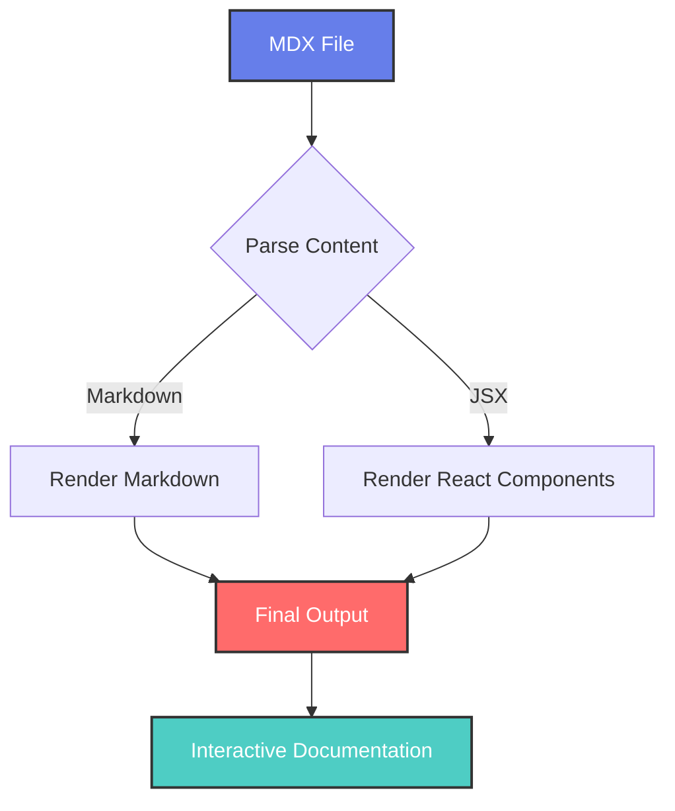

import React from 'react';
import Tabs from '@theme/Tabs';
import TabItem from '@theme/TabItem';
import CodeBlock from '@theme/CodeBlock';
import TOCInline from '@theme/TOCInline';

export const Highlight = ({children, color}) => (
  <span
    style={{
      backgroundColor: color,
      borderRadius: '8px',
      color: '#fff',
      padding: '0.4rem 0.8rem',
      fontWeight: 'bold',
    }}>
    {children}
  </span>
);

export const Button = ({children, onClick, variant = 'primary'}) => {
  const styles = {
    primary: {
      backgroundColor: '#667eea',
      color: 'white',
      border: 'none',
      padding: '12px 24px',
      borderRadius: '8px',
      cursor: 'pointer',
      fontSize: '16px',
      fontWeight: '600',
      transition: 'all 0.3s ease',
    },
    secondary: {
      backgroundColor: 'transparent',
      color: '#667eea',
      border: '2px solid #667eea',
      padding: '10px 22px',
      borderRadius: '8px',
      cursor: 'pointer',
      fontSize: '16px',
      fontWeight: '600',
      transition: 'all 0.3s ease',
    }
  };
  
  return (
    <button 
      style={styles[variant]}
      onClick={onClick}
      onMouseOver={(e) => {
        if (variant === 'primary') {
          e.target.style.backgroundColor = '#5a67d8';
          e.target.style.transform = 'translateY(-2px)';
        } else {
          e.target.style.backgroundColor = '#667eea';
          e.target.style.color = 'white';
        }
      }}
      onMouseOut={(e) => {
        if (variant === 'primary') {
          e.target.style.backgroundColor = '#667eea';
          e.target.style.transform = 'translateY(0)';
        } else {
          e.target.style.backgroundColor = 'transparent';
          e.target.style.color = '#667eea';
        }
      }}
    >
      {children}
    </button>
  );
};

export const InteractiveCounter = () => {
  const [count, setCount] = React.useState(0);
  
  return (
    <div style={{
      border: '2px solid #667eea',
      borderRadius: '12px',
      padding: '20px',
      textAlign: 'center',
      backgroundColor: 'var(--ifm-background-surface-color)',
      margin: '20px 0'
    }}>
      <h3 style={{marginTop: 0, color: '#667eea'}}>Interactive Counter</h3>
      <div style={{fontSize: '3rem', fontWeight: 'bold', color: '#333', margin: '20px 0'}}>
        {count}
      </div>
      <div style={{display: 'flex', gap: '10px', justifyContent: 'center'}}>
        <Button onClick={() => setCount(count - 1)} variant="secondary">-</Button>
        <Button onClick={() => setCount(0)}>Reset</Button>
        <Button onClick={() => setCount(count + 1)} variant="secondary">+</Button>
      </div>
    </div>
  );
};

export const ProgressBar = ({progress, color = '#667eea'}) => (
  <div style={{
    width: '100%',
    backgroundColor: '#e0e0e0',
    borderRadius: '10px',
    overflow: 'hidden',
    margin: '10px 0'
  }}>
    <div style={{
      width: `${progress}%`,
      backgroundColor: color,
      height: '20px',
      borderRadius: '10px',
      transition: 'width 0.3s ease',
      display: 'flex',
      alignItems: 'center',
      justifyContent: 'center',
      color: 'white',
      fontSize: '12px',
      fontWeight: 'bold'
    }}>
      {progress}%
    </div>
  </div>
);

export const AlertBox = ({type, title, children}) => {
  const styles = {
    success: { backgroundColor: '#d4edda', borderColor: '#c3e6cb', color: '#155724' },
    warning: { backgroundColor: '#fff3cd', borderColor: '#ffeaa7', color: '#856404' },
    error: { backgroundColor: '#f8d7da', borderColor: '#f5c6cb', color: '#721c24' },
    info: { backgroundColor: '#d1ecf1', borderColor: '#bee5eb', color: '#0c5460' }
  };
  
  return (
    <div style={{
      ...styles[type],
      border: `1px solid ${styles[type].borderColor}`,
      borderRadius: '8px',
      padding: '15px',
      margin: '15px 0'
    }}>
      {title && <strong style={{display: 'block', marginBottom: '8px'}}>{title}</strong>}
      {children}
    </div>
  );
};

# MDX + React Features Demo 🚀

Welcome to the **advanced MDX demonstration** page! This showcases the power of combining Markdown with React components.

<Highlight color="#25c2a0">
  MDX = Markdown + JSX ✨
</Highlight>

<TOCInline toc={toc} />

## Interactive Components

### Custom React Components

You can create and use custom React components directly in your MDX files:

<InteractiveCounter />

The counter above is a fully functional React component embedded in Markdown!

### Custom Styled Elements

<Highlight color="#ff6b6b">Red highlight</Highlight> and <Highlight color="#4ecdc4">teal highlight</Highlight> using custom components.

<div style={{display: 'flex', gap: '10px', margin: '20px 0'}}>
  <Button onClick={() => alert('Primary button clicked!')}>Primary Button</Button>
  <Button variant="secondary" onClick={() => alert('Secondary button clicked!')}>Secondary Button</Button>
</div>

## Tabs Component

<Tabs>
  <TabItem value="react" label="React" default>
    
```jsx live
function WelcomeMessage() {
  const [name, setName] = React.useState('World');
  
  return (
    <div style={{padding: '20px', textAlign: 'center'}}>
      <input 
        type="text" 
        value={name}
        onChange={(e) => setName(e.target.value)}
        placeholder="Enter your name"
        style={{
          padding: '8px',
          marginRight: '10px',
          borderRadius: '4px',
          border: '1px solid #ccc'
        }}
      />
      <h2>Hello, {name}! 👋</h2>
    </div>
  );
}
```

  </TabItem>
  <TabItem value="vue" label="Vue">
    
```vue
<template>
  <div class="welcome">
    <input v-model="name" placeholder="Enter your name" />
    <h2>Hello, {{ name }}! 👋</h2>
  </div>
</template>

<script>
export default {
  data() {
    return {
      name: 'World'
    }
  }
}
</script>
```

  </TabItem>
  <TabItem value="angular" label="Angular">
    
```typescript
import { Component } from '@angular/core';

@Component({
  selector: 'app-welcome',
  template: `
    <div>
      <input [(ngModel)]="name" placeholder="Enter your name">
      <h2>Hello, {{name}}! 👋</h2>
    </div>
  `
})
export class WelcomeComponent {
  name = 'World';
}
```

  </TabItem>
</Tabs>

## Synced Tabs

<Tabs groupId="operating-systems">
  <TabItem value="windows" label="Windows">

**Windows Installation:**

```bash
# Using Chocolatey
choco install nodejs

# Using Winget
winget install OpenJS.NodeJS
```

  </TabItem>
  <TabItem value="macos" label="macOS">

**macOS Installation:**

```bash
# Using Homebrew
brew install node

# Using MacPorts
sudo port install nodejs18
```

  </TabItem>
  <TabItem value="linux" label="Linux">

**Linux Installation:**

```bash
# Ubuntu/Debian
sudo apt install nodejs npm

# CentOS/RHEL
sudo yum install nodejs npm

# Arch Linux
sudo pacman -S nodejs npm
```

  </TabItem>
</Tabs>

Choose your OS above, and the selection will sync across all tab groups with the same `groupId`!

<Tabs groupId="operating-systems">
  <TabItem value="windows" label="Windows">

**Windows Development:**
- Use PowerShell or Command Prompt
- Consider Windows Subsystem for Linux (WSL)
- Visual Studio Code with Windows-specific extensions

</TabItem>
  <TabItem value="macos" label="macOS">

**macOS Development:**
- Terminal.app or iTerm2
- Xcode Command Line Tools
- Native Unix-like environment

</TabItem>
  <TabItem value="linux" label="Linux">

**Linux Development:**
- Native terminal environment
- Package managers for easy installation
- Vast community support

</TabItem>
</Tabs>

## Advanced Code Examples

### Live Code Editor

```jsx live
function ColorPicker() {
  const [color, setColor] = React.useState('#667eea');
  
  const colors = ['#667eea', '#ff6b6b', '#4ecdc4', '#45b7d1', '#96ceb4', '#feca57'];
  
  return (
    <div style={{textAlign: 'center', padding: '20px'}}>
      <div 
        style={{
          width: '100px',
          height: '100px',
          backgroundColor: color,
          margin: '0 auto 20px',
          borderRadius: '50%',
          border: '3px solid #333',
          transition: 'all 0.3s ease'
        }}
      />
      <div style={{display: 'flex', justifyContent: 'center', gap: '10px'}}>
        {colors.map(c => (
          <button
            key={c}
            onClick={() => setColor(c)}
            style={{
              width: '30px',
              height: '30px',
              backgroundColor: c,
              border: color === c ? '3px solid #333' : '1px solid #ccc',
              borderRadius: '50%',
              cursor: 'pointer'
            }}
          />
        ))}
      </div>
      <p style={{marginTop: '15px', fontFamily: 'monospace'}}>
        Selected: {color}
      </p>
    </div>
  );
}
```

### Code Block with Custom Component

<CodeBlock language="python" title="machine_learning.py" showLineNumbers>
{`import numpy as np
from sklearn.model_selection import train_test_split
from sklearn.ensemble import RandomForestClassifier

# Generate sample data
X = np.random.rand(1000, 5)
y = (X[:, 0] + X[:, 1] > 1).astype(int)

# Split the data
X_train, X_test, y_train, y_test = train_test_split(
    X, y, test_size=0.2, random_state=42
)

# Train the model
model = RandomForestClassifier(n_estimators=100, random_state=42)
model.fit(X_train, y_train)

# Evaluate
accuracy = model.score(X_test, y_test)
print(f"Model accuracy: {accuracy:.2%}")
`}
</CodeBlock>

## Custom Alert Components

<AlertBox type="success" title="Success!">
  This is a success message with **markdown** support and a custom React component!
</AlertBox>

<AlertBox type="warning" title="Warning">
  Be careful when using custom components. Make sure they're properly imported!
</AlertBox>

<AlertBox type="error" title="Error">
  This shows what an error message looks like with our custom component.
</AlertBox>

<AlertBox type="info">
  This is an info alert without a title. You can use `*markdown*` and even [links](/docs/intro) inside!
</AlertBox>

## Progress Bars

<ProgressBar progress={25} />
<ProgressBar progress={50} color="#ff6b6b" />
<ProgressBar progress={75} color="#4ecdc4" />
<ProgressBar progress={100} color="#96ceb4" />

## Embedded HTML with Styling

<div style={{
  background: 'linear-gradient(135deg, #667eea 0%, #764ba2 100%)',
  padding: '30px',
  borderRadius: '15px',
  color: 'white',
  textAlign: 'center',
  margin: '30px 0'
}}>
  
### Gradient Card
  
This is a custom styled card using inline CSS with gradient background.
  
**Features:**
- Custom styling
- Gradient background
- Markdown support inside HTML
- Responsive design

<Button onClick={() => alert('Card button clicked!')}>
  Card Action
</Button>

</div>

## Mixed Content Example

Here's how you can mix **regular markdown** with React components seamlessly:

1. Start with a numbered list
2. Add some <Highlight color="#ff6b6b">highlighted text</Highlight>
3. Include interactive elements:

<InteractiveCounter />

4. Continue with more markdown content
5. Add code examples:

```javascript
// This is regular markdown code block
function mixedContent() {
  return "Markdown + React = 🚀";
}
```

## Advanced Mermaid with Styling



## Math with Interactive Elements

The quadratic formula: $x = \frac&#123;-b \pm \sqrt&#123;b^2-4ac&#125;&#125;&#123;2a&#125;$

<Highlight color="#764ba2">Interactive math coming soon!</Highlight>

Block equation:

$$
\int_&#123;-\infty&#125;^&#123;\infty&#125; e^&#123;-x^2&#125; dx = \sqrt&#123;\pi&#125;
$$

## Complex Example: Todo List

```jsx live
function TodoList() {
  const [todos, setTodos] = React.useState([
    { id: 1, text: 'Learn MDX', completed: true },
    { id: 2, text: 'Build awesome docs', completed: false },
    { id: 3, text: 'Share knowledge', completed: false }
  ]);
  const [newTodo, setNewTodo] = React.useState('');
  
  const addTodo = () => {
    if (newTodo.trim()) {
      setTodos([...todos, { 
        id: Date.now(), 
        text: newTodo.trim(), 
        completed: false 
      }]);
      setNewTodo('');
    }
  };
  
  const toggleTodo = (id) => {
    setTodos(todos.map(todo => 
      todo.id === id ? { ...todo, completed: !todo.completed } : todo
    ));
  };
  
  const deleteTodo = (id) => {
    setTodos(todos.filter(todo => todo.id !== id));
  };
  
  return (
    <div style={{
      border: '2px solid #667eea',
      borderRadius: '12px',
      padding: '20px',
      backgroundColor: 'var(--ifm-background-surface-color)'
    }}>
      <h3 style={{marginTop: 0, color: '#667eea'}}>📝 Interactive Todo List</h3>
      
      <div style={{display: 'flex', gap: '10px', marginBottom: '20px'}}>
        <input
          type="text"
          value={newTodo}
          onChange={(e) => setNewTodo(e.target.value)}
          onKeyPress={(e) => e.key === 'Enter' && addTodo()}
          placeholder="Add new todo..."
          style={{
            flex: 1,
            padding: '8px 12px',
            border: '1px solid #ddd',
            borderRadius: '6px',
            fontSize: '14px'
          }}
        />
        <button
          onClick={addTodo}
          style={{
            backgroundColor: '#667eea',
            color: 'white',
            border: 'none',
            padding: '8px 16px',
            borderRadius: '6px',
            cursor: 'pointer',
            fontSize: '14px'
          }}
        >
          Add
        </button>
      </div>
      
      <ul style={{listStyle: 'none', padding: 0}}>
        {todos.map(todo => (
          <li key={todo.id} style={{
            display: 'flex',
            alignItems: 'center',
            gap: '10px',
            padding: '8px 0',
            borderBottom: '1px solid #eee'
          }}>
            <input
              type="checkbox"
              checked={todo.completed}
              onChange={() => toggleTodo(todo.id)}
              style={{transform: 'scale(1.2)'}}
            />
            <span style={{
              flex: 1,
              textDecoration: todo.completed ? 'line-through' : 'none',
              color: todo.completed ? '#999' : '#333'
            }}>
              {todo.text}
            </span>
            <button
              onClick={() => deleteTodo(todo.id)}
              style={{
                backgroundColor: '#ff6b6b',
                color: 'white',
                border: 'none',
                padding: '4px 8px',
                borderRadius: '4px',
                cursor: 'pointer',
                fontSize: '12px'
              }}
            >
              Delete
            </button>
          </li>
        ))}
      </ul>
      
      <div style={{marginTop: '15px', fontSize: '14px', color: '#666'}}>
        Total: {todos.length} | Completed: {todos.filter(t => t.completed).length}
      </div>
    </div>
  );
}
```

---

## Conclusion

This page demonstrates the incredible power of **MDX in Docusaurus**:

- ✅ **Standard Markdown** - All basic features work perfectly
- ✅ **React Components** - Custom interactive components
- ✅ **Live Code Editor** - Editable and executable code blocks  
- ✅ **Tabs & Navigation** - Enhanced user experience
- ✅ **Custom Styling** - Inline styles and CSS-in-JS
- ✅ **Mixed Content** - Seamless integration of markdown and JSX
- ✅ **Complex Interactions** - Full React functionality

<div style={{textAlign: 'center', margin: '40px 0'}}>
  <Highlight color="#25c2a0">
    MDX + Docusaurus = Powerful Documentation! 🎉
  </Highlight>
</div>

**MDX** là viết tắt của **M**ark**d**own + **J**S**X** - cho phép bạn viết JSX (React components) trực tiếp trong các file Markdown, tạo ra tài liệu tương tác và động.