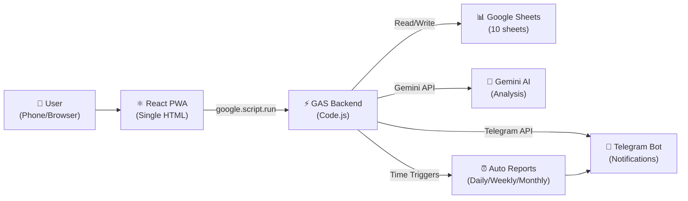
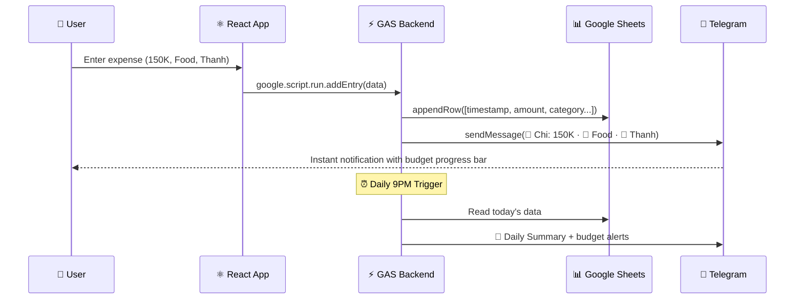
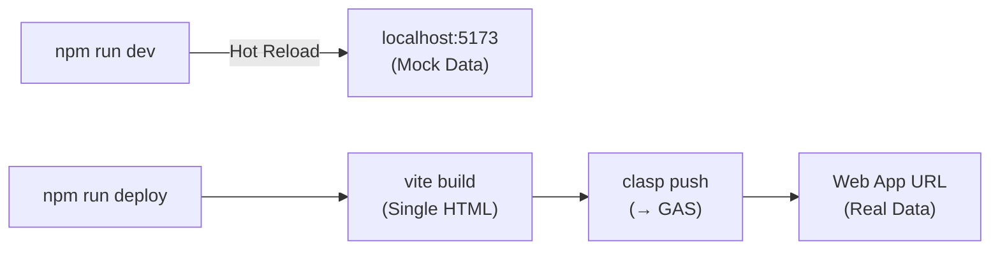

import React from 'react';
import Tabs from '@theme/Tabs';
import TabItem from '@theme/TabItem';
import CodeBlock from '@theme/CodeBlock';
import TOCInline from '@theme/TOCInline';
import Details from '@theme/Details';

export const Highlight = ({children, color}) => (
  <span
    style={{
      backgroundColor: color,
      borderRadius: '8px',
      color: '#fff',
      padding: '0.4rem 0.8rem',
      fontWeight: 'bold',
      display: 'inline-block',
      margin: '0.2rem',
    }}>
    {children}
  </span>
);

export const InfoCard = ({children, title, icon, color = '#4CAF50'}) => (
  <div style={{
    border: `2px solid ${color}`,
    borderRadius: '12px',
    padding: '20px',
    margin: '20px 0',
    backgroundColor: 'var(--ifm-background-surface-color)',
    boxShadow: '0 4px 12px rgba(0,0,0,0.1)',
  }}>
    {title && (
      <h3 style={{marginTop: 0, color: color, display: 'flex', alignItems: 'center', gap: '10px'}}>
        {icon && <span style={{fontSize: '1.5rem'}}>{icon}</span>}
        {title}
      </h3>
    )}
    {children}
  </div>
);

export const FeatureGrid = ({children}) => (
  <div style={{
    display: 'grid',
    gridTemplateColumns: 'repeat(auto-fit, minmax(250px, 1fr))',
    gap: '20px',
    margin: '30px 0',
  }}>
    {children}
  </div>
);

export const FeatureCard = ({icon, title, description, color = '#4CAF50'}) => (
  <div style={{
    border: `2px solid ${color}`,
    borderRadius: '12px',
    padding: '20px',
    textAlign: 'center',
    backgroundColor: 'var(--ifm-background-surface-color)',
    transition: 'transform 0.3s ease, box-shadow 0.3s ease',
    cursor: 'pointer',
  }}
  onMouseEnter={(e) => {
    e.currentTarget.style.transform = 'translateY(-5px)';
    e.currentTarget.style.boxShadow = '0 8px 20px rgba(0,0,0,0.15)';
  }}
  onMouseLeave={(e) => {
    e.currentTarget.style.transform = 'translateY(0)';
    e.currentTarget.style.boxShadow = 'none';
  }}>
    <div style={{fontSize: '3rem', marginBottom: '15px'}}>{icon}</div>
    <h3 style={{color: color, margin: '10px 0'}}>{title}</h3>
    <p style={{color: '#666', fontSize: '0.95rem'}}>{description}</p>
  </div>
);

export const StepIndicator = ({steps, currentStep, anchors = []}) => {
  const handleClick = (idx) => {
    const anchor = anchors[idx];
    if (anchor) {
      const el = document.querySelector(anchor);
      if (el) el.scrollIntoView({ behavior: 'smooth', block: 'start' });
    }
  };
  return (
    <div style={{
      display: 'flex',
      justifyContent: 'space-between',
      alignItems: 'center',
      margin: '30px 0',
      position: 'relative',
    }}>
      <div style={{
        position: 'absolute',
        top: '20px',
        left: '0',
        right: '0',
        height: '2px',
        backgroundColor: '#ddd',
        zIndex: 0,
      }}>
        <div style={{
          height: '100%',
          backgroundColor: '#4CAF50',
          width: `${(currentStep / (steps.length - 1)) * 100}%`,
          transition: 'width 0.5s ease',
        }} />
      </div>
      {steps.map((step, idx) => (
        <div key={idx}
          onClick={() => handleClick(idx)}
          style={{
            display: 'flex',
            flexDirection: 'column',
            alignItems: 'center',
            zIndex: 1,
            cursor: anchors[idx] ? 'pointer' : 'default',
          }}
        >
          <div style={{
            width: '40px',
            height: '40px',
            borderRadius: '50%',
            backgroundColor: idx <= currentStep ? '#4CAF50' : '#ddd',
            color: 'white',
            display: 'flex',
            alignItems: 'center',
            justifyContent: 'center',
            fontWeight: 'bold',
            marginBottom: '10px',
            transition: 'all 0.3s ease',
          }}
          onMouseEnter={(e) => { if (anchors[idx]) { e.currentTarget.style.transform = 'scale(1.15)'; e.currentTarget.style.boxShadow = '0 4px 12px rgba(76,175,80,0.4)'; } }}
          onMouseLeave={(e) => { e.currentTarget.style.transform = 'scale(1)'; e.currentTarget.style.boxShadow = 'none'; }}
          >
            {idx + 1}
          </div>
          <span style={{
            fontSize: '0.85rem',
            textAlign: 'center',
            color: idx <= currentStep ? '#4CAF50' : '#999',
            fontWeight: idx === currentStep ? 'bold' : 'normal',
          }}>
            {step}
          </span>
        </div>
      ))}
    </div>
  );
};

export const InteractiveArchitecture = () => {
  const [hoveredComponent, setHoveredComponent] = React.useState(null);
  const components = [
    { id: 'user', label: '📱 User', color: '#4CAF50', description: 'Mobile-first PWA — add to Home Screen, record expenses in ~8 seconds' },
    { id: 'gas', label: '⚡ Google Apps Script', color: '#FF9800', description: 'Backend API — handles CRUD, reports, triggers, Telegram webhook' },
    { id: 'sheets', label: '📊 Google Sheets', color: '#0F9D58', description: 'Database — 10 sheets: RawData, Reports, Budget, Goals, Assets, Settings' },
    { id: 'telegram', label: '🤖 Telegram Bot', color: '#0088cc', description: 'Notifications — real-time alerts, daily/weekly summaries, inline keyboards' },
    { id: 'gemini', label: '🧠 Gemini AI', color: '#8E24AA', description: 'AI analysis — monthly insights, savings tips, health score, trend forecasting' },
    { id: 'vite', label: '⚡ Vite + React', color: '#646CFF', description: 'Frontend — built into single HTML file via vite-plugin-singlefile, pushed to GAS' },
  ];
  return (
    <div style={{
      border: '2px solid #4CAF50',
      borderRadius: '12px',
      padding: '30px',
      margin: '30px 0',
      backgroundColor: 'var(--ifm-background-surface-color)',
    }}>
      <h3 style={{textAlign: 'center', color: '#4CAF50', marginBottom: '30px'}}>
        🏗️ System Architecture — Hover to Explore
      </h3>
      <div style={{
        display: 'grid',
        gridTemplateColumns: 'repeat(auto-fit, minmax(160px, 1fr))',
        gap: '15px',
      }}>
        {components.map((comp) => (
          <div
            key={comp.id}
            onMouseEnter={() => setHoveredComponent(comp.id)}
            onMouseLeave={() => setHoveredComponent(null)}
            style={{
              padding: '20px 15px',
              borderRadius: '12px',
              textAlign: 'center',
              border: `2px solid ${comp.color}`,
              backgroundColor: hoveredComponent === comp.id ? `${comp.color}15` : 'transparent',
              transition: 'all 0.3s ease',
              transform: hoveredComponent === comp.id ? 'scale(1.05)' : 'scale(1)',
              cursor: 'pointer',
            }}
          >
            <div style={{fontSize: '1.1rem', fontWeight: 'bold', color: comp.color}}>{comp.label}</div>
            {hoveredComponent === comp.id && (
              <p style={{fontSize: '0.85rem', color: '#666', marginTop: '10px', marginBottom: 0}}>
                {comp.description}
              </p>
            )}
          </div>
        ))}
      </div>
      <div style={{
        marginTop: '25px',
        padding: '15px',
        backgroundColor: '#f8f9fa',
        borderRadius: '8px',
        textAlign: 'center',
        fontSize: '0.9rem',
        color: '#666',
      }}>
        <strong>Flow:</strong> User → React PWA → <code>google.script.run</code> → GAS Backend → Google Sheets
        <br />+ GAS Triggers → Telegram Bot notifications + Gemini AI analysis
      </div>
    </div>
  );
};

# Building a Family Expense Tracker with GAS & Telegram 💰

<div style={{
  background: 'linear-gradient(135deg, #4CAF50 0%, #FF9800 50%, #0088cc 100%)',
  padding: '30px',
  borderRadius: '15px',
  color: 'white',
  textAlign: 'center',
  margin: '30px 0',
  boxShadow: '0 8px 25px rgba(76, 175, 80, 0.3)',
}}>
  <h2 style={{margin: 0, fontSize: '2rem'}}>
    💸 Zero-Cost Full-Stack Finance App
  </h2>
  <p style={{margin: '15px 0 0', fontSize: '1.1rem', opacity: 0.95}}>
    Google Apps Script + Sheets + Telegram + Gemini AI — Hosted free, forever
  </p>
</div>

**📋 Table of Contents**

<TOCInline toc={toc} minHeadingLevel={2} maxHeadingLevel={3} />

## Overview

Managing family finances shouldn't require expensive software or complex infrastructure. This guide walks you through building a **complete expense tracking system** that's entirely free to host, using Google's ecosystem and Telegram for notifications.

The app lets you **record expenses in ~8 seconds** from your phone, get **real-time Telegram alerts**, view a **rich dashboard with charts**, and even leverage **Gemini AI** to analyze your spending habits — all powered by Google Apps Script with Google Sheets as the database.

<FeatureGrid>
  <FeatureCard
    icon="📝"
    title="Quick Entry"
    description="Record expenses in ~8 seconds — amount, category, person, done!"
    color="#4CAF50"
  />
  <FeatureCard
    icon="📊"
    title="Rich Dashboard"
    description="5-tab dashboard: Overview, Budget, Goals, Assets, AI Analysis"
    color="#FF9800"
  />
  <FeatureCard
    icon="🤖"
    title="Telegram Bot"
    description="Real-time notifications, daily/weekly summaries, inline keyboards"
    color="#0088cc"
  />
  <FeatureCard
    icon="🧠"
    title="AI Insights"
    description="Gemini 2.5 Flash Lite — 6 quick analyses + free-form Q&A"
    color="#8E24AA"
  />
  <FeatureCard
    icon="🏦"
    title="Asset Tracking"
    description="Gold, savings, stocks, real estate — net worth at a glance"
    color="#E91E63"
  />
  <FeatureCard
    icon="💰"
    title="100% Free"
    description="No servers, no bills — Google Apps Script + Sheets + Telegram"
    color="#009688"
  />
</FeatureGrid>

## 🎯 Key Features

| Feature | Description |
|---------|-------------|
| 📝 **Expense Form** | Mobile-first interface, record in ~8 seconds |
| 📊 **Dashboard** | 5 tabs: Overview · Budget · Goals · Assets · AI |
| 🏦 **Asset Management** | Track gold, savings, stocks, real estate — P&L, maturity dates, net worth |
| 🤖 **Telegram Bot** | HTML-formatted messages, inline keyboard buttons — instant alerts, daily/weekly summaries |
| 🎯 **Goals & Debts** | CRUD savings goals + debt management with progress tracking |
| 💰 **Budget Tracking** | Income, savings, bills, category budgets — spending velocity monitoring |
| 📂 **Category Management** | Add/edit/delete spending categories from the app |
| ⚙️ **Settings** | Toggle Telegram, manage system configuration |
| 📈 **Auto Reports** | Monthly / Quarterly / Yearly — auto-generated on the 1st of each month |
| 📱 **PWA-like** | Add to Home Screen, dark/light theme, mobile-first design |
| 🧠 **AI Analysis** | Gemini-powered: monthly summary, savings tips, trend forecast, financial health score |

## 🏗️ System Architecture

<InteractiveArchitecture />

### Technology Stack

<div style={{
  display: 'grid',
  gridTemplateColumns: 'repeat(auto-fit, minmax(200px, 1fr))',
  gap: '15px',
  margin: '20px 0',
}}>
  {[
    { icon: '⚛️', label: 'React 18', desc: 'Frontend UI', color: '#61DAFB' },
    { icon: '⚡', label: 'Vite', desc: 'Build tooling', color: '#646CFF' },
    { icon: '📊', label: 'Recharts', desc: 'Charts & graphs', color: '#FF7300' },
    { icon: '🔧', label: 'Google Apps Script', desc: 'Backend (V8)', color: '#4285F4' },
    { icon: '📋', label: 'Google Sheets', desc: 'Database', color: '#0F9D58' },
    { icon: '🤖', label: 'Telegram Bot API', desc: 'Notifications', color: '#0088cc' },
    { icon: '🧠', label: 'Gemini 2.5 Flash', desc: 'AI analysis', color: '#8E24AA' },
    { icon: '📦', label: 'Clasp', desc: 'GAS deployment', color: '#F4B400' },
  ].map((item, idx) => (
    <div key={idx} style={{padding: '15px', backgroundColor: 'var(--ifm-background-surface-color)', border: `1px solid ${item.color}40`, borderRadius: '8px', textAlign: 'center'}}>
      <strong style={{color: item.color}}>{item.icon} {item.label}</strong>
      <div style={{fontSize: '0.9rem', color: '#666', marginTop: '5px'}}>{item.desc}</div>
    </div>
  ))}
</div>

### Project Structure

```
family-expense/
├── src/                              ← React source (local dev)
│   ├── main.jsx                      ← Entry point
│   ├── App.jsx                       ← Router (hash-based: #form | #dashboard)
│   ├── styles/globals.css            ← CSS variables & base
│   ├── utils/
│   │   ├── constants.js              ← Categories, budget, colors, sample data
│   │   ├── formatters.js             ← fmt(), fmtK(), pct()
│   │   ├── gas.js                    ← Bridge GAS ↔ local dev (mock in dev)
│   │   └── gemini.js                 ← Gemini AI client (cache, rate-limit)
│   └── components/
│       ├── shared.jsx                ← Card, ProgressBar, StatCard, Tooltip
│       ├── ExpenseForm/              ← Daily expense entry form
│       ├── Dashboard/                ← Dashboard with 5 tabs
│       │   ├── OverviewTab.jsx       ← Tab 1: Overview (trend, pie, recent)
│       │   ├── BudgetTab.jsx         ← Tab 2: Budget (cashflow, budget vs actual)
│       │   ├── GoalsTab.jsx          ← Tab 3: Savings goals & debts
│       │   ├── AssetsTab.jsx         ← Tab 4: Assets (gold, savings, stocks)
│       │   └── AITab.jsx             ← Tab 5: AI analysis (Gemini)
│       └── Management/               ← CRUD panel (goals, debts, categories, etc.)
│
├── gas/                              ← Pushed to Google Apps Script
│   ├── Code.js                       ← Backend: API + reports + triggers + Telegram
│   ├── appsscript.json               ← GAS config + OAuth scopes
│   ├── .clasp.json                   ← CLASP config (scriptId)
│   └── index.html                    ← ⭐ Built file from Vite (all-in-one)
│
├── index.html                        ← Vite entry
├── vite.config.js                    ← Vite + singlefile plugin
└── package.json
```

#### How It Works



#### Data Flow



## 🚀 Getting Started

<StepIndicator
  steps={['Setup Tools', 'Create GAS', 'Google Sheet', 'Build & Deploy', 'Telegram Bot', 'Done!']}
  currentStep={0}
  anchors={[
    '#step-1-install-dependencies',
    '#step-2-configure-vite',
    '#step-3-create-google-sheet--apps-script-project',
    '#-build--deploy',
    '#-telegram-bot-integration',
    '#-conclusion',
  ]}
/>

### Prerequisites

<InfoCard title="Before You Begin" icon="📋" color="#FF9800">

Make sure you have the following installed:

- **Node.js** ≥ 18 (for Vite and Clasp)
- **npm** (comes with Node.js)
- A **Google Account** (for Sheets and Apps Script)
- A **Telegram Account** (for the bot)
- Optionally: a **Gemini API key** from [Google AI Studio](https://aistudio.google.com/) for AI features

</InfoCard>

### Step 1: Install Dependencies

<Tabs>
<TabItem value="npm" label="npm" default>

```bash
# Clone or create the project
mkdir family-expense && cd family-expense
npm init -y

# Install frontend dependencies
npm install react react-dom recharts

# Install dev dependencies
npm install -D vite @vitejs/plugin-react vite-plugin-singlefile

# Install Clasp globally (Google Apps Script CLI)
npm install -g @google/clasp

# Login to Clasp
clasp login
```

</TabItem>
<TabItem value="yarn" label="yarn">

```bash
mkdir family-expense && cd family-expense
yarn init -y

yarn add react react-dom recharts
yarn add -D vite @vitejs/plugin-react vite-plugin-singlefile

npm install -g @google/clasp
clasp login
```

</TabItem>
</Tabs>

:::tip Enable Apps Script API
Before using Clasp, you must enable the Apps Script API at:
https://script.google.com/home/usersettings
:::

### Step 2: Configure Vite

The key innovation here is using `vite-plugin-singlefile` to bundle the entire React app into a **single HTML file** that Google Apps Script can serve:

```js title="vite.config.js"
import { defineConfig } from 'vite';
import react from '@vitejs/plugin-react';
import { viteSingleFile } from 'vite-plugin-singlefile';

export default defineConfig({
  plugins: [react(), viteSingleFile()],
  build: {
    outDir: 'gas',          // Build directly into the gas/ folder
    emptyOutDir: false,      // Don't delete Code.js & appsscript.json!
    assetsInlineLimit: 100000000,  // Inline everything
    cssCodeSplit: false,
    rollupOptions: {
      output: { manualChunks: undefined },
    },
  },
});
```

:::info Why Single File?
Google Apps Script can only serve HTML files via `HtmlService`. By bundling React + CSS + JS into one `index.html`, we can serve a full SPA from GAS with zero external hosting.
:::

### Step 3: Create Google Sheet & Apps Script Project

<Tabs>
<TabItem value="from-sheet" label="From Existing Sheet" default>

1. Go to [Google Sheets](https://sheets.google.com) → Create a new spreadsheet
2. Copy the **Sheet ID** from the URL: `https://docs.google.com/spreadsheets/d/{SHEET_ID}/edit`
3. Open **Extensions → Apps Script** → copy the **Script ID** from the URL
4. Create the Clasp config:

```json title="gas/.clasp.json"
{
  "scriptId": "PASTE_YOUR_SCRIPT_ID_HERE",
  "rootDir": "."
}
```

</TabItem>
<TabItem value="new" label="Create New with Clasp">

```bash
# Enable Apps Script API first: https://script.google.com/home/usersettings
mkdir gas && cd gas
clasp create --type standalone --title "Family Expense Tracker"
```

Then create a Google Sheet separately and note its Sheet ID.

</TabItem>
</Tabs>

### Step 4: GAS Configuration

```json title="gas/appsscript.json"
{
  "timeZone": "Asia/Ho_Chi_Minh",
  "dependencies": {},
  "exceptionLogging": "STACKDRIVER",
  "runtimeVersion": "V8",
  "oauthScopes": [
    "https://www.googleapis.com/auth/spreadsheets",
    "https://www.googleapis.com/auth/script.external_request",
    "https://www.googleapis.com/auth/script.scriptapp",
    "https://www.googleapis.com/auth/calendar"
  ],
  "webapp": {
    "access": "ANYONE_ANONYMOUS",
    "executeAs": "USER_DEPLOYING"
  }
}
```

| Scope | Purpose |
|-------|---------|
| `spreadsheets` | Read/write Google Sheets data |
| `script.external_request` | Call Telegram & Gemini APIs |
| `script.scriptapp` | Manage time-based triggers |
| `calendar` | Reserved for future calendar integration |

## ⚡ Backend: Google Apps Script

This is the heart of the application — a single `Code.js` file that handles everything.

### Configuration & Constants

```js title="gas/Code.js"
// ════════════════════════════════════════════════════════════════
//  FAMILY EXPENSE TRACKER — Google Apps Script Backend
// ════════════════════════════════════════════════════════════════

const CONFIG = {
  // ⚠️ Paste your Google Sheet ID here
  SPREADSHEET_ID: 'YOUR_SHEET_ID_HERE',
  SHEETS: {
    RAW_DATA:  'RawData',       // Raw transactions
    MONTHLY:   'BaoCao_Thang',  // Monthly reports
    QUARTERLY: 'BaoCao_Quy',    // Quarterly reports
    YEARLY:    'BaoCao_Nam',    // Yearly reports
    GOALS:     'MucTieu_TietKiem', // Savings goals
    DEBTS:     'QuanLy_No',     // Debt management
    ASSETS:    'TaiSan',        // Assets tracking
    BUDGET:    'NganSach',      // Budget configuration
    SETTINGS:  'CaiDat',        // System settings
    CONFIG:    'CauHinh',       // Categories & config
  },
  TIMEZONE: 'Asia/Ho_Chi_Minh',
};

// Helper: open spreadsheet by ID
function getSpreadsheet_() {
  return SpreadsheetApp.openById(CONFIG.SPREADSHEET_ID);
}

// Helper: read secrets from Script Properties (never hardcode!)
function getSecret_(key) {
  return PropertiesService.getScriptProperties().getProperty(key) || '';
}
```

:::danger Security First
**Never hardcode** API tokens or secrets in your source code! Use GAS **Script Properties** to store:
- `TELEGRAM_BOT_TOKEN`
- `TELEGRAM_CHAT_ID`
- `GEMINI_API_KEY`

Go to GAS Editor → **Project Settings** ⚙️ → **Script Properties** → Add each key/value pair.
:::

#### Web App Entry Point

```js title="gas/Code.js — doGet()"
function doGet() {
  return HtmlService.createHtmlOutputFromFile('index')
    .setTitle('Family Expense Tracker')
    .setXFrameOptionsMode(HtmlService.XFrameOptionsMode.ALLOWALL)
    .addMetaTag('viewport', 'width=device-width, initial-scale=1, user-scalable=no');
}
```

This single function serves your entire React app. When Vite builds the project, it outputs `gas/index.html` which is then served by GAS.

### Adding Expenses

```js title="gas/Code.js — addEntry()"
function addEntry(entry) {
  const ss = getSpreadsheet_();
  const sheet = getOrCreateSheet_(ss, CONFIG.SHEETS.RAW_DATA, [
    'Timestamp', 'Date', 'Month', 'Year', 'Quarter',
    'Person', 'Type', 'Group', 'Category', 'Full Category',
    'Amount (K)', 'Amount (VND)', 'Note',
  ]);

  // Support custom timestamp from frontend
  var ts = entry.timestamp ? new Date(entry.timestamp) : new Date();
  if (isNaN(ts.getTime())) ts = new Date();

  var month = parseInt(Utilities.formatDate(ts, CONFIG.TIMEZONE, 'M'), 10);
  var year  = parseInt(Utilities.formatDate(ts, CONFIG.TIMEZONE, 'yyyy'), 10);
  var quarter = 'Q' + Math.ceil(month / 3);

  sheet.appendRow([
    ts,
    Utilities.formatDate(ts, CONFIG.TIMEZONE, 'dd/MM/yyyy'),
    month, year, quarter,
    entry.person,
    entry.type === 'expense' ? 'Expense' : 'Income',
    catInfo.group,
    entry.category,
    catInfo.fullName,
    entry.amount,
    entry.amount * 1000,
    entry.note || '',
  ]);

  // Send Telegram notification
  notifyTelegram_(entry, ts);

  return { success: true };
}
```

#### Helper: Get or Create Sheet

```js title="gas/Code.js — getOrCreateSheet_()"
function getOrCreateSheet_(ss, name, headers) {
  var sheet = ss.getSheetByName(name);
  if (!sheet) {
    sheet = ss.insertSheet(name);
    if (headers && headers.length) {
      sheet.getRange(1, 1, 1, headers.length).setValues([headers]);
      sheet.getRange(1, 1, 1, headers.length)
        .setFontWeight('bold')
        .setBackground('#4CAF50')
        .setFontColor('white');
      sheet.setFrozenRows(1);
    }
  }
  return sheet;
}
```

### System Setup Function

Run this **once** after deploying to create all sheets and triggers:

```js title="gas/Code.js — SETUP_HE_THONG()"
function SETUP_HE_THONG() {
  setupGoals();      // Create savings goals sheet
  setupAssets();     // Create assets sheet
  setupBudget();     // Create budget sheet
  setupSettings();   // Create settings sheet
  setupAllTriggers(); // Install time-based triggers

  Logger.log('✅ SYSTEM READY!');
  Logger.log('📊 RawData         — Raw transactions');
  Logger.log('📈 BaoCao_Thang    — Monthly reports');
  Logger.log('📈 BaoCao_Quy      — Quarterly reports');
  Logger.log('📈 BaoCao_Nam      — Yearly reports');
  Logger.log('🎯 MucTieu_TietKiem — Savings goals');
  Logger.log('📋 QuanLy_No       — Debt management');
  Logger.log('🏦 TaiSan          — Assets');
  Logger.log('💰 NganSach        — Budget config');
  Logger.log('⚙️ CaiDat          — Settings');
}
```

### Time-Based Triggers

```js title="gas/Code.js — setupAllTriggers()"
function setupAllTriggers() {
  // Remove existing triggers to avoid duplicates
  ScriptApp.getProjectTriggers().forEach(function(t) {
    ScriptApp.deleteTrigger(t);
  });

  // Monthly/Quarterly/Yearly reports — 1st of each month, 8 AM
  ScriptApp.newTrigger('generateAllReports')
    .timeBased().onMonthDay(1).atHour(8).create();

  // Update savings goals progress — Sundays, 8 PM
  ScriptApp.newTrigger('updateGoalsProgress')
    .timeBased().onWeekDay(ScriptApp.WeekDay.SUNDAY).atHour(20).create();

  // Telegram daily summary — Every day, 9 PM
  ScriptApp.newTrigger('telegramDailyReminder')
    .timeBased().everyDays(1).atHour(21).create();

  // Telegram weekly summary — Sundays, 8 PM
  ScriptApp.newTrigger('telegramWeeklySummary')
    .timeBased().onWeekDay(ScriptApp.WeekDay.SUNDAY).atHour(20).create();

  Logger.log('✅ All triggers installed');
}
```

<InfoCard title="Automatic Triggers" icon="⏰" color="#FF9800">

| Trigger | Schedule | Function |
|---------|----------|----------|
| Monthly/Quarterly/Yearly reports | 1st of month, 8 AM | `generateAllReports()` |
| Update goals progress | Sunday, 8 PM | `updateGoalsProgress()` |
| Telegram daily summary | Every day, 9 PM | `telegramDailyReminder()` |
| Telegram weekly summary | Sunday, 8 PM | `telegramWeeklySummary()` |

</InfoCard>

## 🤖 Telegram Bot Integration

This is one of the most powerful features — a fully interactive Telegram bot that sends rich notifications with inline keyboard buttons.

### Step 1: Create Your Bot (~2 minutes)

1. Open Telegram → search for **@BotFather** → send `/newbot`
2. Choose a name (e.g., `Family Expense Bot`)
3. Choose a username (e.g., `family_expense_bot`)
4. Copy the **token** that BotFather gives you

### Step 2: Get Your Chat ID (~1 minute)

1. Open Telegram → search for **@userinfobot** or **@RawDataBot** → send `/start`
2. Copy your **Chat ID** (a number)

### Step 3: Store Credentials Securely

<Tabs>
<TabItem value="ui" label="Via GAS Editor (Recommended)" default>

1. Open GAS Editor → **Project Settings** (⚙️ icon on the left sidebar)
2. Scroll to **Script Properties** → **Edit script properties**
3. Add these properties:

| Property | Value |
|----------|-------|
| `TELEGRAM_BOT_TOKEN` | Token from BotFather |
| `TELEGRAM_CHAT_ID` | Your Chat ID |
| `GEMINI_API_KEY` | API key from Google AI Studio |

4. Click **Save script properties**

</TabItem>
<TabItem value="code" label="Via Code (One-time)">

Create a temporary function in GAS Editor, run it once, then delete it:

```js
function _initSecrets() {
  setupSecrets({
    TELEGRAM_BOT_TOKEN: '123456:ABC-DEF1234...',
    TELEGRAM_CHAT_ID: '123456789',
    GEMINI_API_KEY: 'AIza...'
  });
}
```

```js title="gas/Code.js — setupSecrets()"
function setupSecrets(secrets) {
  var props = PropertiesService.getScriptProperties();
  if (secrets.TELEGRAM_BOT_TOKEN) props.setProperty('TELEGRAM_BOT_TOKEN', secrets.TELEGRAM_BOT_TOKEN);
  if (secrets.TELEGRAM_CHAT_ID) props.setProperty('TELEGRAM_CHAT_ID', secrets.TELEGRAM_CHAT_ID);
  if (secrets.GEMINI_API_KEY) props.setProperty('GEMINI_API_KEY', secrets.GEMINI_API_KEY);
  Logger.log('✅ Secrets saved to Script Properties');
}
```

</TabItem>
</Tabs>

### Sending Messages

```js title="gas/Code.js — sendTelegram_()"
function sendTelegram_(text, opts) {
  var token = getSecret_('TELEGRAM_BOT_TOKEN');
  var chatIds = getAllChatIds_();
  if (!token || chatIds.length === 0) return false;

  var anySuccess = false;
  chatIds.forEach(function(chatId) {
    try {
      var url = 'https://api.telegram.org/bot' + token + '/sendMessage';
      var payload = {
        chat_id: chatId,
        text: text,
        parse_mode: 'HTML',
        disable_web_page_preview: true,
      };
      if (opts && opts.reply_markup) {
        payload.reply_markup = opts.reply_markup;
      }

      var res = UrlFetchApp.fetch(url, {
        method: 'post',
        contentType: 'application/json',
        payload: JSON.stringify(payload),
        muteHttpExceptions: true,
      });

      if (res.getResponseCode() === 200) anySuccess = true;
      // Auto-remove blocked chats
      if (res.getResponseCode() === 403) removeChatId_(chatId);
    } catch (e) {
      Logger.log('❌ Telegram error: ' + e.message);
    }
  });
  return anySuccess;
}
```

#### Inline Keyboard Buttons

```js title="gas/Code.js — buildInlineKeyboard_()"
function buildInlineKeyboard_(buttons) {
  return { inline_keyboard: buttons };
}

// Usage example:
sendTelegram_('💸 <b>Expense:</b> 150K\n🛒 Food · 👤 Thanh', {
  reply_markup: buildInlineKeyboard_([[
    { text: '📊 This Month', callback_data: '/status' },
    { text: '📋 Report', callback_data: '/report' }
  ]])
});
```

### Webhook Handler for Bot Commands

```js title="gas/Code.js — doPost() + handleTelegramWebhook_()"
function doPost(e) {
  try {
    var body = JSON.parse(e.postData.contents);
    if (body.update_id !== undefined) {
      return handleTelegramWebhook_(body);
    }
  } catch(err) {}
  return ContentService.createTextOutput('OK');
}

function handleTelegramWebhook_(update) {
  // Handle inline button presses
  if (update.callback_query) {
    return handleCallbackQuery_(update.callback_query);
  }

  var msg = update.message;
  if (!msg || !msg.text) return ContentService.createTextOutput('OK');

  var chatId = String(msg.chat.id);
  var text = msg.text.trim();
  var firstName = msg.from.first_name || '';
  var reply = '', replyMarkup = null;

  if (text === '/start') {
    addChatId_(chatId);  // Auto-register for notifications
    reply = '🎉 <b>Hello ' + escapeHtml_(firstName) + '!</b>\n\n'
      + '✅ Subscribed to expense notifications.\n\n'
      + '📋 <b>Commands:</b>\n'
      + '/status — Today\'s summary\n'
      + '/report — Monthly report\n'
      + '/stop — Unsubscribe\n';
    replyMarkup = buildInlineKeyboard_([[
      { text: '📊 Status', callback_data: '/status' },
      { text: '📋 Report', callback_data: '/report' }
    ]]);
  } else if (text === '/status') {
    reply = buildQuickStatus_();
    replyMarkup = buildInlineKeyboard_([[
      { text: '📋 Report', callback_data: '/report' },
      { text: '📊 Sheet', url: getSheetUrl_() }
    ]]);
  } else if (text === '/report') {
    reply = buildQuickMonthSummary_();
  }

  // Send reply to the user who sent the command
  if (reply) {
    sendDirectReply_(chatId, reply, replyMarkup);
  }
  return ContentService.createTextOutput('OK');
}
```

#### Setting Up the Webhook

```js title="gas/Code.js — setupTelegramWebhook()"
function setupTelegramWebhook(webAppUrl) {
  var token = getSecret_('TELEGRAM_BOT_TOKEN');
  if (!token) { Logger.log('❌ No bot token'); return; }

  var url = 'https://api.telegram.org/bot' + token + '/setWebhook';
  var res = UrlFetchApp.fetch(url, {
    method: 'post',
    contentType: 'application/json',
    payload: JSON.stringify({ url: webAppUrl }),
    muteHttpExceptions: true,
  });
  Logger.log('Webhook setup: ' + res.getContentText());
}
```

After deploying your web app, run:
```js
setupTelegramWebhook('https://script.google.com/macros/s/YOUR_DEPLOY_ID/exec');
```

### Notification Types

<InfoCard title="Telegram Message Types" icon="🔔" color="#0088cc">

| Trigger | When | Content | Inline KB |
|---------|------|---------|-----------|
| New expense | Real-time | 💸 150K · 🛒 Food · 👤 Thanh + budget progress | [📊 This Month] |
| `telegramDailyReminder` | 9 PM daily | Today's total + budget alerts + remaining | [📊 Sheet] [📋 Report] |
| `telegramWeeklySummary` | Sunday 8 PM | Week total + vs last week + top 3 + debts due | [📊 Sheet] |
| `telegramBudgetAlert` | Manual | Categories at ≥80% / 100% budget | [📊 Sheet] [📋 Details] |
| `telegramMonthlyReport` | 1st of month | Last month summary + pie chart | [📊 Sheet] |

</InfoCard>

#### Telegram Helper Functions

```js title="gas/Code.js — Utility functions"
// Format amount (K) for Telegram: 1500 → "1.5M", 150 → "150K"
function formatK_(val) {
  var n = Number(val) || 0;
  if (Math.abs(n) >= 1000) return (n / 1000).toFixed(1).replace(/\.0$/, '') + 'M';
  return n.toLocaleString('vi-VN') + 'K';
}

// Unicode progress bar for budget tracking
function progressBar_(pct, len) {
  len = len || 10;
  var p = Math.min(100, Math.max(0, pct));
  var filled = Math.round(p / 100 * len);
  var bar = '';
  for (var i = 0; i < filled; i++) bar += '▰';
  for (var i = 0; i < len - filled; i++) bar += '▱';
  return bar + ' ' + Math.round(p) + '%';
}

// Escape HTML for Telegram parse_mode: HTML
function escapeHtml_(text) {
  return String(text).replace(/&/g, '&amp;')
    .replace(/</g, '&lt;').replace(/>/g, '&gt;');
}
```

### Testing the Bot

```js title="gas/Code.js — telegramTest()"
function telegramTest() {
  var ok = sendTelegram_(
    '🔔 <b>Test successful!</b>\n\n'
    + 'Family Expense Bot is connected.\n'
    + '📅 ' + Utilities.formatDate(new Date(), CONFIG.TIMEZONE, 'dd/MM/yyyy HH:mm')
    + '\n\n🧪 ' + progressBar_(75, 10),
    { reply_markup: buildInlineKeyboard_([[
      { text: '📊 Status', callback_data: '/status' },
      { text: '📋 Report', callback_data: '/report' }
    ]]) }
  );
  Logger.log(ok ? '✅ Telegram test OK' : '❌ FAILED — Check BOT_TOKEN and CHAT_ID');
}
```

## ⚛️ Frontend: React + Vite

### GAS ↔ Frontend Bridge

The magic that connects the React frontend to GAS backend:

```js title="src/utils/gas.js"
// Bridge: GAS calls in production, mock data in local dev
const isDev = typeof google === 'undefined' || !google.script;

export function callGas(functionName, ...args) {
  if (isDev) {
    console.log(`[DEV] Mock GAS call: ${functionName}`, args);
    return Promise.resolve(getMockData(functionName));
  }

  return new Promise((resolve, reject) => {
    google.script.run
      .withSuccessHandler(resolve)
      .withFailureHandler(reject)
      [functionName](...args);
  });
}
```

:::tip Local Development
When running `npm run dev`, the app uses **mock/sample data** instead of real GAS calls. This gives you hot reload and fast iteration without deploying to GAS every time.
:::

#### Package Scripts

```json title="package.json — scripts"
{
  "scripts": {
    "dev": "vite",
    "build": "vite build",
    "preview": "vite preview",
    "push": "cd gas && npx @google/clasp push",
    "deploy": "npm run build && npm run push",
    "open": "cd gas && npx @google/clasp open --webapp"
  }
}
```

#### Development Workflow



| Command | Description |
|---------|-------------|
| `npm run dev` | Vite dev server with hot reload (uses mock data) |
| `npm run build` | Build single HTML file into `gas/` |
| `npm run deploy` | Build + push to Google Apps Script |
| `npm run open` | Open the deployed web app |

## 🧠 AI Analysis with Gemini

### Gemini API Setup

Get a free API key from [Google AI Studio](https://aistudio.google.com/) and store it in Script Properties as `GEMINI_API_KEY`.

The AI tab provides **6 quick analyses** + free-form Q&A:

| Analysis | Description |
|----------|-------------|
| 🏠 Simple Summary | Plain-language explanation anyone can understand |
| 📊 Monthly Analysis | Income/expenses, budget adherence, reduction suggestions |
| 👶 Baby Expenses | Track baby-related spending: formula, diapers, checkups |
| 💡 Savings Tips | Specific, actionable suggestions tailored to your data |
| 📈 6-Month Trend | Trend analysis, forecasting, early warnings |
| ❤️ Financial Health | Score your financial health + priority actions |
| 💬 Free Q&A | Chat with AI about your personal finances |

```js title="src/utils/gemini.js — Simplified"
const GEMINI_MODEL = 'gemini-2.5-flash-lite';
const GEMINI_BASE_URL = 'https://generativelanguage.googleapis.com/v1beta/models';

export async function askGemini(apiKey, prompt, data) {
  const url = `${GEMINI_BASE_URL}/${GEMINI_MODEL}:generateContent?key=${apiKey}`;

  const systemPrompt = `You are a family financial advisor. 
    Analyze the following expense data and provide insights.
    Data: ${JSON.stringify(data)}`;

  const response = await fetch(url, {
    method: 'POST',
    headers: { 'Content-Type': 'application/json' },
    body: JSON.stringify({
      contents: [{ parts: [{ text: systemPrompt + '\n\n' + prompt }] }],
    }),
  });

  const result = await response.json();
  return result.candidates?.[0]?.content?.parts?.[0]?.text || 'No response';
}
```

:::info Free Tier Limits
Gemini 2.5 Flash Lite free tier: ~30 requests/minute, ~1500 requests/day — more than enough for personal use.
:::

## 📊 Google Sheets Structure

The app uses **10 sheets** as its database:

<div style={{overflowX: 'auto'}}>

| Sheet | Purpose | Auto-Created |
|-------|---------|:---:|
| `RawData` | Raw transactions (1 row per entry) | ✅ |
| `BaoCao_Thang` | Monthly reports | ✅ |
| `BaoCao_Quy` | Quarterly reports | ✅ |
| `BaoCao_Nam` | Yearly reports | ✅ |
| `MucTieu_TietKiem` | Savings goals | ✅ |
| `QuanLy_No` | Debt management | ✅ |
| `TaiSan` | Assets (gold, savings, stocks, real estate) | ✅ |
| `NganSach` | Budget configuration (versioned by month) | ✅ |
| `CaiDat` | System settings (Telegram on/off, etc.) | ✅ |
| `CauHinh` | Categories & configuration | ✅ |

</div>

#### RawData Schema

Each expense/income entry becomes a single row:

| Column | Field | Example |
|--------|-------|---------|
| A | Timestamp | `2026-02-10T14:30:00` |
| B | Date | `10/02/2026` |
| C | Month | `2` |
| D | Year | `2026` |
| E | Quarter | `Q1` |
| F | Person | `Thanh` |
| G | Type | `Expense` / `Income` |
| H | Group | `Essential` / `Wants` / `Growth` |
| I | Category | `Food` |
| J | Full Category | `Food (groceries, supermarket, snacks)` |
| K | Amount (K) | `150` |
| L | Amount (VND) | `150000` |
| M | Note | `Weekly groceries` |

## 🚢 Build & Deploy

<StepIndicator
  steps={['Build', 'Push', 'Deploy', 'Setup', 'Test']}
  currentStep={0}
  anchors={[
    '#one-command-deploy',
    '#one-command-deploy',
    '#deploy-as-web-app',
    '#first-time-setup',
    '#testing-the-bot',
  ]}
/>

#### One-Command Deploy

```bash
# Build React app into single HTML + push to GAS
npm run deploy
```

This runs:
1. `vite build` — bundles React into `gas/index.html`
2. `clasp push` — pushes `Code.js`, `index.html`, `appsscript.json` to GAS

#### Deploy as Web App

1. Open GAS Editor: `cd gas && clasp open`
2. Click **Deploy** → **New deployment**
3. Select **Web app**
4. Execute as: **Me** | Access: **Anyone**
5. Click **Deploy** → Copy the URL

#### First-Time Setup

In the GAS Editor, run the `SETUP_HE_THONG` function:
1. Open GAS Editor
2. Select `SETUP_HE_THONG` from the function dropdown
3. Click **Run** ▶️
4. Grant permissions when prompted

This creates all 10 sheets and installs all time-based triggers automatically.

#### After Each Code Change

```bash
npm run deploy
```

Then in GAS: **Deploy** → **Manage deployments** → **Edit** → select **New version** → **Deploy**

:::warning Version Management
Each `clasp push` updates the code, but the **deployed** version doesn't change automatically. You must create a **new version** in the deployment settings after each push.
:::

## 📱 Daily Usage

<div style={{
  display: 'grid',
  gridTemplateColumns: 'repeat(auto-fit, minmax(280px, 1fr))',
  gap: '20px',
  margin: '30px 0',
}}>
  {[
    { step: '1', icon: '📱', title: 'Open App', desc: 'Tap the Home Screen icon (PWA-like)' },
    { step: '2', icon: '💸', title: 'Enter Expense', desc: 'Amount → Category → Person → Save (~8 sec)' },
    { step: '3', icon: '🔔', title: 'Get Notified', desc: 'Instant Telegram confirmation with budget bar' },
    { step: '4', icon: '🌙', title: '9 PM Summary', desc: 'Automatic daily recap with alerts' },
    { step: '5', icon: '📊', title: 'Weekly Review', desc: 'Sunday summary with trends and goals' },
    { step: '6', icon: '🧠', title: 'AI Insights', desc: 'Ask Gemini to analyze your spending anytime' },
  ].map((item, idx) => (
    <div key={idx} style={{
      padding: '20px',
      backgroundColor: 'var(--ifm-background-surface-color)',
      border: '2px solid #4CAF50',
      borderRadius: '12px',
      textAlign: 'center',
    }}>
      <div style={{
        width: '40px', height: '40px', borderRadius: '50%',
        backgroundColor: '#4CAF50', color: 'white',
        display: 'inline-flex', alignItems: 'center', justifyContent: 'center',
        fontWeight: 'bold', fontSize: '1.2rem', marginBottom: '10px',
      }}>{item.step}</div>
      <div style={{fontSize: '2.5rem', margin: '10px 0'}}>{item.icon}</div>
      <h4 style={{color: '#4CAF50', margin: '10px 0'}}>{item.title}</h4>
      <p style={{color: '#666', fontSize: '0.9rem', margin: 0}}>{item.desc}</p>
    </div>
  ))}
</div>

## 🔧 Customization

### Categories

<Tabs>
<TabItem value="app" label="From App" default>

Dashboard → ⚙️ Management → Categories tab → Add / Edit / Delete

</TabItem>
<TabItem value="code" label="From Code">

Edit `CATEGORY_MAP` in both `src/utils/constants.js` and `gas/Code.js`:

```js
const CATEGORY_MAP = {
  'Food':         { group: 'Essential', fullName: 'Food (groceries, supermarket)' },
  'Transport':    { group: 'Essential', fullName: 'Transport (gas, grab, repairs)' },
  'Healthcare':   { group: 'Essential', fullName: 'Healthcare (checkups, medicine)' },
  'Dining Out':   { group: 'Wants',     fullName: 'Dining Out (cafe, restaurants)' },
  'Shopping':     { group: 'Wants',     fullName: 'Shopping (clothes, tech, cosmetics)' },
  'Entertainment':{ group: 'Wants',     fullName: 'Entertainment (movies, travel)' },
  'Education':    { group: 'Growth',    fullName: 'Education (books, courses, apps)' },
  'Salary':       { group: 'Income',    fullName: 'Salary' },
  'Freelance':    { group: 'Income',    fullName: 'Freelance' },
};
```

</TabItem>
</Tabs>

#### Budget Configuration

Edit `DEFAULT_BUDGET` in `constants.js` and `Code.js`:

```js
const DEFAULT_BUDGET = {
  income:  { 'Salary': 30000, 'Freelance': 5000 },
  savings: { 'Gold': 2000, 'Emergency Fund': 3000 },
  bills:   { 'Rent': 8000, 'Internet': 250, 'Phone': 200 },
  expenses: {
    'Food': 3000, 'Transport': 1200, 'Healthcare': 800,
    'Dining Out': 3000, 'Shopping': 700, 'Entertainment': 800,
    'Education': 1000,
  },
  debt: 2000,
};
```

#### CRUD API Reference

| Entity | Get | Add | Update | Delete |
|--------|-----|-----|--------|--------|
| Goals | `getGoals()` | `addGoal(goal)` | `updateGoal(goal)` | `deleteGoal(rowIndex)` |
| Debts | `getDebts()` | `addDebt(debt)` | `updateDebt(debt)` | `deleteDebt(rowIndex)` |
| Assets | `getAssets()` | `addAsset(asset)` | `updateAsset(asset)` | `deleteAsset(rowIndex)` |
| Categories | `getCategories()` | `addCategory(cat)` | `updateCategory(cat)` | `deleteCategory(rowIndex)` |
| Budget | `getBudget()` | — | `updateBudget(budget)` | — |
| Settings | `getSettings()` | — | `updateSettings(settings)` | — |

## 🐛 Troubleshooting

<Details summary="clasp push fails">

- Verify `.clasp.json` has the correct `scriptId` and `rootDir: "."`
- Make sure Apps Script API is enabled: https://script.google.com/home/usersettings
- Run `clasp login` again if your session expired

</Details>

<Details summary="App shows loading forever">

- In GAS deployment settings, make sure access is set to **Anyone**
- Try creating a **new deployment** instead of editing an existing one

</Details>

<Details summary="Telegram bot not responding">

- Verify `TELEGRAM_BOT_TOKEN` and `TELEGRAM_CHAT_ID` in Script Properties
- Run `telegramTest()` in GAS Editor — grant permissions if prompted
- Check the Execution Log for errors

</Details>

<Details summary="Telegram webhook not working">

- Make sure you called `setupTelegramWebhook()` with the correct Web App URL
- The URL should be the **deployed** web app URL, not the editor URL
- Run `removeTelegramWebhook()` then `setupTelegramWebhook(url)` to reset

</Details>

<Details summary="Local dev shows no data">

This is **normal**! `npm run dev` uses mock/sample data. Real data only appears in the deployed version on GAS.

</Details>

<Details summary="AI analysis not working">

- Verify `GEMINI_API_KEY` in Script Properties
- Ensure you're using a valid key from [Google AI Studio](https://aistudio.google.com/)
- Check the browser console for API errors

</Details>

<Details summary="After deploy, old version still shows">

In GAS Editor: **Deploy** → **Manage deployments** → **Edit** → select **New version** → **Deploy**. Each `clasp push` updates code but the deployed version is pinned.

</Details>

## 🎓 Best Practices

<div style={{
  display: 'grid',
  gridTemplateColumns: 'repeat(auto-fit, minmax(300px, 1fr))',
  gap: '20px',
  margin: '30px 0',
}}>
  <InfoCard title="Security" icon="🔒" color="#E91E63">

  - **Never hardcode** secrets in source files
  - Use **Script Properties** for all tokens/keys
  - Set web app access to "Anyone" only if needed
  - Blocked chats are auto-removed from notification list

  </InfoCard>
  <InfoCard title="Performance" icon="⚡" color="#FF9800">

  - GAS has a **6-minute execution limit** per function
  - Batch sheet reads: get full range, filter in memory
  - Use `Utilities.formatDate()` with timezone for consistency
  - Cache Gemini results to reduce API calls

  </InfoCard>
  <InfoCard title="Development" icon="🛠️" color="#4CAF50">

  - Use `npm run dev` for hot reload with mock data
  - Deploy only when changes are ready: `npm run deploy`
  - Always create a **new version** after deploying
  - Keep `CATEGORY_MAP` in sync between frontend and backend

  </InfoCard>
  <InfoCard title="Data" icon="📊" color="#2196F3">

  - Google Sheets has a **10 million cell** limit
  - 1 year ≈ 3,000–5,000 rows — plenty of room
  - Use sheet-based versioning for budget (snapshot per month)
  - Back up your Sheet periodically

  </InfoCard>
</div>

## 🚀 Next Steps & Enhancements

<FeatureGrid>
  <FeatureCard
    icon="📸"
    title="Receipt OCR"
    description="Scan receipts with Google Vision API and auto-fill expenses"
    color="#E91E63"
  />
  <FeatureCard
    icon="👨‍👩‍👧"
    title="Multi-User"
    description="Family members can register via /start and get their own notifications"
    color="#9C27B0"
  />
  <FeatureCard
    icon="📈"
    title="Chart Images"
    description="Send pie/bar charts via Telegram using quickchart.io"
    color="#FF5722"
  />
  <FeatureCard
    icon="🌐"
    title="Multi-Language"
    description="Add English/Vietnamese toggle for the entire app"
    color="#00BCD4"
  />
  <FeatureCard
    icon="🔄"
    title="Recurring Expenses"
    description="Auto-add monthly bills (rent, subscriptions) on schedule"
    color="#795548"
  />
  <FeatureCard
    icon="📊"
    title="Investment Tracking"
    description="Auto-fetch gold prices, stock quotes for real-time portfolio value"
    color="#607D8B"
  />
</FeatureGrid>

## 📚 Resources & References

### 🔗 Official Documentation

- [Google Apps Script Reference](https://developers.google.com/apps-script/reference)
- [Clasp — Command Line Apps Script](https://github.com/google/clasp)
- [Telegram Bot API](https://core.telegram.org/bots/api)
- [Gemini API — Google AI Studio](https://aistudio.google.com/)
- [Vite Documentation](https://vite.dev/)
- [vite-plugin-singlefile](https://github.com/nickreese/vite-plugin-singlefile)
- [Recharts — React Charting Library](https://recharts.org/)

### 📖 Learning Resources

- [Google Apps Script — Getting Started](https://developers.google.com/apps-script/overview)
- [Building Web Apps with GAS](https://developers.google.com/apps-script/guides/web)
- [Telegram Bot Tutorial](https://core.telegram.org/bots/tutorial)
- [React 18 Documentation](https://react.dev/)

## 🎉 Conclusion

<div style={{
  textAlign: 'center',
  padding: '40px 20px',
  background: 'linear-gradient(135deg, #4CAF50 0%, #FF9800 50%, #0088cc 100%)',
  borderRadius: '15px',
  color: 'white',
  margin: '40px 0',
  boxShadow: '0 10px 30px rgba(76, 175, 80, 0.3)',
}}>
  <div style={{fontSize: '4rem', marginBottom: '20px'}}>🎊</div>
  <h2 style={{margin: '0 0 20px', fontSize: '2.5rem'}}>
    Your Free Finance App is Ready!
  </h2>
  <p style={{fontSize: '1.2rem', maxWidth: '600px', margin: '0 auto', lineHeight: '1.6'}}>
    You've built a complete expense tracking system with zero hosting costs.
    Record expenses, track budgets, get AI insights, and receive Telegram notifications — all from your phone.
  </p>
</div>

### Key Takeaways

<div style={{
  display: 'grid',
  gridTemplateColumns: 'repeat(auto-fit, minmax(250px, 1fr))',
  gap: '20px',
  margin: '30px 0',
}}>
  {[
    { icon: '💸', title: 'Zero Cost', desc: 'GAS + Sheets + Telegram = completely free hosting' },
    { icon: '⚡', title: 'Single File', desc: 'Vite bundles entire React app into one HTML file for GAS' },
    { icon: '🤖', title: 'Smart Notifications', desc: 'Telegram bot with inline keyboards and rich formatting' },
    { icon: '🧠', title: 'AI-Powered', desc: 'Gemini analyzes your spending and gives actionable advice' },
    { icon: '📊', title: 'Auto Reports', desc: 'Time-based triggers generate daily/weekly/monthly summaries' },
    { icon: '🛠️', title: 'Full CRUD', desc: 'Manage goals, debts, assets, categories — all from the app' },
  ].map((item, idx) => (
    <div key={idx} style={{
      padding: '20px',
      backgroundColor: 'var(--ifm-background-surface-color)',
      border: '2px solid #4CAF50',
      borderRadius: '10px',
      textAlign: 'center',
    }}>
      <div style={{fontSize: '3rem', marginBottom: '10px'}}>{item.icon}</div>
      <h4 style={{color: '#4CAF50', margin: '10px 0'}}>{item.title}</h4>
      <p style={{color: '#666', fontSize: '0.9rem', margin: 0}}>{item.desc}</p>
    </div>
  ))}
</div>

---

<div style={{textAlign: 'center', color: '#666', fontSize: '0.9rem', marginTop: '50px'}}>
  <p>
    <strong>Built with ❤️ using Google Apps Script, React, Vite, Telegram & Gemini AI</strong>
  </p>
  <p style={{marginTop: '20px'}}>
    <em>Last updated: February 2026 | Version 2.7.0</em>
  </p>
</div>
