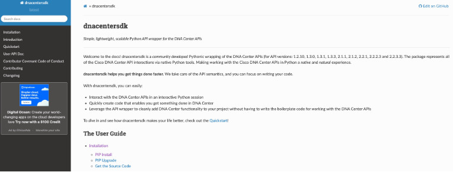
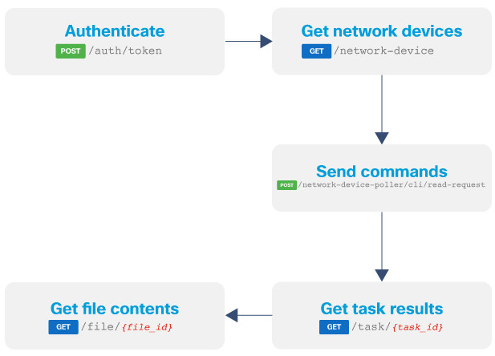

import Highlight from '@site/src/components/Highlight.js';
import Tabs from '@theme/Tabs';
import TabItem from '@theme/TabItem';
import CodeBlock from '@theme/CodeBlock';

## Introduction
What You’ll know
- Introduction to Cisco DNA Center SDK
- Understand Command Runner and usage
- Code a configuration manager

What You'll Need

- Set up [Python 3.x](https://www.python.org/downloads/)
- Use your IDE of [choice](https://code.visualstudio.com/)
- Install [Cisco DNA Center SDK](https://dnacentersdk.readthedocs.io/en/latest/)
- Access a [Cisco DNA Center instance](https://devnetsandbox.cisco.com/RM/Diagram/Index/c3c949dc-30af-498b-9d77-4f1c07d835f9?diagramType=Topology)

## DNA Center SDK first steps
Install DNA Center SDK

Just like any API or tool, your first stop is to check out the documentation:

- [Cisco DNA Center SDK Doc](https://dnacentersdk.readthedocs.io/en/latest/)


- Installing SDK is simple. In your terminal, execute:

```bash
pip install dnacentersdk
```

Quick Start: Let's Authenticate Using the SDK

By default, DNA Center SDK will look for the following environment variables to create new connection objects:
- **DNA_CENTER_USERNAME**: HTTP Basic Auth username
- **DNA_CENTER_PASSWORD**: HTTP Basic Auth password
- **DNA_CENTER_BASE_URL**: The base URL to be prefixed to the individual API endpoint suffixes

**In our case, we will not use environment variables. We will add it to part of our Python code.**

Let's Get Started!

1. **Clone the code repo.**

In your terminal, run:
```bash
git clone https://github.com/CiscoLearning/dnac-config-manager.git
```
Kick-start Python in interactive mode:
```bash
python3
```
- You can copy and paste the Python code snippets while in Python interactive mode.*

2. **Import the DNA Center SDK.**
```python
from dnacentersdk import DNACenterAPI
```
3. **Define the connection string.**

In this case, we will create a **Python dictionary** with the connection string:
```python
dnac_creds = {}
dnac_creds['url'] = 'https://sandboxdnac.cisco.com'
dnac_creds['username'] = 'devnetuser'
dnac_creds['password'] = 'Cisco123!'
```
4. **Instantiate "Connection Object."**
```python
dnac = DNACenterAPI(username=dnac_creds['username'], password=dnac_creds['password'], base_url=dnac_creds['url'], verify=False)
```
5. **Display your Auth Token.**
```python
print("Auth Token: ", dnac.access_token)
```
6. **Let's look at the completed script.**

Head over to the working directory from our cloned repo and run the `Authentication.py` file:
```bash
cd dnac-config-manager/
ls -al
```
7. **Run it.**
```bash
python Authentication.py
```
## What is Command Runner?
**Now that we have an understanding on how the DNA Center SDK works and we've authenticated, let's build our use case!**

Use Case Definition

I'd like to be able to take a snapshot of all of the device config to detect configuration drift and have a golden image.

Use Case Workflow
- Authenticate
- Get a list of all managed network devices
- Use Command Runner to retrieve the running config
- Save to a file



What Is Command Runner?

Command Runner is a feature in Cisco DNA Center that allows you to execute a handful of read-only (for now) Cisco IOS commands on the devices managed by DNA Center.

Here is how you can get a list of all supported Cisco IOS commands:
```python
commands = dnac.command_runner.get_all_keywords_of_clis_accepted()
```
⚠️ Cisco DNA Center API calls are asynchronous, which means that for each executed task, a task ID is created. Upon task completion, content can be retrieved from the /file endpoint.

API endpoints that we are planning on using:

- POST /dna/system/api/v1/auth/token
- GET /dna/intent/api/v1/network-device
- POST /dna/intent/api/v1/network-device-poller/cli/read-request
- GET /dna/intent/api/v1/task/`{task_id}`
- GET /dna/intent/api/v1/file/`{file_Id}`

SDK methods that we are planning on using:

- [Authentication](https://dnacentersdk.readthedocs.io/en/latest/api/api.html#dnacentersdk.api.authentication.Authentication)
- [devices.get_device_list()](https://dnacentersdk.readthedocs.io/en/latest/api/api.html#dnacentersdk.api.v1_3_1.devices.Devices.get_device_list)
- [command_runner.run_read_only_commands_on_devices()](https://dnacentersdk.readthedocs.io/en/latest/api/api.html#dnacentersdk.api.v1_3_0.command_runner.CommandRunner.run_read_only_commands_on_devices)
- [task.get_task_by_id()](https://dnacentersdk.readthedocs.io/en/latest/api/api.html#dnacentersdk.api.v1_2_10.task.Task.get_task_count)
- [file.download_a_file_by_fileid()](https://dnacentersdk.readthedocs.io/en/latest/api/api.html#dnacentersdk.api.v1_2_10.file.File.download_a_file_by_fileid)

Let's Code It!
## Coding Config. manager
Code Use Case

Device Config Backup


0. **Using your IDE of choice, create a new '.py' file and import libraries.**

Click the + sign next to the cloned folder ciscolive-devwks-2107:
```python
from dnacentersdk import DNACenterAPI
import json
import warnings
```
1. **Authenticate.**

By now, we know how to do this. We need to pass Basic Auth and capture our API token.

**Copy this step to the editor last; this needs to be at the end of the file.**
```python
if __name__ == '__main__':
    dnac_creds = {}
    dnac_creds['url'] = 'https://sandboxdnac.cisco.com'
    dnac_creds['username'] = 'devnetuser'
    dnac_creds['password'] = 'Cisco123!'

    dnac = DNACenterAPI(username=dnac_creds['username'], password=dnac_creds['password'], base_url=dnac_creds['url'],
                        verify=False)
    print("Auth Token: ", dnac.access_token)
    print("Gathering Device Info ... \n")
    get_device_list()
```
2. **Retrieve a list of devices.**

Use the devices class to call the `get_device_list()` method to retrieve a list of all managed devices.

Upon 200 OK, loop through the list of `Switches and Hubs `and extract the device ID. We need to leverage it to programmatically run the command on each device.

Access the device ID variable via `device.id` and pass it to and call the `cmd_run()` function (we will build next).

**Notice anything?**
```python
"""
This function handles getting device list
"""
def get_device_list():
    devices = dnac.devices.get_device_list()
    devicesuid_list = []
    for device in devices.response:
        if device.family == 'Switches and Hubs':
            print("Managed Device IP: {} ".format(device.managementIpAddress))
            devicesuid_list.append(device.id)
    print("\n")
    cmd_run(devicesuid_list)
```

3. **Initiate Command Runner.**

As we iterate over each device, we will need to execute the `show run` command. To do so, use the `command_runner` class and call `read run_read_only_commands_on_devices()` method. This method requires two inputs of type list: `commands` and `deviceUuids`.

Upon execution, DNA Center will return a `taskId` (asynchronous, remember?).

Check its progress via the `task` class by calling the `get_task_by_id()` method. Once the task has been successfully executed (you can use the built-in error handling within the SDK to check, but that’s for another blog post), grab the returned `fileId`.

Now, simply access the `file` class and call the `download_a_file_by_fileid()` method ... and VOILA!

```python
"""
This function handles command runner execution
"""
def cmd_run(device_list):
    for device in device_list:
        print("Executing Command on {}".format(device))
        run_cmd = dnac.command_runner.run_read_only_commands_on_devices(commands=["show run"], deviceUuids=[device])
        print("Task started! Task ID is {}".format(run_cmd.response.taskId))
        task_info = dnac.task.get_task_by_id(run_cmd.response.taskId)
        task_progress = task_info.response.progress
        print("Task Status : {}".format(task_progress))
        while task_progress == 'CLI Runner request creation':
            task_progress = dnac.task.get_task_by_id(run_cmd.response.taskId).response.progress
        task_progress= json.loads(task_progress)
        cmd_output = dnac.file.download_a_file_by_fileid(task_progress['fileId'], dirpath='file.json', save_file=True)
        print("Saving config for device ... \n")
```

Run It!

This is a great example of configuration management. You could use this as a base to start building out a simple configuration drift monitoring tool, given that the config is returned as JSON data. We can easily use a JSON query to check for any configuration drift and automatically rebase it to the original config.

This can be taken a step further even by leveraging Git for version control of your device config.

## References:

- [Cisco Learning Network DevNet Certifications Community](https://learningnetwork.cisco.com/s/topic/0TO3i0000008jY5GAI/devnet-certifications-community)
- [ENAUTO Certification](https://www.cisco.com/c/en/us/training-events/training-certifications/exams/current-list/enauto-300-435.html)
