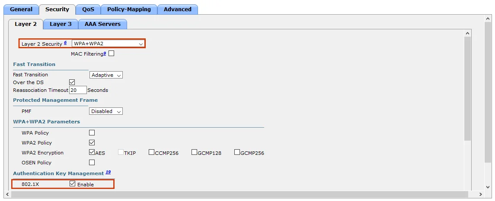

import Highlight from '@site/src/components/Highlight.js';
import Tabs from '@theme/Tabs';
import TabItem from '@theme/TabItem';
import CodeBlock from '@theme/CodeBlock';

:::caution
I've only covered what I observed, so please refer to the complete guide for more information.
You can find it at:
  - [Security Design](https://www.cisco.com/c/en/us/td/docs/solutions/Enterprise/Education/SchoolsSRA_DG/SchoolsSRA-DG/SchoolsSRA_chap4.html)
  - Cisco U.
:::

## Introduction

The Institute of Electrical and Electronics Engineers (IEEE) 802.1X standard was created to provide strong Layer 2 edge network authentication and authorization to secure wired and wireless networks. To successfully deploy IEEE 802.1X for Cisco secure network access, you must configure the supplicant, authenticator, and authentication server for 802.1X operation.

This article will cover steps to configure 802.1X on:

- Cisco Catalyst Switch: an 802.1X authenticator for wired users and devices
- Cisco Wireless LAN Controller: an 802.1X authenticator for wireless users and devices
- Cisco ISE: the RADIUS authentication and authorization server
- 802.1X Endpoint: a Cisco AnyConnect NAM or Native OS supplicant

## Cisco Catalyst Switch 802.1X Configuration
You can use a phased approach when deploying 802.1X. This phased approach helps you to determine the potential impact to devices, adjust policy enforcement over time, and ensure a smooth transition to identity-based policy services.


You can use these 802.1X deployment modes:
- **Monitor (open) mode**: Allows you to enable authentication across the wired infrastructure, without affecting wired users or devices. It can be thought of as an audit mode. With the help of logging data for validation, administrators use the monitor mode to help ensure that all devices are authenticating correctly, either with 802.1X or MAB. If a device is misconfigured or is missing an 802.1X supplicant, access will be allowed and logged. However, if authentication succeeds, authorization (for example, Dynamic VLAN, downloadable access control list (dACL)) can still be applied.
- **Low-impact mode**: It allows selective transition from an open (nonfiltering) preauthorization method to selective preauthorization. This function is provided by static port ACLs (Pre-ACL as shown in the previous figure) that allow necessary services such as Dynamic Host Configuration Protocol (DHCP) and Domain Name System (DNS) while blocking all other network access. Users connected to controlled ports will receive additional access (based on policy) after successful authentication, based on the dACL that will override the static ACL on the port.
- **High-security (closed) mode**: It provides the highest level of control by configuring the closed preauthorization port control. No traffic will be permitted on a port except Extensible Authentication Protocol over LAN (EAPOL) before authentication and authorization.

### 802.1X Phased Deployment Modes

#### Monitor Mode


In the monitor mode, the open access feature allows end user access, regardless of authentication results. Thus, the 802.1X, MAB, or web authentication deployment has no effect on user access. 802.1X-enabled ports do not block traffic before successful authentication and authorization, as they would normally. This feature allows you to create an initial Cisco ISE deployment and learn about your network without having to worry about blocking access unintentionally.

:::note
The monitor mode is like placing a security camera at the door to monitor and record port access behavior. You can enable RADIUS accounting to log authentication attempts. You gain visibility on who and what is connecting to your network with an audit trail.
:::

In the monitor mode, you can discover the following:

- Which endpoints connect to your network, such as PCs, printers, and cameras.
- Where these endpoints connect to the network (switch, port).
- Whether they are 802.1X-capable or not.
- Whether they have valid credentials.
- In the event of failed MAB attempts, whether the endpoints have known, valid MAC addresses.

#### Low-Impact Mode

The low-impact mode allows you to incrementally increase your security. You may have previously configured ports for open mode to gain insight into the network and endpoint usage. Now you can configure these open ports with a preauthentication ACL and permit only basic connectivity for unauthenticated hosts.


For example, unauthenticated users may be able to use DHCP, DNS, and perhaps get to the Internet without gaining access to all internal resources.

After successful authentication, the Cisco ISE authentication server sends a DACL to override any existing port ACL. This action provides differentiated access for authenticated users.

#### Closed Mode

The last option for 802.1X-enabled switch ports involves strict use of the traditional, closed mode, along with differentiated access, which could be dynamic VLAN assignment, DACLs, or another authorization mechanism. Formerly known as the high-security mode, it allows only Extensible Authentication Protocol over LAN (EAPOL) traffic until the authentication process completes, which is the default behavior of an 802.1X- enabled switch port. EAP is the message format and framework defined by RFC 4187 that provides a way for the supplicant and the authenticator to negotiate an authentication method (the EAP method). EAP over LAN (EAPoL) is the encapsulation defined by 802.1X for the transport of the EAP from the supplicant to the switch.


#### 802.1X Fallback Options

Even though IEEE 802.1X supplicant support on user's devices is ubiquitous, either coming directly from the operating system vendor as a preinstalled package or as a third-party add-on, there are always some devices that either do not have the supplicant installed or supported. Such non-supplicant devices can come in the form of wired or wireless devices, such as laptops, printers, IP cameras, tablets, and other mobile devices.


There are also some users that bring their own laptops or mobile devices into a network and those devices are usually not configured with the supplicant or do not have correct credentials to authenticate. Sometimes, the device lacks 802.1X support altogether.

Quite often, you also need to consider devices belonging to visiting users that may have the 802.1X supplicant configured but lack local credentials to authenticate inside your network. Such devices will initiate 802.1X authentication but will fail the authentication because of invalid credentials.

In that case, you need to configure some kind of a fallback mechanism in an 802.1X enabled network that will allow connectivity from such devices to the network. Here are the available mechanisms:

- MAB
- Guest VLAN
- Authentication fail VLAN
- Central Web Authentication (CWA) with Cisco ISE

Some of the methods listed above are mutually exclusive. It is your task to decide which mechanisms you will use during the design process of an 802.1X deployment.

### MAC Authentication Bypass (MAB)

MAB uses a MAC address for both the username and password. This authentication is the most basic form of authentication in deployments because many devices either do not, or cannot, support 802.1X. Because MAC addresses are easily spoofed, they are a relatively weak form of authentication, but they are a good first step for device identification. It is very common to use MAB as an 802.1X fallback mechanism to authenticate simple devices, such as printer, IP cameras, or physical access control mechanisms, such as card readers.


The figure illustrates a high-level functional sequence when MAB is configured as a fallback mechanism to 802.1X. If 802.1X is not enabled, the sequence is the same except that MAB starts immediately after link-up, instead of waiting for IEEE 802.1X to time out.


As you can see from the figure, there are four phases:

- **Phase** 1: Initiation
- **Phase** 2: MAC Address Learning
- **Phase** 3: Authorization
- **Phase** 4: Accounting

**Phase 1, Initiation**: From the switch’s perspective, authentication begins when the switch detects link-up on a port. The switch initiates authentication by sending an EAP Request-Identity message to the endpoint. If the switch does not receive a response, it retransmits the request at periodic intervals. If no response is received after the maximum number of retries, the switch lets IEEE 802.1X time out and proceeds to MAB, if configured.

**Phase 2, MAC Address Learning**: During the MAC address learning stage, the switch begins MAB by opening the port to accept a single packet. The switch will then learn the source MAC address of the endpoint. Packets that are sent before the port has fallen back to MAB (that is, during the IEEE 802.1X timeout phase) are discarded immediately. They cannot be used to learn the MAC address. The switch can use almost any Layer 2 and Layer 3 packets to learn MAC addresses. The exception are frames such as Cisco Discovery Protocol, Link Layer Discovery Protocol (LLDP), Spanning Tree Protocol (STP), and Dynamic Trunking Protocol (DTP). After the switch learns the source MAC address, it discards the packet. Then the switch crafts a RADIUS Access-Request packet. By default, the Access-Request message is a PAP authentication request. The request includes the source MAC address in three attributes: Attribute 1 (Username), Attribute 2 (Password), and Attribute 31 (Calling-Station-Id).

Although the MAC address is the same in each attribute, the format differs, which is important because different RADIUS servers may use different attributes for MAC address validation. Some RADIUS servers may look at only Attribute 31 (Calling-Station-Id), while others will actually verify the username and password in Attributes 1 and 2. MAB uses the MAC address as both a username and password, so be sure that the RADIUS server can differentiate MAB requests from other request types. This differentiation will prevent other clients from attempting to use a MAC address as a valid credential. Cisco switches uniquely identify MAB requests by setting Attribute 6 (Service-Type) to 10 (Call-Check) in a MAB Access-Request message. Therefore, you can use Attribute 6 to filter MAB requests at the RADIUS server.

**Phase 3, Authorization**: If the MAC address is valid, the RADIUS server returns a RADIUS Access-Accept message. This message informs the switch to allow endpoint port access. Optionally, the RADIUS server may include dynamic network access policy instructions in the Access-Accept message, which could be a dynamic VLAN or DACL. In the absence of dynamic policy instructions, the switch simply opens the port. If MAB succeeds, it will try no further authentication methods.

If the MAC address is invalid or is rejected by network policy, the RADIUS server returns a RADIUS Access-Reject message. This message indicates that the switch should deny endpoint access to the port. Depending on how the switch is configured, several different outcomes are possible. If alternative authentication or authorization methods are configured, the switch may attempt IEEE 802.1X authentication or web authentication or deploy the guest VLAN.

If no fallback authentication or authorization methods are configured, the switch will stop the authentication process and the port will remain unauthorized. You can configure the switch to restart authentication after a failed MAB attempt. You must configure the interface with the authentication timer restart feature. Once enabled, unknown MAC addresses will periodically fail authentication until the endpoint disconnects from the switch or the address is added to a MAC database. To prevent the unnecessary control-plane traffic that is associated with restarting failed MAB sessions, Cisco generally recommends that you leave authentication timer restart disabled.

**Phase 4, Accounting**: If the switch can successfully apply the authorization policy, the switch can send a RADIUS Accounting-Request message to the RADIUS server with details about the authorized session.

### Guest VLAN

The guest VLAN feature is designed to support non-supplicant hosts that are attempting to access a wired switch port that is configured for the 802.1X port control. After three EAP retries, the switch dynamically places that port on a guest VLAN that is configured on the switch port. Guest VLAN is compatible with MAB. If MAB is configured and MAB fails after 802.1X failure, the port can be moved to the guest VLAN. The guest VLAN traffic is typically restricted by using an ACL on the termination point of the VLAN, for example, to allow access only to the Internet.

The example that is shown in the figure allows secure guest access to the internet through a Cisco Adaptive Security Appliance (ASA) firewall


:::note
The guest VLAN functionality in combination with MAB does not work with the default configuration of Cisco ISE. Cisco ISE MAB authentication policy is by default configured in such a way that MAB will always succeed for the unknown MAC addresses. This means that the configured guest VLAN functionally on the switch never kicks in. In such case, you can use dynamic guest VLAN functionality, which relies on the Cisco ISE server to assign a VLAN when an unknown MAC address attempts to access the port after IEEE 802.1X times out or fails. The dynamically assigned VLAN would be one for which restricted access can be enforced. From the perspective of the switch, MAB passes even though the MAC address is unknown. The advantage of this approach over the local guest VLAN is that the Cisco ISE server is aware of and in control of unknown endpoints. Centralized visibility and control make this approach even more preferable.
:::

### Restricted VLAN

Sometimes, a guest user will connect to the network of your organization with a host with 802.1X supplicant software. When the host plugs in to the switch port, the supplicant will initiate an EAPOL connection with the switch. However, because the user lacks local authentication credentials, authentication will fail. By configuring a restricted VLAN, the user can be dynamically assigned to a VLAN for restricted access.

Restricted VLAN (also referred to as an authentication failed VLAN) and MAB are mutually exclusive. After 802.1X authentication failure, the switch can be configured either to deploy restricted VLAN or proceed to the next authentication method, which is usually MAB.


:::Note
Similar as with the guest VLAN functionality, you can use the dynamic VLAN functionality, which relies on the Cisco ISE server to assign a dynamic guest VLAN after IEEE 802.1X times out or fails. In most cases with Cisco ISE deployments, dynamic guest and restricted VLAN will be the same and will be dynamically pushed from Cisco ISE.
:::

### 802.1X Host Modes

The host mode of the 802.1X port determines whether more than one client can be authenticated on the port and how authentication will be enforced. You can configure an 802.1X port to use any of the four host modes that are described. In addition, each mode may be modified to allow preauthentication open access.

- **Single host mode**: In the single host mode, only one client can be connected to the 802.1X-enabled port. When the port state changes to "up," the switch detects the client and sends an EAPOL frame. Client access is granted after authentication. Packets from other hosts are dropped. If the client leaves, or is replaced with another client, the switch changes the port link state to "down." The port is then returned to the unauthorized state.

- **Multiple host mode**: In the multiple host mode (often called multihost mode), you can attach multiple hosts to a single 802.1X-enabled port. In this mode, only the first client that attaches clients must be authorized. All subsequent clients are granted network access based on this authentication. If the port becomes unauthorized (reauthentication fails or an EAPOL logoff message is received), the authenticator denies network access to all attached clients.


- **Multiple Domain Authentication Mode**: Multidomain Authentication (MDA) mode allows an IP phone, and a single host behind the IP phone, to authenticate independently via 802.1X, MAB, or (for the host only) web-based authentication. In this application, multidomain refers to two domains (data and voice VLAN). Only one MAC address is allowed per domain. The switch can place the host in the data VLAN and the IP phone in the voice VLAN, but they appear on the same switch port. The data and voice VLAN assignment can be obtained dynamically from the authentication, authorization, and accounting (AAA) server such as Cisco ISE.

- **Multiple Authentication Mode**: Multiple Authentication mode (often called multiauth mode) allows one 802.1X or MAB client on the voice VLAN. It also allows multiple authenticated 802.1X, MAB, or web authorization clients on the data VLAN. When a hub or access point is connected to an 802.1X port, multiauth mode provides enhanced security over the multihosts mode by requiring authentication of each connected client. For non-802.1X devices, MAB, or web-based authentication, can be used as the fallback method for individual host authentications, which allows different hosts to be authenticated through different methods on a single port.


In this mode, the first host that is authorized on the port defines the group VLAN assignment, and subsequent hosts will be added to the same group VLAN. The subsequent hosts may either have no VLAN assignment in the RADIUS database, or their configured group VLAN must match the assigned group VLAN on the port. Otherwise, they will be denied access to the port.

Furthermore, if the authentication server assigns a DACL, the DACL will be modified to use the authenticated host’s IP address as the source address. In other words, in multiauth mode, per-host differentiated DACLs are supported.

### 802.1X Flexible Authentication

Flexible authentication provides a flexible timeout and fallback mechanism among 802.1X, MAB, and local web authentication methods.


On switch ports that are configured for 802.1X port control, Flexible Authentication, or FlexAuth, sets the order of methods that the switch attempts when trying to authenticate a new device that is connected to a port. If one method in the list is unsuccessful, the next method is attempted. This simplifies the identity configuration by providing a single set of configuration commands to manage different types of endpoints connecting to the switch ports.

In addition, FlexAuth sequencing allows you to configure any authentication method on a standalone basis. In other words, MAB can be configured without requiring 802.1X configuration.

By default, the Cisco Catalyst switch will first perform 802.1X authentication. If it fails, and the switch is configured to proceed with the next method, such as MAB, the switch will then perform MAB.

In environments where the majority of hosts authenticate using MAB, you may want a switch to perform MAB first and 802.1X second. This will prevent hosts being delayed when accessing the network and waiting for 802.1X to timeout.

When the authentication order is set to initiate MAB first, the endpoint directory on the authentication server will be queried. If the host has an 802.1X supplicant, the supplicant will also initiate 802.1X authentication from its side. As a result, it may happen that both MAB and 802.1X authentication will succeed. In such case, you need to configure FlexAuth priority for 802.1X authentication to have priority over MAB. In such case, if the supplicant on the port begins an EAPOL session, MAB will be interrupted, and normal authentication will proceed.

When designing 802.1X deployment, you should weigh the benefit of quickly authenticating MAB devices against the additional authentication overhead.

:::note
Setting FlexAuth to authenticate using MAB first and 802.1X second may cause problems when periodic reauthentication is enabled on a switch. In such cases, the switch will initiate new authentication request using MAB, once periodic re-authentication kicks in. MAB authentication with Cisco ISE default configuration does not fail for unknown endpoints, especially in a combination with central web authentication, so the switch will assign authorization attributes from MAB authentication and will never proceed to 802.1X. In such case, all previously 802.1X authenticated hosts will get access as defined by the Cisco ISE MAB authorization policy. When using re-authentication in a combination with central web authentication, it is recommended to perform 802.1X authentication first, and rather decrease 802.1X timers in order for MAB to happen sooner.
:::

### Inaccessible Authentication Bypass

When deploying 802.1X it is also recommended to deploy the inaccessible authentication bypass feature, also referred to as critical authentication or the AAA fail policy. This feature is applied when the switch cannot reach the configured RADIUS servers (ISE) and new hosts cannot be authenticated. If the feature is configured, when a new host tries to connect to the port and RADIUS server (ISE) is not reachable, that host is moved to a user-specified access VLAN, the critical VLAN.

Port is put into critical-authentication state if AAA server (ISE) is not reachable.


When a new host tries to connect to the critical port, that host is moved to a user-specified access VLAN, the critical VLAN. You usually allow limited connectivity inside that VLAN.

When the switch tries to authenticate a host connected to a critical port, the switch checks the status of the configured RADIUS server (ISE). If a server is available, the switch can authenticate the host. However, if all the RADIUS servers (ISEs) are unavailable, the switch grants network access to the host and puts the port in the critical-authentication state, which is a special case of the authentication state.

You can configure the critical port to reinitialize hosts and move them out of the critical VLAN when the RADIUS server (ISE) is again available. When this is configured, all critical ports in the critical-authentication state are automatically re-authenticated.

Inaccessible authentication bypass works for voice VLAN as well. With the critical voice VLAN configuration, when the RADIUS server (ISE) does not respond, the port goes into critical authentication mode. When traffic coming from the host is tagged with the voice VLAN, the connected device (the phone) is put in the configured voice VLAN for the port. The IP phones learn the voice VLAN identification through CDP (Cisco devices) or through LLDP or DHCP.

:::note
Low-impact mode does not work well with the inaccessible authentication bypass feature. When a RADIUS server (ISE) is not reachable, a port is put into critical state and critical VLAN is applied. The problem is that preauthentication ACL is still applied to the port in critical state, therefore limiting traffic going through the port into the critical VLAN.
:::

### 802.1X Timers

802.1X relies on several timers and variables to control the timing of the authenticator functionality on the switch. Before 802.1X deployment you should be familiar with 802.1X timers that greatly improve 802.1X authentication process for endpoints that authenticate using MAB.

At the link up event, the switch sends an EAP Request-Identity frame. It waits for a period of time defined by the dot1x timeout tx-period timer and then sends another Request-Identity frame. The number of times it resends the Request-Identity frames is defined by `dot1x max-reauth-req` variable.


The combination of tx-period and max-reauth-req is especially important for non-802.1X capable endpoints. Endpoints without a supplicant must wait until 802.1X times out before getting network access via a fallback mechanism (such as MAB). The total time it takes for 802.1X to time out is determined by the following formula:

> Timeout = (max-reauth-req +1) * tx-period

Cisco Catalyst switches have default values of tx-period = 30 seconds and max-reauth-req = 2. Applying the above formula, it takes 90 seconds by default for an endpoint without a supplicant to get access via MAB, or the Guest VLAN. By modifying these two settings, you can decrease the total timeout down to a minimum value of two seconds.

Because of the impact on endpoints without supplicants, it is generally recommended to change the default values of tx-period and/or max-reauth-req to allow a more rapid access to the network. When modifying these values, consider the following:

- A timer that is too short may result in 802.1X capable endpoints being subject to a fallback authentication or authorization technique. Although supplicants can send an EAPoL-Start frame to restart 802.1X after a fallback has occurred, you may still be generating unnecessary control plane traffic. In addition, if the endpoint has been authorized by a fallback method, that endpoint may temporarily be adjacent to guest devices that have been similarly authorized. If your goal is to ensure that your 802.1X capable assets are always and exclusively on a trusted network, you should ensure that the timer is long enough to allow 802.1X capable endpoints time to authenticate.

- A timer that is too long can subject endpoints without a supplicant to unnecessarily long delays in getting network access.

| Command | Description |
| --- | --- |
| `dot1x timeout tx-period seconds` | Configures the number of seconds between retransmission of EAP request/identity frame packets (assuming that no response is received) to the client |
| `dot1x max-reauth-req number` | Sets the maximum number of times the authenticator sends an EAP request/identity frame (assuming that no response is received) to the client |

:::note
Test `tx-period` and `max-reauth-req` in your network. Because the optimal value for the timeout depends on the specific details of your network, it is recommended that you use the 802.1X deployment planning phase to test whichever value you select. Pay particular attention to DHCP clients, PXE clients, and the specifics of your managed desktop infrastructure.
:::

:::note
There are also other 802.1X timers that you can tune but are not discussed. These other timers are rarely invoked in typical 802.1X deployments and are usually not changed.
:::

### Configure 802.1X on a Cisco Catalyst Switch
To configure 802.1X on a Cisco Catalyst switch you need to first configure global AAA settings. These settings include enabling AAA new-model and configure AAA lists for 802.1X.

Next, you need to configure global RADIUS settings, which include configuration of individual RADIUS servers (ISE), RADIUS server group, RADIUS attributes, and RADIUS Change of Authorization (CoA). The RADIUS CoA feature provides a mechanism to change the attributes of an authentication, authorization, and accounting (AAA) session after it is authenticated. When there is a policy change for a user or user group in AAA, RADIUS CoA packets can be sent from the AAA server such as ISE to reinitialize the authentication and apply the new policy.

Then, enable the IP device tracking functionality. The purpose of IP device tracking is for the switch to obtain and maintain a list of devices that are connected to the switch via an IP address. This functionality is critical whenever DACLs are used with 802.1X in order to replace the "any" keyword as the source in the ACL with the IP address of the device connected to the switch.

Now you need to enable 802.1X authentication globally.

Finally, you enable 802.1X functionality and related features on every interface you would like to enable for secure network access. These settings include enabling 802.1X and MAB, configuring order of 802.1X and MAB using Flexible Authentication, tuning of 802.1X timers, setting deployment mode, setting host mode, enabling reauthentication, configuring guest and restricted VLAN, and enabling Inaccessible Authentication Bypass (IAB) or critical data VLAN and critical voice VLAN. Some of these settings are discussed below.

### Configure Global AAA Settings
First, you need to configure global AAA settings.

Enter configuration mode and enable AAA and 802.1X:

```bash
aaa new-model
```

Configure AAA for 802.1X:
```bash
aaa authentication dot1x default group ISE
aaa authorization network default group ISE
aaa accounting dot1x default start-stop group ISE
```

The table shows the first global configuration commands that are required to enable AAA and 802.1X support on a Cisco Catalyst access switch.

| Command | Description |
| --- | --- |
| `aaa new-model` | Globally enables the AAA access model on the switch |
| `aaa authentication dot1x default group ISE` | Globally enables 802.1X authentication. The `default group ISE` portion of the command causes the switch to use RADIUS server that are defined in the ISE server group. |
| `aaa authorization network default group ISE` | Globally enables the RADIUS server to perform authorization tasks such as VLAN assignment and downloadable ACLs. |
| `aaa accounting dot1x default start-stop group  ISE` | Sends a start accounting notice at the beginning of a process and a stop accounting notice at the end of a process. The user process begins regardless of whether the start accounting notice was received by the accounting server. |

### Configure Global RADIUS Settings

The next example shows how to configure an AAA server (ISE). It is a best practice to configure an automated user to periodically test availability of the AAA server (ISE) and to configure RADIUS dead-server detection.

Configure the RADIUS server with a shared secret and automated test user:

```bash
radius server ISE
 address ipv4 10.64.0.100 auth-port 1812 acct-port 1813
 automate-tester username dummy ignore-acct-port
 key 3df23d21
```

Configure RADIUS dead-server detection:

```bash
radius-server dead-criteria time 5 tries 3
radius-server deadtime 3
```

The `auth-port` and `acct-port` command arguments when specifying AAA server's IP address are optional. However, if these arguments are not included, the authentication port is UDP 1645 and the accounting port is UDP 1646. Cisco ISE listens on UDP ports 1812 and 1813 and UDP ports 1645 and 1646 to ensure maximum compatibility. For operational consistency, it is a best practice to standardize on one set of RADIUS UDP ports.

It is recommended to enable the automated testing feature for the RADIUS server. With this practice, the switch sends periodic test authentication messages to the RADIUS server. It looks for a RADIUS response from the server. A success message is not necessary, a failed authentication will suffice, because it shows that the server is alive.

It is also recommended to enable the AAA dead-server detection feature to specify the criteria that are used to mark a RADIUS server as dead. That is, you can configure the minimum amount of time, in seconds, that must elapse from the time that the switch last received a valid packet from the RADIUS server to the time the server is marked as dead. In addition, you can configure the number of consecutive timeouts that must occur on the switch before the RADIUS server is marked as dead.

The table explains the commands that are needed to configure global RADIUS settings.

| Command | Description |
| --- | --- |
| `radius server ISE` | Specifies the name for the RADIUS server |
| `address ipv4 100.64.0.100 auth-port 1812 acct-port 1813` | Assigns an IPv4 address and optionally authentication and accounting ports to the RADIUS server |
| `automate-tester username dummy ignore-acct-port` | Enables the automated testing feature for the RADIUS server with disabled testing on the UDP port for the RADIUS accounting server |
| `key 3df23d21` | Specifies the shared secret text string used between the device and the RADIUS server |
| `radius-server dead-criteria time 5 tries 3` | Determines how long to wait for a response from the RADIUS server before declaring it dead and attempting a connection to the next available server. In this example, the switch is configured for a 5- second timeout and will retry three times. This yields a dead time of 15 seconds (5 * 3). |
| `radius-server deadtime 3` | Specifies amount of time in minutes before declaring previously dead RADIUS server us accessible again |

In the next step, create a RADIUS server group and add previously configured RADIUS servers to the group for easier configuration management. Also enable CoA, which is needed for Cisco ISE services.

Configure the RADIUS server group:

```bash
aaa group server radius ISE
 server name ISE
```

Configure RADIUS CoA:

```bash
aaa server radius dynamic-author
 client 10.64.0.100 server-key 3df23d21
```

The following table explains the commands that are needed to configure a RADIUS server group and to enable RADIUS CoA.

| Command | Description |
| --- | --- |
| `aaa group server radius ISE` | Defines the AAA server group with a group name |
| `server name ISE` | Associates previously defined RADIUS server with the defined server group |
| `aaa server radius dynamic-author` | Enters dynamic authorization local server configuration mod |
| `client 10.64.0.100 server-key 3df23d21` | Configures the RADIUS key to be shared between a device and RADIUS clients |

The next example in the figure shows the commands that allow the switch to send RADIUS vendor-specific attributes (VSAs) to the authentication server, Cisco ISE.

Configure support to send RADIUS vendor-specific attributes (VSAs):

```bash
radius-server vsa send authentication
radius-server vsa send accounting
```

Define which RADIUS attributes to include with authentication requests:

```bash
radius-server attribute 6 on-for-login-auth
radius-server attribute 8 include-in-access-req
radius-server attribute 25 access-request include 
```

The following table explains the commands that are needed to enable RADIUS VSA attributes.

| Command | Description |
| --- | --- |
| `radius-server vsa send authentication` | Allows the switch to send authentication-related VSAs to the authentication server |
| `radius-server vsa send accounting` | Allows the switch to send accounting-related VSAs to the authentication server |
| `radius-server attribute 6 on-for-login-auth` | Provides for the service-type attribute (attribute 6) in RADIUS Access-Accept messages |
| `radius-server attribute 8 include-in-access-req` | Instructs the switch to include the user IP address in the Access-Request message |
| `radius-server attribute 25 access-request include` | Instructs the switch to include the RADIUS class attribute in the Access-Request message. Failure to include this attribute can cause Cisco ISE to improperly process accounting messages. |

### Enable IP Device Tracking

Enable IP device tracking:

```bash
ip device tracking
ip device tracking probe delay 10
```

The purpose of IP device tracking is for the switch to obtain and maintain a list of devices that are connected to the switch via an IP address. In order to do this, it sends unicast ARP probes with a default interval of 30 seconds; these probes are sent to the MAC address of the host connected on the other side of the link and use the source MAC address of the physical interface out of which the Address Resolution Protocol (ARP) goes and a sender IP address of 0.0.0.0.

When enabling IP device tracking, it is recommended to configure the probe delay of 10 seconds. This minimizes the possibility to have the probe sent while the host on the other side of the link checks for duplicate IP addresses. If you do not configure the delay, you may start getting duplicate IP address errors on Microsoft Windows machines while they are in the DHCP request phase. In that case, the PC might not obtain an address, and the user must manually release or renew the address, disconnect and reconnect to the network, or reboot the PC in order to gain network access.

The table explains the commands that are needed to enable IP device tracking.

| Command | Description |
| --- | --- |
| `ip device tracking` | Enables IP device tracking globally |
| `ip device tracking probe delay 10` | Does not allow a switch to send a probe for 10 seconds when it detects a link UP, which minimizes the possibility to have the probe sent while the host on the other side of the link checks for duplicate IP addresses. |

### Globally Enable 802.1X

Enable 802.1X globally:

`dot1x system-auth-control`

The following table explains the command to globally enable 802.1X authentication on the switch.

| Command | Description |
| --- | --- |
| `dot1x system-auth-control` | Globally enables 802.1X authentication on the switch |

Optionally, create an access list to define permitted traffic before the port is authenticated (used for low-impact mode):

```bash
ip access-list extended PRE-AUTH
 remark DHCP
 permit udp any eq bootpc any eq bootps
 remark DNS
 permit udp any any eq domain
 remark Ping
 permit icmp any any echo
 remark PXE / TFTP
 permit udp any any eq tftp
 remark Drop and log the rest
 deny ip any any log 
```

The example also shows a configured ACL that will be applied in the inbound direction on ports configured for 802.1X to implement low-impact mode. Without an ACL to permit basic services, protocols such as DHCP may time out waiting for the host supplicant to authenticate to the switch port.

### Configure Interface Specific Settings
Once you are done configuring global settings, you need to apply interface-specific 802.1X commands on all interfaces that will run the 802.1X authentication.

The example shows how to configure a switch port for basic operations, which is required before you can apply an 802.1X configuration:

- First, enter the interface configuration mode.
- Set the port mode to access.
- Configure the access VLAN.
- Bind the preauthentication port ACL to the interface.
- Enable PortFast

```bash
interface GigabitEthernet1/0/1
 description PC
 switchport mode access 
 switchport access vlan 10
 spanning-tree portfast 
 ip access-group PRE-AUTH in
```

| Command | Description |
| --- | --- |
| `switchport mode access` | Configures the switch port as an access port for host attachment |
| `switchport access vlan 10` | Associates the port with access VLAN 10 |
| `spanning-tree portfast` | Allows a switch port to transition directly from spanning-tree blocking state to forwarding state |
| `ip access-group PRE-AUTH in` | Applies the named access list to the switch port in the inbound direction |

The next example shows the minimum commands that are necessary to configure 802.1X on an interface:

- Optionally, allow hosts to access the network before the port is authorized (low-impact mode)
- Enable 802.1X support on the interface.
- Enable periodic reauthentication of the supplicant.
- Configure the reauthentication timeout.

The timer value can be set explicitly or be derived from RADIUS attribute 27 (session timeout).

```bash
interface GigabitEthernet1/0/1
 authentication open
 authentication port-control auto
 authentication periodic
 authentication timer reauthenticate server
```

| Command | Description |
| --- | --- |
| `authentication open` | Allows traffic to flow into a controlled port before it is authenticated. The use of an interface ACL is strongly recommended when this command is used. |
| `authentication port-control auto` | Enables port-based authentication and causes the port to begin in the unauthorized state, allowing only EAPOL frames to be sent and received through the port |
| `authentication periodic` | Allows the switch port to periodically require a supplicant to reauthenticate to the network. If this command is not configured on an interface with 802.1X port control, the supplicant remains authenticated indefinitely. |
| `authentication timer reauthenticate server` | Configures the reauthentication interval. The final argument in the command can be set to `timer` or `server`. If set to `timer`, the default reauthentication timeout is 3600 seconds (1 hour). If the argument is set to `server`, the reauthentication timer is configured on the RADIUS server by setting the Session-Timeout RADIUS attribute (attribute 27). |

There are special considerations for the configuration of switch ports where an IP phone has a PC connected to it. By default, only one MAC address is permitted to be authenticated in an 802.1X-controlled switch port. Therefore, you need to enable MDA. It allows two MAC addresses to authenticate separately on the voice and data VLANs.

Another deployment option for IP phones without a supplicant with tethered PCs is to allow MAB for the IP phone and require 802.1X authentication for the PC. The functionality that allows both authentication types is a feature called flexible authentication (FlexAuth). FlexAuth allows administrators to support both MAB and 802.1X on the same switch port and to also specify order and priority of the authentication mechanisms.

Generally, it is recommended to set the FlexAuth order to 802.1X authentication first and MAB second. The same applies for the priority.

The next example shows how to configure support for an IP phone:

- Configure a voice VLAN.
- Configure MDA.
- Configure FlexAuth authentication order.
- Configure FlexAuth authentication priority.
- Enable MAB on the interface.

```bash
interface GigabitEthernet1/0/1
 description IP Phone + PC
 switchport voice vlan 40
 authentication open
 authentication host-mode multi-domain
 mab
 authentication order dot1x mab
 authentication priority dot1x mab
 authentication event fail action next-method
```

| Command | Description |
| --- | --- |
| `authentication host-mode multi-domain` | Enables MDA. MDA allows one MAC address on the voice VLAN and one MAC address on the data VLAN to authenticate using 802.1X. |
| `authentication open` | When used with MDA, the `authentication open` command allows traffic to flow on the voice and data VLANs before authentication is successful. It is a best practice to apply an interface ACL to restrict allowed traffic before authentication. |
| `mab` | This command enables MAC-based authentication on a port. |
| `authentication order dot1x mab` | This `FlexAuth` command allows the administrator to select the order in which authentication methods are executed. |
| `authentication priority dot1x mab` | This `FlexAuth` command determines the priority of authentication methods. |
| `authentication event fail action next-method` | Specifies the behavior when authentication fails. In the example the next configured authentication method, which is MAB, is attempted. |

The next example shows how to enable inaccessible authentication bypass (critical data VLAN and critical voice VLAN):

- Configure critical VLAN for data
- Configure critical voice VLAN
- Reinitialize port when AAA server comes back up

```bash
interface GigabitEthernet1/0/1
 authentication event server dead action authorize vlan 88
 authentication event server dead action authorize voice
 authentication event server alive action reinitialize
```

| Command | Description |
| --- | --- |
| `authentication event server dead action authorize vlan 88` | Configures a critical VLAN to move hosts on the port to the user-specified critical VLAN if the RADIUS server is unreachable. |
| `authentication event server dead action authorize voice` | Configures critical voice VLAN to move data traffic on the port to the voice VLAN if the RADIUS server is unreachable. |
| `authentication event server alive action reinitialize` | Re-initializes a port when RADIUS server becomes reachable again. |

### Review Cisco Catalyst Switch 802.1X Configuration

In the next demonstration slide, you will review a complete 802.1X configuration on the Cisco Catalyst switch.


<details>
  <summary>The following figure shows the topology that is used for this slide:</summary>
    
</details>

## Cisco WLC 802.1X Configuration
To deploy 802.1X for wireless network you need to start with configuration of global AAA settings on Cisco WLC. This configuration includes specifying Cisco ISE server as authentication and accounting server, including needed RADIUS configuration, such as RADIUS preshared key and RADIUS CoA configuration.

The next step in deploying 802.1X for wireless networks is to enable 802.1X authentication on individual WLAN. You need to select Wi-Fi Protected Access 2 (WPA2) as Layer 2 security mechanism and 802.1X as key management mechanism.

Inside the WLAN-specific settings you also need to select authentication and accounting server for that WLAN.

Finally, you need to set the advanced parameters of the wireless LAN (WLAN), such as AAA override settings. This setting is needed if you want to dynamically push certain settings from the AAA server to the WLC, such as dynamic VLAN assignment

### Configure Global RADIUS Settings
You will start deploying 802.1X for wireless network by defining RADIUS AAA server (ISE) on Cisco WLC.

Defining RADIUS server contains specifying the IP address of Cisco ISE, entering the RADIUS shared secret, and checking the **Apply Cisco ISE Default settings** check box.


Enabling Cisco ISE Default settings sets these parameters:
- Enables RADIUS CoA.
- Applies authentication server details (IP address and shared secret) also to the accounting server.
- Sets the Layer 2 security of a WLAN to WPA+WPA2.
- Sets authentication key management (AKM) method to 802.1X.
- Enables MAC filtering if the Layer 2 security of a WLAN is set to None.

Because of the previously enabled Cisco ISE default settings, the accounting server will be created automatically with the same settings as the authentication server. It is recommended to verify that the accounting server was indeed created, as shown in the following figure.


If the accounting server has not been added for any reason, add one manually.

As you did when adding Cisco ISE as an authentication server, to manually add Cisco ISE as an accounting server, enter the IP address of Cisco ISE and the RADIUS shared secret. Leave the other settings at their defaults.


### Enable 802.1X per WLAN
The next step in deploying 802.1X for wireless networks is to enable 802.1X authentication on individual WLAN.

Inside the Layer 2 security settings of the WLAN, make sure WPA+WPA2 is selected as the Layer 2 security mechanism and 802.1X is selected as AKM mechanism. These two will be enabled automatically if you enabled Cisco ISE Default settings.



Next you need to select Cisco ISE as authentication and accounting server. Even though Cisco ISE and the WLC are properly configured for RADIUS communications, each WLAN must be configured to use RADIUS to authenticate wireless users. Choose the Cisco ISE IP address from the drop-down menus for Authentication Servers and Accounting Servers. You can choose more AAA servers for high-availability purposes.


Next, you need to enable AAA override. This setting enables you to apply dynamic VLAN, Quality of Service (QoS), and ACLs to individual clients based on the returned RADIUS attributes from the AAA server, such as Cisco ISE. The AAA override setting is shown in the following figure.


### Configure 802.1X on Cisco WLC

In the next demonstration video, you will review the 802.1X configuration on the Cisco WLC.

The topology that is used for this video is shown in the following figure.


You will connect to the WLC and configure all needed settings for the WLC to act as the 802.1X authenticator. These settings include configuring Cisco ISE as the RADIUS authentication and authorization server and enabling 802.1X authentication on a WLAN.

<details>
  <summary>The following figure shows the configurations on WLC:</summary>
    
</details>


## Cisco ISE 802.1X Configuration

Once the network devices, such as Cisco Catalyst switches and Cisco WLCs are configured with 802.1X settings, you need to deploy, setup, and configure Cisco ISE for basic 802.1X authentication and authorization.

Cisco ISE configuration for 802.1X consists of the following overall tasks:

Configure Cisco ISE digital certificates. Digital certificates on Cisco ISE are used for different purposes, for example for sever-side and client-side EAP authentication.

Configure identity sources, that are used to verify clients identity. This include configuration of local user and device accounts, and integrations with external identity sources, such as Microsoft Active Directory, or general Lightweight Directory Access Protocol (LDAP) server.

Configure network devices, which act as RADIUS clients. The settings include device name, IP address, and RADIUS settings.

Review authentication policy. Generally, no changes are needed in Cisco ISE default authentication policy.

Configure authorization policy. Authorization policy on Cisco ISE usually needs to be customized based on your requirements.

### Configure Cisco ISE Certificates
Cisco ISE heavily relies on public key infrastructure (PKI) and digital certificates for the following important purposes:

- Cisco ISE's identity certificate is used to:
  - Identify Cisco ISE when accessed over HTTPS (web management, guest portals, and so on).
  - Identify Cisco ISE server in EAP methods that use digital certificates for server-side authentication.
  - Identify Cisco ISE server in ISE distributed environment where the ISE servers communicate over Transport Layer Security (TLS).

- Certificate Authority (CA) root certificate on Cisco ISE is used to:

  - Authenticate clients in EAP methods that use client-based certificates.
  - Authenticate other Cisco ISE nodes in distributed ISE environment.

Cisco ISE comes by default with a self-signed certificate, which does not require operating an internal PKI, or the expense of purchasing certificates from a commercial CA. However, self-signed certificates are not scalable to large enterprises. Every host on the network would need a copy of a self-signed certificate added to its trusted certificate store for every Cisco ISE appliance using a self-signed certificate. In general, self-signed certificates should only be deployed in small or test environments.

A PKI, on the other hand, is designed to securely distribute public key information in a scalable manner. This authentication framework is based on private and public key pairs. Public key authenticity is guaranteed by a CA, which is used to sign and issue certificates to entities, such as clients and Cisco ISE servers. Therefore, it is recommended that you enroll Cisco ISE in your PKI and obtain CA-signed certificate.

Cisco ISE supports EAP methods that use password and certificate-based user authentication. Some authentication methods use a mixed approach. Mixed approaches use multiple credential types to achieve bi-directional authentication between the client and the server side, such as passwords, one-time passwords (OTPs), and certificates. Depending on the selected EAP method, you need to configure digital certificates on Cisco ISE, on clients, or both.

For commonly used EAP methods that use only server-side certificate-based authentication, such as PEAP or EAP-FAST, a client validates the Cisco ISE authentication server certificate. Therefore, you need to generate a certificate for the Cisco ISE server on your CA. Meanwhile you also distribute a copy of the CA server’s root certificate to each client. In order to deploy CA root certificate on clients in a highly scalable manner, you can rely on software distribution systems, such as Microsoft Active Directory Group Policy for Microsoft Active Directory domain endpoints or on mobile device management (MDM) system for mobile devices.

During EAP exchange, the client requests the Cisco ISE server certificate. Cisco ISE presents its identity certificate to the client. The client verifies this server certificate against its stored copy of the root certificate. If the ISE server certificate is valid, EAP process continues. If the client determines that the ISE server certificate is invalid, the process stops. The whole idea behind the server-side authentication is that the client makes sure that it communicates with the Cisco ISE server, because you would not want a client to reveal credentials to an untrusted server.


Extensible Authentication Protocol-Transport Layer Security (EAP-TLS), however, uses certificate-based authentication for clients as well. Therefore, you must generate and distribute certificates for every client device, in addition to each authentication server (ISE). In order to verify client certificates on the Cisco ISE, you must also distribute the CA root certificate to Cisco ISE.

During authentication, Cisco ISE requests that the client proves its identity. The client provides its certificate, and Cisco ISE verifies this certificate against its stored copy of the CA root certificate. Cisco ISE extracts the public key of the CA root certificate and uses it to validate the CA signature in the received client identity certificate.

:::note
The CA, responsible to generate certificates for clients, and the CA, responsible to generate certificates for ISE server(s) can either be the same, or different.
:::

The first step in configuring Cisco ISE certificates is typically importing the CA root certificate.

The following figure shows an example of importing CA root certificate to Cisco ISE and enabling the certificate to be used to verify Cisco ISE servers identity in distributed ISE deployment, and to verify clients identity in certificate-based client-side authentication.

:::note
All the following Cisco ISE GUI screens are based on ISE version 2.4
:::

To enroll Cisco ISE in PKI, you need to create a certificate signing request (CSR) first. Inside the CSR, you need to specify certificate subject identifier. It needs to be set to fully qualified domain name of the ISE server.

Next you need export the Certificate Signing Request (CSR) to the CA server and issue the certificate on the CA server. Once the certificate is generated, you need to export the certificate back to Cisco ISE and bind it to the previously generated CSR.

Finally, you need to set the certificate usage, as shown in the following figure. In the example, the certificate usage is set for the web management portal and EAP authentication.


### Configure Cisco ISE Identity Sources
Cisco ISE relies on various identity sources to validate the user credentials and to check group information and other user or endpoint attributes.


Cisco ISE supports internal and external identity sources. The internal identity source supports the following entities:

- **User**: User identity information can include a username, password, e-mail address, account description, associated administrative group, user group, and role.
- **Endpoint**: Endpoint identity information is stored for wired, wireless, or VPN-connected devices. The endpoint identity store typically represents an endpoint by its MAC address. Stored endpoint attributes may also include various other attributes, such as platform and OS version.

Cisco ISE supports the following external identity sources:

- **LDAP**: LDAP is a standards-based networking protocol that is used to query and modify directory services. LDAP can be used to retrieve user identity from Active Directory servers, Sun Directory servers, and the Novell eDirectory.
- **Active Directory (Multi-Active Directory)**: Cisco ISE uses Microsoft Active Directory (AD) to access information about users, machines, groups, and attributes. Cisco ISE supports Multi-Active Directory: multiple joins to Active Directory domains, without need for specific trusts between them. Cisco ISE supports up to 50 Active Directory joins.
- **RADIUS**: A RADIUS identity source is an external collection of subjects and their credentials and uses the RADIUS protocol for communication. Cisco ISE supports any RADIUS RFC 2865-compliant server.
- **RSA**: RSA SecurID is a two-factor authentication external authentication server, which provides a unique dynamic authentication code for user authentication.
- **SAML**: Supports Security Assertion Markup Language Version 2.0 (SAMLv2), which enables the exchange of security authentication information between an Identity Provider (IdP) and a service provider (Cisco ISE).
- **Certificate Authentication Profile**: Some authentication methods use certificates in addition to, or instead of, a password or one-time password (OTP)-based authentication. For example, if you want to use the EAP-TLS certificate-based authentication method, it is necessary to create a certificate authentication profile.
- **ODBC**: As of Cisco ISE v2.2, you can use an Open Database Connectivity (ODBC)-compliant database as an external identity source to authenticate users and endpoints. ODBC identity sources can be used in an identity store sequence and for guest and sponsor authentications, as well as for Bring Your Own Device (BYOD) flow. The following database engines are supported:
  - MySQL
  - Oracle
  - PostgreSQL
  - M- icrosoft SQL Server
  - Sybase

- **Social Login**: as of Cisco ISE v2.3 you can use social login, such as Facebook, as an external identity source for guest users.

### Configure Internal Identity Source
The internal user database offers a simple way to provision users and endpoints locally on Cisco ISE. This approach does not require any external servers and is thus applicable to test beds, temporary installations, and very small deployments. The most common use case for using internal identity source in the context of 802.1X is to maintain a database of MAC addresses for MAB, or to maintain a database of guest accounts for web authentication.

For easier management of user and endpoint accounts, assign users and endpoints to groups. You can use these groups in authorization policy. User accounts also have a set of attributes, that you can use in authorization policy.

Password is a mandatory parameter of an internal Cisco ISE user. Some protocols, such as EAP-TLS or Protected Extensible Authentication Protocol-Transport Layer Security (PEAP-TLS), do not use password-based authentication. The internal database does not work with these protocols.

The internal database can include device endpoints. This database is used for MAB. To enable MAB with the internal Cisco ISE database, you must define endpoints and identify them by their device MAC addresses.

Configuration of the internal user database starts with creation of user and endpoint groups.

Cisco ISE comes with a set of built-in user and endpoint identity groups. You can edit the built-in groups or define your own custom groups for users and endpoints. The only mandatory setting for a user group is its name.

Once you have defined the user and endpoint groups, you will configure the user accounts, if needed. The mandatory user attributes are the name, status, and password. Optional attributes include the email address, user information, description, and the requirement to change the password on the next login. For 802.1X deployments, user accounts in the internal user database are generally not needed. Instead, you will rely on integration with an existing external user database.

To deploy MAB using the internal Cisco ISE endpoints database, you must identify and add endpoint MAC addresses. You can add endpoints manually, or by importing them from a file or an LDAP database. You can also export the endpoint information to a text file.

The following figure shows how to work with endpoints in the internal identity source.


### Configure External Identity Source
Most companies deploy a scalable authentication framework, with external repositories that store user accounts and attributes. This process allows multiple systems to access a single, centralized database, and request desired information. The external identity source is configured in a redundant fashion to provide a highly available authentication solution.

Cisco ISE can authenticate clients against a single authentication source or a sequence of authentication sources, as shown in the following figure.


The following figure shows the first step to configure integration between Cisco ISE and Active Directory as external identity source. First you need to provide name of the joint point, which is used internally inside ISE to refer to the identity source, and Active Directory domain name.


Once Cisco ISE joins the domain, you can import the Active Directory groups. Active Directory groups can be used in authorization policy to implement differentiated network access based on user group affiliation.

You can also use Active Directory user attributes inside authorization policy. If this is needed, you need to import user attributes from the Active Directory as well.

### Configure Identity Source Sequence
Identity source sequences define the order in which Cisco ISE seeks user credentials in different databases. If you store user information in more than one database, you can define the order in which you want Cisco ISE to check these databases for user information.

When a match is found, Cisco ISE does not look further. It evaluates the credentials and returns the result to the user. This policy is a "first match" policy.

However, you can configure Cisco ISE behavior for situations when a certain database cannot be accessed. The two available settings are "continue to search other databases" or "stop processing altogether."

The following example illustrates an identity source sequence of three databases: Active Directory, LDAP, and an internal identity store. When a user is not found in the Active Directory database, Cisco ISE proceeds to search the second source—LDAP. If the LDAP server is down, and the option "Proceed to the next store in the sequence”" is configured, Cisco ISE falls back to the third identity source option. Because the user is found in this database, and the credentials match, authentication succeeds.


The figure shows how to navigate to the list of identity source sequences and then either add a new one or configure an existing one. In this case, you are viewing the existing Guest Portal Sequence. Available identity sources are listed on the left and selected sources are on the right. In this case, the internal user store will be checked before the internal Guest user store. Finally, all Active Directory join points will be checked for valid credentials.


Notice the Advanced option at the bottom. These two options define the behavior when the database is not accessible:

- **Do Not Access Other Stores in the Sequence**: This option is the default method and causes Cisco ISE to stop processing the list.
- **Treat as if the User Was Not Found and Proceed to the Next Store in the Sequence**: This method enables failover to the next source if the database is not reachable.

### Configure Network Devices in Cisco ISE
Next you need to add your Cisco Catalyst switches and Cisco WLCs to Cisco ISE as network access devices (NADs).

In the initial Cisco ISE configuration, the NAD device list will be empty.

In the figure, the network device is a Cisco Catalyst 9300 access switch. You need to provide the hostname, IP address and optionally description. You can also group devices by type and, optionally, location. You can use both type and location in authentication and authorization policies to implement differentiated access based on type and location of switches and WLCs.


Scrolling down the configuration dialog screen (not shown in the figure), you need to check the RADIUS Authentication Settings check box and specify RADIUS shared secret.

You would use the same procedure to add Cisco WLC as well.

### Explore Cisco ISE Policies
Cisco ISE uses a hierarchical policy system to control network access. The top level of the policies hierarchy are policy sets, which steer RADIUS authentication requests to the next hierarchical levels. This next level of hierarchy includes authentication policy and authorization policy.

The figure provides an overview of Cisco ISE policies, and policy sets are at the top of this hierarchy. A policy set serves three key, interrelated functions:

- Serves as a container for a logical grouping of authentication and authorization policies.
- U- ses Boolean conditions to steer RADIUS authentication requests to the appropriate group of policies for network authentication and authorization.
- Limits authentication session to a set of allowed protocols (or proxy to an external RADIUS server).


When creating policy, you may need to group authentication and authorization policies based on some criteria, and you accomplish this task by creating policy sets. For example, the grouping can be based on the following:

- **Use case**: Wireless, wired, or guest access. You might group a set of authentication and authorization policies that are based on use case, as shown in the figure. Wired users use a different set of policies than wireless users.
- **Location**: You could also create different policies sets for different locations in your organization. You might want users in the main campus to authenticate by using different resources than those in a remote campus. You can use any criteria appropriate to your organization.

As shown in the figure, you create a policy set by configuring three key items: a name, conditions, and a resultant set of allowed protocols. Look at the policy set named **PolSet1**. If a wired user attempts to access the network via a switch, then **PolSet1** is selected. Thus, they will be limited to a set of allowed protocols for authentication; in this case they are allowed to use only MAB or EAP-TLS. They will be authenticated based on the rules contained in **AuthC_Policy1** and authorized to access certain resources via the authorization policy named **AuthZ_Policy1**.

Policy sets are processed "top-down," very much like a typical access list. Because **PolSet1** is listed first, and its conditions are checked first. If those conditions are not met (not a wired user), then **PolSet2** is checked.

The **PolSet2** condition checks if users are connecting over wireless network. If so, then the user may only authenticate via PEAP or EAP-TLS. They are authenticated by the **AuthC_Policy2** rules and authorized based on the rules in **AuthZ_Policy2**.

Policy sets are the top level of the Cisco ISE policy system. They steer RADIUS authentication requests to a set of policies and limit them to a set of allowed protocols. The second level of this hierarchy is composed of the actual policies for authentication and for authorization.

Authentication policies control which databases to check for user credentials, the so-called identity source, or an identity source sequence. Each policy set can have only one authentication policy, but that policy can have multiple rules.

In the figure, **PolSet1**’s authentication policy has two rules, and like policy sets, these rules are processed top-down. Look at the first rule. If the user attempts to authenticate via MAB, then his credentials are checked against a single identity source, the Cisco ISE internal user database. If this condition is not met, then the second rule is checked. If using 802.1X, then an identity source sequence is applied. First, the Active Directory named AD_1 is checked, and then the LDAP database named LDAP_1 is checked.


Regardless of the network access method that is used, either MAB or 802.1X, the user or device credentials are checked against the appropriate database. If credentials are valid, the user or device is successfully authenticated. This process is the first part of the AAA (authentication) and determines who the user and/or device is.

The second part of AAA is authorization or defining what is allowed. The authorization policy defines what resources may or may not be accessed, as well as other attributes that can be applied to the session. Authorization policies are also processed top-down and only a single policy can apply to a single session.

In **PolSet1**’s authorization policy, access levels are determined by your Active Directory group membership. If you are a member of the Employees group, then you are given appropriate employee level access. If you are a member of the Contractors group, then your rights are limited to only access a smaller set of resources.

Review this process from the perspective of a user, attempting to access your network:

- Network access services are chosen at the policy set level.
- Identity sources are chosen at the authentication policy level.
- Network permissions are chosen at the authorization policy level.

Before configuring an ISE policy set, you need to configure or review the existing allowed protocols object. This object specifies what will be allowed network services, based on the matched conditions inside a policy set.

One allowed protocols object exists by default. The default allowed protocols object generally does not need any configuration changes. The Default Network Access object allows many authentication protocols inside RADIUS, such as the most used EAP types, MAB, and Password Authentication Protocol (PAP). You only need to modify or create a new allowed protocols object if you want to enforce usage of certain EAP types, for example, allow only PEAP-MSCHAPv2 authentication for 802.1X.

For basic ISE deployments, you do not need to configure any policy sets. One exists by default. It matches all RADIUS authentication requests and applies authorization protocols as specified in the Default Network Access allowed protocols object.

The figure displays the default policy set.


### Explore Cisco ISE Authentication Policy
The authentication policy is the next policy level after policy sets and is used to specify the identity source RADIUS authentication request that it will be authenticated against.

The figure shows the relationship among various Cisco ISE services that are related to authentication, authorization, posture, profiling, and guest. This discussion is focused on authentication. Authentication requests are processed immediately after an endpoint attempts to access the network through the NAD. Cisco ISE evaluates contextual information that is related to the particular endpoint’s connection and compares it against the authentication policy conditions. When it finds a match, a particular external or internal ID store is selected (or a sequence of stores are chosen). The user’s credentials are checked against the identity store. Of course, when invalid credentials result in a failed authentication, access is typically denied. Valid credentials result in a successful authentication.

Then the authorization policy is processed, along with the other services, as shown in the figure.

Remember, the policy set defines the protocols that Cisco ISE should use to authenticate devices. The authentication policy defines the identity sources that it should use for authentication.


The authentication policy is made of a list of rules. Each authentication rule has three components:

- Name
- Set of conditions
- Resulting identity source

The name is any arbitrary name that makes sense to you, perhaps matching some corporate naming convention.

A condition consists of an operand (attribute), an operator (equal to, not equal to, greater than, and so on), and a value. You can create compound conditions composed of one or more simple conditions that are connected by the AND or OR operator. Cisco ISE evaluates the policy condition and then applies the specified result, based on whether the policy evaluation returns a true or a false value.

Cisco ISE allows you to create conditions as individual, reusable policy elements that can be referenced from other rule-based policies.

The top of the figure shows a fairly simple rule named **Ether_Rule**. The condition states: **IF Radius NAS-Port-Type = Ethernet**. If this condition is met, the result is that the Cisco ISE internal user database is used to search for credentials.


There is another rule named **TLS_Rule**. This rule strings together two conditions with a Boolean AND operator. If the certificate serial number = 74501742, AND the Network Access EAP Authentication Type = EAP-TLS, then a sequence of servers can be checked for credentials. The actual servers to be checked are defined in an identity source sequence named **All_User_ID_Stores**.

Notice that the attribute has the format **DICTIONARY:dictionary-attribute**. The word **Certificate** is a dictionary. Inside that dictionary are a list of certificate-related attributes.

The next object that is used by Cisco ISE authentication policy are identity sources. An identity source is used to validate the user credentials during authentication.

Cisco ISE integrates with external identity sources to validate user credentials during authentication. Identity sources are also used to retrieve group information and other user attributes for authorization. Cisco ISE supports several commonly implemented identity sources, including Microsoft Active Directory and LDAP.

Identity sources can be listed in an identity source sequence. When specified, Cisco ISE searches these identity sources in the order in which they are defined.

Cisco ISE maintains internal databases that can be used as identity sources during the authentication process. The internal user database is commonly used to support guest logins. The internal endpoint database is primarily used for MAB and can be populated manually or using the Cisco ISE profiler function.

Cisco ISE comes with prebuilt authentication policy that suffices majority of 802.1X deployments. Recall that a policy set contains authentication policy and authorization policy.


As seen in the figure, there are two authentication rules. The first one is called MAB and matches RADIUS requests coming from switches (Wired_MAB) or wireless LAN controllers (Wireless_MAB) that use MAB as authentication. Such requests are authenticated against the internal endpoints Cisco ISE database containing MAC addresses.

The second one is called Dot1X and matches RADIUS requests coming from switches (Wired_802.1X) or wireless LAN controllers (Wireless_802.1X) that use 802.1X/EAP as authentication. Such requests are authenticated against the identity source sequence that matches different identity sources in order in which they are defined. Let's examine the identity source sequence.

As you can see in the figure, the identity source sequence contains all identity bases that could potentially contain user authentication credentials (Internal Users, then All_AD_Join_Points, and then Guest Users). All_AD_Join_Points container contains all Microsoft Active Directory domains Cisco ISE is joined to. This is the reason that default configuration of Cisco ISE authentication policy suffices deployments of 802.1X where users are authenticated against Microsoft Active Directory domain.


### Configure Basic Cisco ISE Authorization
What happens after successful authentication, authorization controls client access levels, and authorization is the focus of this discussion.

The process flow on Cisco ISE splits after authentication is complete. Three separate components may be involved in these phases: the posture service, the profiler, and the authorization process. The posture and profiler services can be used in addition to the authentication and authorization services and, if deployed, they may invoke additional information exchange.


Similar to authentication, Cisco ISE uses a modular network authorization policy.

A Cisco ISE authorization policy is based on a set of rules. If a particular user and group identity is matched, along with a set of conditions, then an appropriate authorization profile is applied. This profile is pushed from the Cisco ISE node to the NAD to enforce appropriate permissions. Remember that Cisco ISE is an attribute-based policy system, and identity groups are one of the many attributes.

Authorization profiles consist of attributes that are chosen from a set of resources, which is stored in a dictionary. When the compound condition for the specific authorization policy matches, an appropriate profile is applied. Because authorization policies can include compound conditions that map to a single network service rule, these policies can also include a list of authorization checks.


Authorization profiles define the permissions that are granted to client sessions and can include these elements, as shown in the previous figure:

- **DACL**: Cisco ISE can push DACLs to an access switch that is applied to a particular user session. Thus, when an entry-level employee connects to a port, they may have very limited access. But when a high-level executive connects to the same port, they receive elevated access. For ports configured in multiauth mode, it is applied per user. The ACL is downloaded once per NAD and can be applied to multiple sessions.
- **Airespace ACL**: Cisco ISE can reference named ACLs configured on a Cisco WLC. In this way, various users can connect to the same Service Set Identifier (SSID) and gain appropriate access levels.
- **Web Redirection**: Redirect to a particular portal for further actions such as CWA.
- **VLAN**: Wired switch ports and wireless SSIDs are configured with a default VLAN. When you attach to that port or SSID, you are assigned to that VLAN. However, when certain users authenticate, Cisco ISE can override this default VLAN and assign certain users to a different VLAN, perhaps based on Active Directory group membership or some other criteria.
- **Voice Domain Permission**: Endpoint that is placed into the voice domain. Applies to multidomain authorization mode.
- **Auto Smart Port**: Cisco Auto Smartports technology enables appropriate QoS parameters to be applied to the port according to a template.
- **Filter ID**: ACL name that is referenced by Cisco ISE. NAD applies a local ACL with this name to the session.
- **Reauthentication**: Requires reauthentication and specifies a reauthentication timer.
- **SGT**: Security Group Access (SGA) allows user identity information to be captured and tagged with each data packet. Security Group Access Control Lists (SGACLs) can be implemented at the egress point for some network resource (such as a file server). SGA-based access control allows you to keep the existing logical design at the access layer. With flexible policies and services, you can meet different business requirements without having to redeploy the security controls. This solution tags every packet at the ingress network device and enables the egress network devices to enforce traffic control closest to the destination.

:::note
The previous list does not include all possible elements, but only the most commons ones.
:::

The following figure shows an example of some configured authorization policy rules, which reveals how to configure authorization policy rules.

You create a rule name, such as "Active Directory Employee Access." Then you define conditions for the rule. The condition for the top rule states that the user must be a member of the Employees Active Directory group. If the user is a member of this group, a profile named Employee Access is applied. If needed, you can also assign a Security Group as a result of the matched condition.


You can see that the profile named Employee Access assigns a downloadable ACL named ACL_EMPLOYEE. And you can see that this ACL denies access to subnet 10.1.30.0 and permits everything else.

As you can see in the example, one authorization rule exists by default. It is called Basic_Authenticated_Access, and it is matched if a user successfully authenticated. By default, the rule references to the Permit Access authorization rule, which allows access to the network without assigning any authorization parameters. Therefore, full access to the network is allowed by default if a user successfully authenticated.

The default authorization rule is not very secure. Usually, you should disable the rule and create a new, more specific authorization rule.

:::note
The condition presented in the authorization rules above are very simple. In more complicated deployments of 802.1X and Cisco ISE, conditions can be very complex, containing many attributes combined by using logical AND and/or OR operator.
:::

### Configure Cisco ISE for 802.1X
In the next demonstration video, you will review the needed configuration to enable Cisco ISE for 802.1X authentication.

The topology that is used for the demo video is shown in the next figure.

You will connect to the web interface of Cisco ISE and configure needed settings for the Cisco ISE to act as the 802.1X authentication server. You will start with setting up a digital certificate that will be used for server-side authentication during PEAP exchange. Then you will configure identity stores. This will include configuring an endpoint identity group for printers and adding a MAC address of the printer to the group. You will also integrate ISE with AD domain in order to authenticate domain users and/or computers. In the next step you will add the switch and WLC to ISE. Finally, you will observe authentication policy and configure authorization policy to enable access for the printer that will authenticate using MAB, and for the employees and contractors that will authenticate using 802.1X.

### Verify MAB Authentication
In the following demonstration video, you will verify MAB authentication. Both the switch and Cisco ISE are now configured with the needed configuration for 802.1X authentication. The MAC address of the printer was added to the PRINTERS identity group in the previous demonstration video.

You will first connect to the switch and enable the port that connects to the printer. Then you will observe the authentication result on the switch and examine the authentication logs on Cisco ISE.

:::note
The MAC address of the printer in this demo may not match the MAC address that was added to the PRINTERS group in the previous demo.
:::

## Supplicant 802.1X Configuration

## Cisco Central Web Authentication