import Highlight from '@site/src/components/Highlight.js';
import Tabs from '@theme/Tabs';
import TabItem from '@theme/TabItem';
import CodeBlock from '@theme/CodeBlock';

:::caution
I've only covered what I observed, so please refer to the complete guide for more information.
You can find it at:
  - [Security Design](https://www.cisco.com/c/en/us/td/docs/solutions/Enterprise/Education/SchoolsSRA_DG/SchoolsSRA-DG/SchoolsSRA_chap4.html)
  - Cisco U.
:::

## Introduction

The need for secure network access is more important than ever before. Consultants, contractors, and guests all need access to network resources, but they may not be authorized to access all of the same resources as regular employees. 802.1X is an IEEE standard that provides media-level (Layer 2) access control, which means that it can be used to control who is allowed to connect to the network and what resources they are allowed to access.

802.1X authentication offers the following benefits:

  - **Visibility**: Linking a username with an IP address, MAC address, switch, and port. This visibility is useful for security audits, network forensics, network use statistics, and troubleshooting.
  - **Security**: Providing the strongest method for authentication, allowing you to control network access at the access edge.
  - **Identity-based services**: Leveraging an authenticated identity to dynamically deliver customized services such as assigning appropriate access for an authenticated user.
  - **Transparency**: Deploying authentication in a way that does not interfere with the end-user experience.
  - **User and device authentication**: Authenticating both users and devices.

This article explains the roles that both the Extensible Authentication Protocol (EAP) and RADIUS play in 802.1X authentication. EAP carries arbitrary authentication information and supports two types of authentication methods: tunnel EAP and non-tunnel EAP. RADIUS serves as a transport protocol of EAP messages between the authenticator, such as a switch, and authentication server. <Highlight color="#FFB07F">RADIUS' Change of Authorization (CoA)</Highlight> feature provides a mechanism to change the attributes of an AAA session after it is authenticated, which allows the deployment of several important Cisco ISE services.

## 802.1X and EAP
EAP was originally designed to operate as an authentication framework for PPP (documented in RFC 1661), but EAP has been widely adopted for use on IEEE 802.3 wired and 802.11 wireless networks. EAP was originally specified in RFC 2284, made obsolete by RFC 3748, and updated in RFC 5247. EAP is a flexible transport protocol used to carry arbitrary authentication information, and not the authentication method itself (EAP supports a wide selection of authentication methods). EAP is also media-independent, but typically runs over data link layers such as PPP, IEEE 802.3 wired, or 802.11 wireless media.

There are four EAP packet types defined in RFC 3748 and listed by the number that is assigned to the code field of the EAP packet:

| Code Field | EAP Packet Type |
| ---------- | -------------- |
| 1          | Request        |
| 2          | Response       |
| 3          | Success        |
| 4          | Failure        |

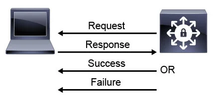

It is important to understand that EAP itself is a specification for the transport of authentication and authorization mechanisms and not an authentication protocol.

802.1X defines the encapsulation of EAP over IEEE 802, which is known as EAPOL. When a switch port is configured to require 802.1X authentication, it is called a controlled port.

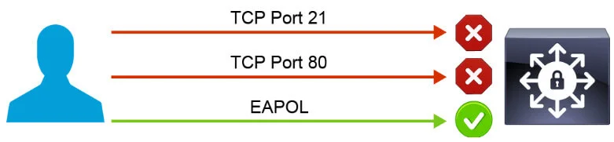

A controlled port, by default, does not allow any input on that port except for EAPOL. The supplicant can only access network services beyond the port after the supplicant authenticates.

The next figure shows a generic 802.1X authentication and authorization exchange. The specifics of the messaging vary by the EAP method that is selected by the network administrator. The role of the authenticator is to enforce policies that are provided by the authentication server, to serve as a translator between Layer 2 EAPOL messages from the supplicant, and to encapsulate EAP in Layer 3 RADIUS messages to the authentication server, Cisco ISE in this example.

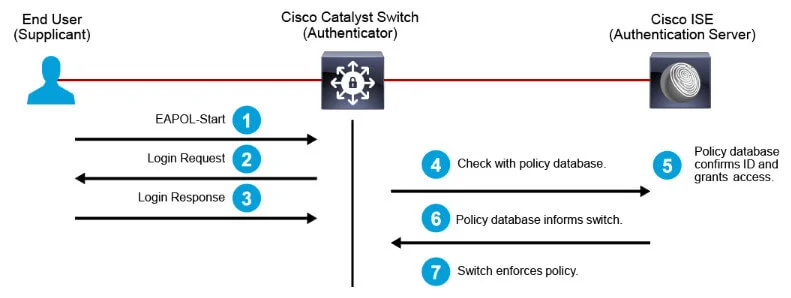

## EAP Methods
The authentication protocol that is used within EAP authentication and authorization mechanism is defined by the used EAP method. There are two types of EAP methods: tunnel EAP and non-tunnel EAP.

In the simple, non-tunnel EAP architecture, a single EAP session exists between the supplicant and the authentication server. In this architecture, the supplicant sends its identity (name) in the clear to the authentication server. This step is followed by an exchange that authenticates the authentication server to the user, and the user to the authentication server. If the user is successfully authenticated, the authentication server signals success to the authenticator via the RADIUS protocol. This mode is simple to understand but has the limitation of transmitting the user identity (but not the credentials) in the clear. This limitation may not be considered a risk for many organizations. Transmitting the challenge-response authentication exchange in the clear can facilitate some passive dictionary attacks if user passwords are weak. Also, these EAP architectures cannot easily support one-time passwords because these passwords do not support challenge-response methods that are typically used inside the EAP authentication exchange.

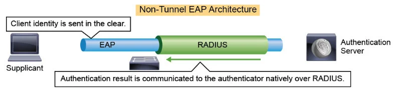

To overcome these limitations, you can use a tunneled EAP architecture, in which an outer EAP encapsulates an inner EAP. The outer EAP provides server authentication, and a cryptographically secure tunnel for the inner EAP method to run in. Typical outer EAPs are Protected Extensible Authentication Protocol (PEAP) and Extensible Authentication Protocol-Flexible Authentication via Secure Tunneling (EAP-FAST). Extensible Authentication Protocol-Microsoft Challenge Handshake Authentication Protocol version 2 (EAP-MSCHAPv2), Extensible Authentication Protocol-Transport Layer Security (EAP-TLS), and Extensible Authentication Protocol-Generic Token Card (EAP-GTC) are commonly used for the inner EAP.

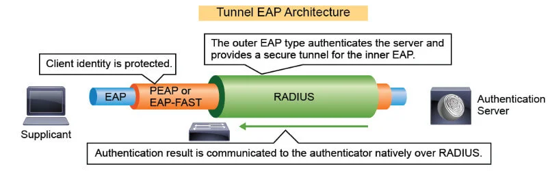

EAP has many variations that use different classes of authentication protocols and support different credentials.

The most common non-tunneled EAP methods are:

- **EAP-MD5**: The Extensible Authentication Protocol-Message Digest 5 (EAP-MD5) type uses a challenge response mechanism with hashing. It only supports passwords as client credentials and does not authenticate the server, making it vulnerable to man-in-the-middle attacks. EAP-MD5 should be avoided, unless it is tunneled inside another EAP that authenticates the server (for example, PEAP).

- **EAP-MSCHAPv2**: This EAP type is like EAP-MD5 but provides bidirectional authentication. It supports passwords for both client and server credentials and can also work with Microsoft password hashes instead of passwords, making it suitable for integration with Microsoft Active Directory. EAP-MSCHAPv2 is therefore recommended in authentication architectures that use plain passwords and can be deployed over untrusted channels.

- **EAP-TLS**: This EAP type is a challenge-response method using public key cryptography. It supports public and private key pairs (digital certificates) as client and server credentials. EAP-TLS requires a public key infrastructure (PKI) for certificate distribution. EAP-TLS works with Microsoft Active Directory or generic Lightweight Directory Access Protocol (LDAP) database to authorize users based on digital certificate identity.

- **EAP-GTC**: Is a simple EAP type. It sends the cleartext password or one-time password to the authentication server. EAP-GTC is the only protocol that supports one-time passwords (OTPs) as client credentials but should always be tunneled inside PEAP or EAP-FAST, which provide a secure communications channel. EAP-GTC works with Microsoft AD or generic LDAP user database, as well as with token servers.

The most common tunneled EAP methods are:

- **EAP-FAST**: This EAP type is a tunneling protocol that can tunnel inner EAP varieties requiring a secure channel. EAP-FAST can use either passwords or a certificate to authenticate a server. It may require secure initial provisioning of server credentials (called Protected Access Credentials [PAC]) on clients. You will typically use EAP-FAST to tunnel EAP-MSCHAPv2 or EAP-TLS inside it, to provide identity protection, or to tunnel EAP-GTC inside it. The advantage of EAP-FAST when compared to PEAP is that it supports EAP Chaining, which allows authentication of user and device (machine) inside the same EAP session. The concept of user and/or machine authentication is only used for Microsoft Windows endpoints that are members of Microsoft Active Directory domain.

- **PEAP**: An EAP tunneling protocol that can tunnel inner EAP varieties requiring a secure channel. PEAP authenticates authentication servers using public and private key pairs. It requires administrators to provision the authentication server certificate or root certificate authority (CA) certificate on clients. You will typically use PEAP to tunnel EAP-MSCHAPv2 or EAP-TLS inside it, to provide identity protection, or to tunnel EAP-GTC inside it.

  
The following table describes the method, type of security that is employed, and the requirements for server- or client-side digital certificates.:

<Tabs>
  <TabItem value="non-tunnel-eap" label="Non-Tunnel EAP">

  |Method|Authentication protocol|Supported Credentials|When to Use|
  |------|-----------------------|---------------------|-----------|
  | EAP-MD5 | Challenge response with hashing | Passwords for client authentication | Avoid because it is vulnerable to man-in-the-middle attacks. |
  | EAP-MSCHAPv2 | Challenge response with hashing | Passwords for client authentication | To support client password authentication, when integrating with existing Windows (AD) databases. |
  | EAP-TLS | Challenge response with public key cryptography | Digital certificates for client and server authentication | To support digital certificates as server and client credentials. |
  | EAP-GTC | Cleartext transfer of passwords | Passwords or OTPs for client authentication | To support OTPs as client credentials, should only be used inside PEAP or EAP-FAST. |

  </TabItem>
  <TabItem value="tunnel-eap" label="Tunnel EAP">

  |Method|Authentication protocol|Supported Credentials|When to Use|
  |------|-----------------------|---------------------|-----------|
  | PEAP | Challenge response with public key cryptography | Digital certificates for server authentication Other credentials inside tunneled EAP methods | To support digital certificates as server credentials, and to provide TLS secure channel for inner EAP methods. |
  | EAP-FAST | Challenge response with symmetric cryptography (PAC) | Digital certificates for server authentication, PAC for mutual authentication Other credentials inside tunneled EAP methods | To support digital certificates as server credentials, and to provide TLS secure channel for inner EAP methods. To support EAP Chaining. |

  </TabItem>
</Tabs>

When deploying Cisco secure network access, you will have to gather required parameters, such as level of security, functionalities, and type of desired credentials to authenticate users and devices and select proper EAP methods.

EAP-TLS and EAP-MSCHAPv2, tunneled inside PEAP or EAP-FAST are the most widely used EAP methods to deploy secure network access. However, EAP functionality varies based on the EAP method selected, and it is important to consider the capabilities of each EAP method when selecting a new implementation. For example, if there is a requirement to use digital certificates for client authentication, EAP-TLS is the only non-tunnel method that satisfies the requirement. Similarly, if there is a requirement for EAP Chaining, Cisco EAP-FAST is the only tunnel EAP method that satisfies the requirement.

## Role of RADIUS in 802.1X Communications

RADIUS began as a solution to authenticate and authorize dial-up user services. Initially developed in 1991 by Livingston to provide authentication, authorization, and accounting (AAA) services for its line of remote access servers (RASs), RADIUS has been extended and expanded to service the AAA needs of a wide variety of devices and requirements.

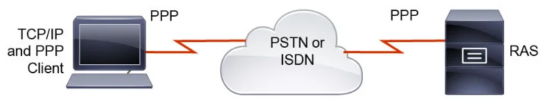

There are several RFCs that implementers of Cisco secure network access deployments will find useful:

- **RFC 2865**: RADIUS

- **RFC 3579**: RADIUS Support for EAP

- **RFC 3580**: IEEE 802.1X RADIUS Usage Guidelines

RADIUS defines four packet types that are used to authenticate and authorize user communications. In the context of 802.1X, these four packet types are used to carry EAP messages.

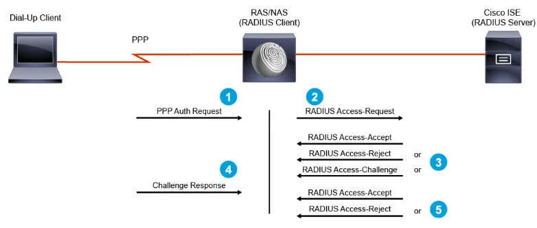

| RADIUS Packet Types | Description |
|---------------------|-------------|
| Access-Request | Every RADIUS session must begin with an Access-Request. The request usually includes a username but must include information about the network access server (NAS) and some form of password. This packet type is always sent to the RADIUS server.|
| Access-Accept | This packet type is used to convey the configuration information to the NAS to provision services for the user. In the context of 802.1X, this could include a DACL, or VLAN assignment. This packet type is always sent from the RADIUS server.|
| Access-Reject | If any attribute received by the RADIUS server is not acceptable, an Access-Reject packet must be sent to the NAS. This packet type is always sent from the RADIUS server. |
| Access-Challenge | Upon receipt of an Access-Request, the RADIUS server may issue a challenge to the user. In an EAP-MD5 exchange, the RADIUS server will use this packet type to send the challenge string to the user. The proper response to an Access-Challenge packet is an Access-Request packet with the answer to the challenge. This packet type is always sent from the RADIUS server. |

In the context of 802.1X, RADIUS is used as a transport mechanism for EAP messages, sourced from 802.1X supplicant and sent to authentication server. Note that EAP messages are transported inside RADIUS only between an authenticator and authentication server.

As illustrated in the figure, EAP messages from the supplicant to the authenticator are exchanged as Layer 2 EAPOL packets. Because the authentication server speaks the RADIUS protocol and is likely Layer 3 adjacent to the authenticator, the authenticator encapsulates EAP messages in RADIUS. The authenticator acts as a translating transit point for EAP and RADIUS.

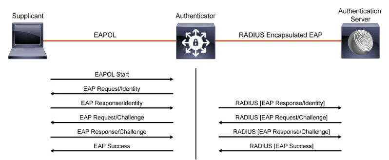

The encapsulation of EAP in RADIUS is defined in RFC 3579. Any EAP methods that are used by the client must also be configured in the RADIUS authentication server. For methods such as EAP-TLS or PEAP, the authentication server requires an X.509 version 3 (X.509v3) digital certificate.

The authentication can be initiated by the supplicant or the authenticator. The authenticator initiates authentication when the link state changes from down to up, or periodically as long as the port remains up and unauthenticated.

The authenticator sends an EAP request or identity frame to the client to request its identity. Upon receipt of the frame, the supplicant responds with an EAP response or identity frame. However, if during bootup, the supplicant does not receive an EAP request or identity frame from the authenticator, the supplicant can initiate authentication by sending an EAPOL start frame, which prompts the authenticator to request the identity of the client.

When the supplicant provides its identity, the authenticator begins its role as the intermediary and passes EAP frames between the supplicant and the authentication server until authentication succeeds or fails. If the authentication succeeds, the authenticator port is authorized.

The specific exchange of EAP frames depends on the authentication method that is used.

### RADIUS Attribute-Value Pairs in 802.1X

Although both EAP and RADIUS use attributes to pass information, EAP attributes are fairly limited in number and are transparent to the administrator and end user alike. For detailed coverage of EAP attributes, refer to RFC 3579, section 3.3, Table of Attributes.

RADIUS attribute-value pairs are of much more interest because the RADIUS server can be configured to parse received attribute-value pairs and make policy decisions. The result of a policy decision could be to send attributes to the authenticator and affect the communication capabilities of the supplicant.

RADIUS IETF attributes are the original set of 255 standard attributes that are used to communicate AAA information between a client and a server. The IETF attributes are standard, and the attribute data is predefined. All clients and servers that exchange AAA information using IETF attributes must agree on attribute data such as the exact meaning of the attributes and the general bounds of the values for each attribute.

RADIUS attributes are specified in a type, length, value (TLV) tuple, where the type and length fields are fixed at 8 bits each, and the value field is of variable size, depending on the attribute.

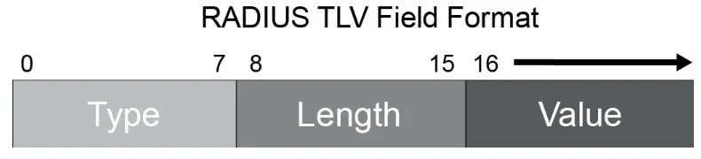

| No. | RADIUS Attribute | Function |
|---|---|---|
| 1 | User-Name | The name of the user to authenticate |
| 2 | User-Password | The user password |
| 4 | NAS-IP-Address | IP address of the NAS which is requesting authentication of the user |
| 5 | NAS-Port | Physical port on NAS (for example, gi1/0/11) |
| 8 | Framed-IP-Address | Specifies user- or RADIUS-supplied IP |
| 26 | Vendor-Specific | Any attribute defined by a vendor |
| 30 | Called-Station-Id | For IEEE 802.1X, this attribute is used to store the authenticator MAC address |
| 31 | Calling-Station-Id | For IEEE 802.1X, this attribute is used to store the supplicant MAC address |
| 32 | NAS Identifier | Identifies NAS which is requesting authentication of the user |
| 44 | Acct-Session-Id | Uniquely identify a session of the user |
| 64 | Tunnel-Type | Specifies encapsulation type |
| 65 | Tunnel-Medium-Type | Specifies physical medium type |
| 81 | Tunnel-Private-Group-ID | Specifies the group ID for a session |

There are some Internet Engineering Task Force (IETF) attributes that you should be familiar with. Of the common attributes in the table, some need additional explanation.

Attribute 32 contains a string identifying the NAS originating the Access-Request. This attribute is only used in Access-Request packets. Either NAS-IP-Address (attribute 4) or NAS-Identifier (attribute 32) must be present in an Access-Request packet.

RADIUS vendor-specific attributes (VSAs) are derived from a vendor-specific IETF attribute (attribute 26). Attribute 26 allows RADIUS functionality to be extended by vendors without the need to rewrite the protocol every time that a vendor has a good idea to enhance their RADIUS offering. VSAs are used extensively by vendors such as Cisco, Microsoft, and Juniper. A VSA is identified by IETF as a tuple in the format attribute 26/vendor ID/vendor attribute.

Attribute 26 allows a vendor to create additional 255 attributes; that is, a vendor can create an attribute that does not match the data of any IETF attribute and encapsulate it behind attribute 26. The newly created attribute is accepted if the user accepts attribute 26.

As an example, the Cisco VSA cisco-av-pair has an identifier of 026/009/001. In that tuple, 26 is the IETF attribute number for VSAs, 009 is the vendor ID assigned to Cisco by the IETF, and 001 is the ID that Cisco assigned to its custom attribute. The cisco-av-pair attribute is frequently used when RADIUS is used to authenticate and authorize users requiring network or device access. For example, Cisco ISE uses "cisco-av-pair = url-redirect=https://ISE_FQDN:8443/guestportal/gateway?sessionId=SesionIdValue&portal=..." attribute to instruct a switch or WLC to redirect clients to the specified URL for web authentication.

IETF RADIUS attributes 64, 65, and 81 are typically used together in Cisco 802.1X implementations as a way to perform VLAN assignment when a supplicant authenticates. Attributes 64 and 65 specify to the authenticator that a VLAN on an IEEE 802 network will be expected. Attribute 81 includes the name or number of the VLAN in its value field.

In the next example, user test successfully authenticates against the RADIUS server. Authenticator (switch) also sends different RADIUS attributes in RADIUS Access-Request message.

The server performs a group membership lookup and determines that test user is a member of the Project group. After the RADIUS server matches the group, it executes a policy of moving that user to the proper access VLAN. In this case, the user is assigned to the Project VLAN. The RADIUS server acts as the Policy Decision Point (PDP) and sends the appropriate attributes to the authenticator in the form of RADIUS attributes 64, 65, and 81. The authenticator enforces policy.

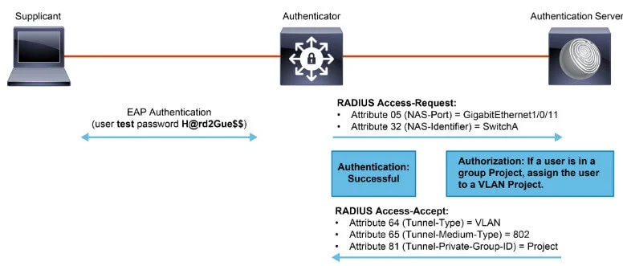

## RADIUS Change of Authentication

The RADIUS CoA feature provides a mechanism to change the attributes of a AAA session after it is authenticated. When a policy changes for a user or user group on a AAA server, such as Cisco ISE, the server can send unsolicited RADIUS CoA request to reinitialize authentication and apply the new policy.

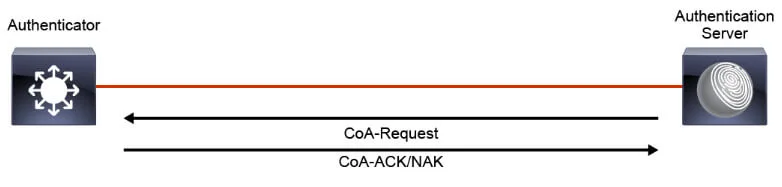

The standard RADIUS protocol is typically used in a pulled model, in which the request originates from a Network Access Device (NAD) and the response is sent from the queried AAA servers. The Cisco IOS and IOS XE software, and Cisco WLC support the RADIUS CoA request defined in RFC 5176 that is used in a pushed model, in which the request originates from the AAA server and is sent to the NAD and enables the dynamic reconfiguring of sessions from AAA or policy servers.

There are two different RADIUS CoA messages that can be sent from the AAA server:

- **Disconnect-Request**: used to terminate user session(s) on a network access device (NAD) and discard all associated session context.

- **CoA-Request**: used to dynamically change session authorization and can include actions, such as: reauthenticate, port bounce, and disable port.

There are four different RADIUS CoA messages that are sent from a NAD to the AAA server as a response:

- **Disconnect-ACK**: used to confirm user session(s) disconnect.

- **Disconnect-NAK**: used to notify AAA server NAD was unable to disconnect user session(s).

- **CoA-ACK**: used to confirm user session(s) CoA.

- **CoA-NAK**: used to notify AAA server CoA was not successful.

Both Disconnect-Request and CoA-Request packets need to include certain RADIUS attributes to uniquely identify the NAD as well as user session(s) on the NAD.

The NAS identification attributes are the following:

- **NAS-IP-Address**: The IPv4 address of the NAD.

- **NAS-Identifier**: String identifying the NAD.

Some session identification attributes:

- **User-Name**: The name of the user associated with one or more sessions.

- **NAS-Port**: The port on which a session is terminated.

- **Called-Station-Id**: The link address to which a session is connected.

- **Calling-Station-Id**: The link address from which one or more sessions are connected.

- **Acct-Session-Id**: The identifier uniquely identifying a session on the NAD.

Cisco ISE server heavily relies on RADIUS CoA. Without support for CoA on ISE and Cisco IOS and IOS XE devices, and Cisco WLCs, the following services would not be available:

- **Central web authentication**: CoA is used to change authorization session of a user after the user authenticates via a captive guest portal.

- **Client posturing**: CoA is used to change authorization session of a user after Cisco ISE determines posture status of the client.

- **Client profiling**: CoA is used to change authorization session of a device after Cisco ISE determines profile and classification of the device.

- **Rapid threat containment**: CoA is used to change the authorization session of a user if another Cisco device, such as Cisco Stealthwatch or Cisco FirePower Next-Generation Firewall, detects a malicious event involving the user.

- **Administrator's control of active RADIUS sessions**: used by administrators to manually trigger re-authentication for troubleshooting purposes, blocking a problematic host, or pushing an updated authorization policy to a host after authorization policy configuration update.

The following figure displays a sample flow of RADIUS CoA for the purposes of client posturing with Cisco ISE. Note that the figure is simplified and does not include all the steps that happen in reality.

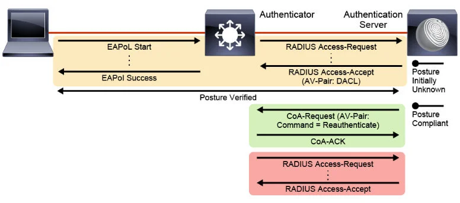

The flow is as follows:

1. An endpoint connects and starts the EAP authentication process. The authenticator encapsulates EAP exchange inside RADIUS packets and sends it to Cisco ISE authentication server.

2. Although Cisco ISE is aware of the user identity, it has not yet performed posture assessment. As such, it selects a temporary policy for this session and sends a RADIUS Access-Accept message to the NAD. Because the endpoint should not have full access yet, Access-Accept message contains downloadable access control list (DACL) in a form of Cisco AV attribute, which is applied on the authenticator for the endpoint session. Such DACL, for example, allows IP connectivity to Cisco ISE to allow the posture assessment to complete, and IP connectivity to a remediation server in case posture assessment fails.

3. The posture assessment completes, and the endpoint is found to be compliant. Cisco ISE associates a full access policy with the session.

4. Cisco ISE issues a CoA message to the switch, requesting reauthentication of a certain AAA session.

5. Switch acknowledges the CoA by sending the CoA-ACK packet.

6. Switch resends RADIUS Access-Request with existing session ID and authentication data.

7. Cisco ISE responds with Access-Accept message. This time, the message does not contain any DACL since the endpoint is compliant and can have full access to the network.