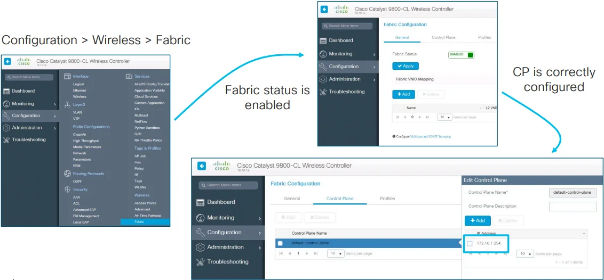
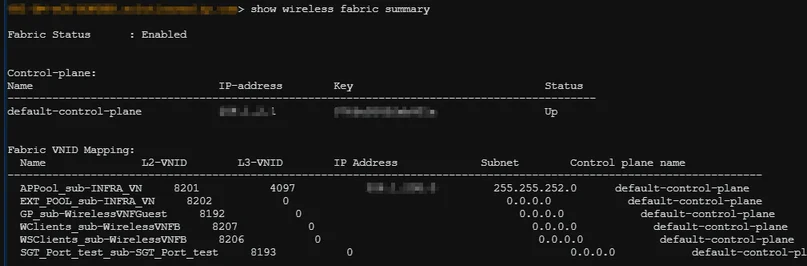

export const Highlight = ({children, color}) => (
  <span
    style={{
      backgroundColor: color,
      borderRadius: '2px',
      color: '#fff',
      padding: '0.2rem',
    }}>
    {children}
  </span>
);

:::caution
I've only covered what I observed, so please refer to the complete guide for more information.
You can find it at:
  - [See all ISE guide](https://www.cisco.com/en/US/docs/security/ise/1.0/user_guide/ise10_man_identities.html#wp1054550)
  - [Understand Admin Access and RBAC Policies on ISE](https://www.cisco.com/c/en/us/support/docs/security/identity-services-engine/200891-Understanding-Admin-Access-and-RBAC-Poli.html?dtid=osscdc000283)
:::
## SD-Access Wireless Architecture


Here, we will explore the fundamental functions of SD-Access Wireless to offer you a comprehensive comprehension of the processes that take place in the Cisco DNA Center. This guide assumes that you have completed the Design phase and will solely concentrate on the implementation and provisioning stage.

## Adding a WLC to the fabric


1. In Cisco DNAC, first provision the <Highlight color="#25c2a0">WLC</Highlight> and add it to the fabric domain
2. Fabric configuration is pushed to the WLC. The WLC becomes fabric aware. Most importantly, the WLC is configured with credentialsto established a secure connection to CP
3. The WLC is ready to participate in SD-Access Wireless

## Adding WLC to Fabric - Configuration Verification
There are some ways to verify WLC added to the fabric.
1. In GUI: 


2. Using CLI: 

```bash
show wireless fabric summary
```


## AP Join

### Configures AP Pools

1. Admin configures AP pool in Cisco DNA Center in <Highlight color="#F1C93B">INFRA_VN</Highlight>. Cisco DNA Center preprovision a configuration on all the FEs to automatically onboard APs

### AP INFRA_VN
- **INFRA_VN** is introduced to easily onboard APs. APs are in the Fabric overlay but **INFRA_VN** is mapped to the global routing table. Only APs and Extended nodes can belong to INFRA_VN

- "Layer 2 Extension" is automatically enabled and turn on L2 LISP service.

### WLC Configuration
- By choosing **Pool Type = AP** and **Layer-2 extension** to **ON**, DNA Center connects to the Wireless Controller and set the Fabric interface to VN_ID mapping for the AP subnet for both L2 & L3 VN_IDs

  - Using CLI: 
  ```bash
  show wireless fabric summary
  ```

### Automatic AP onboarding
- In Cisco DNA Center 1.2.x a **CDP macro** is pushed to all FEs for AP onboarding. This is done **only if** the switchport **No Authentication** template is selected:
- If any other switchport Authentication template is selected, then use static assignment to map the APs’ switch ports to the right IP pool or use MAB and ISE profiling to assign the port to the right pool
- In release 1.3 and above, Cisco DNA Center leverages **Interface Templates** (IBNS 2.0) and these are pushed also for dot1x/MAB authentication on the FE ports

#### From Macros to Autoconf (IBNS2.0)

#### Authentication Template with dot1x/MAB

#### Authentication Template per site


1. Admin configures a pool in Cisco DNA Center to be dedicated to APs in the <Highlight color="#F1C93B">INFRA_VN</Highlight>. Cisco DNA Center pre-provisions a configuration on all the FEs to automatically onboard APs. Cisco DNA Center 1.3 and above uses **[Autoconf](https://www.cisco.com/c/en/us/td/docs/switches/lan/catalyst9400/software/release/17-3/configuration_guide/nmgmt/b_173_nmgmt_9400_cg/configuring_autoconf.html#id_97884:~:text=the%20switchover%20feature.-,Information%20about%20Autoconf,-The%20following%20sections)** while release 1.2 uses macro.
2. The AP is plugged in and powers up. The device classifier on FE discovers it’s an AP through Cisco Discovery Protocol - [CDP](https://www.cisco.com/c/en/us/td/docs/cloud-systems-management/network-automation-and-management/dna-center/2-3-5/user_guide/b_cisco_dna_center_ug_2_3_5/b_cisco_dna_center_ug_2_3_5_chapter_010.html#task_sjb_pzg_2z:~:text=Network%20Using%20LLDP-,Discover%20Your%20Network%20Using%20CDP,-You%20can%20discover)and applies the marco( or the interface template) to assign the switch port to the right VLAN.
3. The AP gets an IP address through DHCP. It is a “special” wired host to the fabric.

(*) AP can be connectted also through an "Extended node" switch

#### configuration Verification

### AP Provisioning

## Client onboarding flow

This will be covered later.