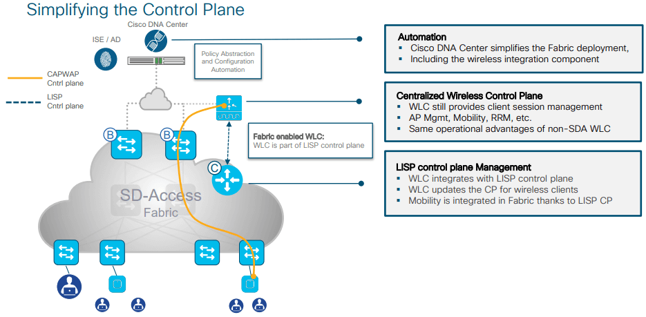
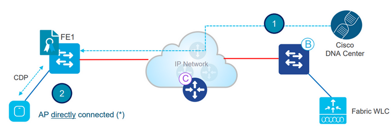

export const Highlight = ({children, color}) => (
  <span
    style={{
      backgroundColor: color,
      borderRadius: '2px',
      color: '#fff',
      padding: '0.2rem',
    }}>
    {children}
  </span>
);

:::caution
I've only covered what I observed, so please refer to the complete guide for more information.
You can find it at:
  - [See all ISE guide](https://www.cisco.com/en/US/docs/security/ise/1.0/user_guide/ise10_man_identities.html#wp1054550)
  - [Understand Admin Access and RBAC Policies on ISE](https://www.cisco.com/c/en/us/support/docs/security/identity-services-engine/200891-Understanding-Admin-Access-and-RBAC-Poli.html?dtid=osscdc000283)
:::



{/* ## Understanding User Identities
In Cisco ISE, <mark>user identities</mark> are authenticated using credentials such as usernames, passwords, certificates, or one-time passwords. Once authenticated, each user, group, or endpoint is granted access to system resources or services for which they are authorized. Identity roles are used to limit access based on identity, administrative group membership, or endpoint type. Each administrative group has a unique set of privileges, which are shared by its members. */}

Here, we will explore the fundamental functions of SD-Access Wireless to offer you a comprehensive comprehension of the processes that take place in the Cisco DNA Center. This guide assumes that you have completed the Design phase and will solely concentrate on the implementation and provisioning stage.

## Adding a WLC to the fabric


In Cisco DNAC, first provision the <Highlight color="#25c2a0">WLC</Highlight> and add it to the fabric domain
1. Fabric configuration is pushed to the WLC. The WLC becomes fabric aware. Most importantly, the WLC is configured with credentialsto established a secure connection to CP
2. The WLC is ready to participate in SD-Access Wireless

## Adding WLC to Fabric - Configuration Verification
There are some ways to verify WLC added to the fabric.
1. In GUI: 


2. Using CLI: 

```bash
show wireless fabric summary
```


## AP join

### Configures AP Pools

### AP INFRA_VN

### 

1. Admin configures a pool in Cisco DNA Center to be dedicated to APs in the <Highlight color="#F1C93B">INFRA_VN</Highlight>. Cisco DNA Center pre-provisions a configuration on all the FEs to automatically onboard APs. Cisco DNA Center 1.3 and above uses **[Autoconf](https://www.cisco.com/c/en/us/td/docs/switches/lan/catalyst9400/software/release/17-3/configuration_guide/nmgmt/b_173_nmgmt_9400_cg/configuring_autoconf.html#id_97884:~:text=the%20switchover%20feature.-,Information%20about%20Autoconf,-The%20following%20sections)** while release 1.2 uses macro.
2. The AP is plugged in and powers up. The device classifier on FE discovers it’s an AP through Cisco Discovery Protocol - [CDP](https://www.cisco.com/c/en/us/td/docs/cloud-systems-management/network-automation-and-management/dna-center/2-3-5/user_guide/b_cisco_dna_center_ug_2_3_5/b_cisco_dna_center_ug_2_3_5_chapter_010.html#task_sjb_pzg_2z:~:text=Network%20Using%20LLDP-,Discover%20Your%20Network%20Using%20CDP,-You%20can%20discover)and applies the marco( or the interface template) to assign the switch port to the right VLAN.
3. The AP gets an IP address through DHCP. It is a “special” wired host to the fabric.

(*) AP can be connectted also through an "Extended node" switch
## Client onboarding flow

This will be covered later.