import Highlight from '@site/src/components/Highlight.js';
import Tabs from '@theme/Tabs';
import TabItem from '@theme/TabItem';
import CodeBlock from '@theme/CodeBlock';

:::caution
I've only covered what I observed, so please refer to the complete guide for more information.
You can find it at:
  - [See all ISE guide](https://www.cisco.com/en/US/docs/security/ise/1.0/user_guide/ise10_man_identities.html#wp1054550)
  - [Understand Admin Access and RBAC Policies on ISE](https://www.cisco.com/c/en/us/support/docs/security/identity-services-engine/200891-Understanding-Admin-Access-and-RBAC-Poli.html?dtid=osscdc000283)
  - Cisco Live!
:::
## SD-Access Wireless Architecture

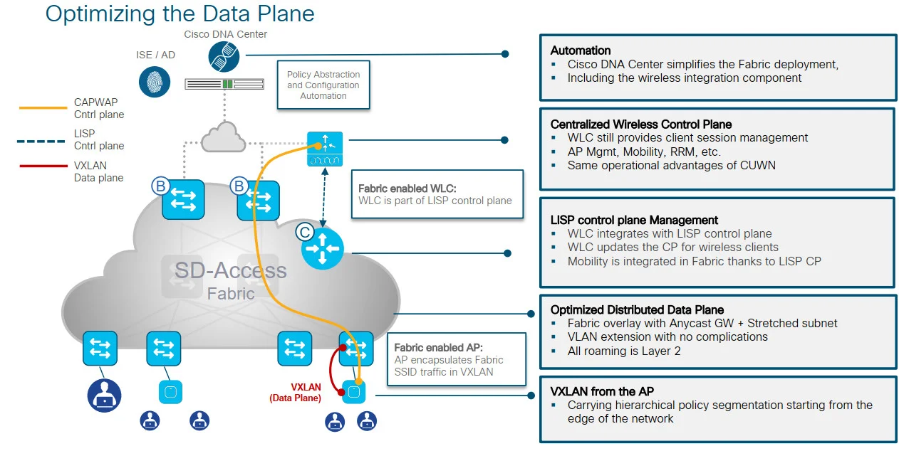


Here, we will explore the fundamental functions of SD-Access Wireless to offer you a comprehensive comprehension of the processes that take place in the Cisco DNA Center. This guide assumes that you have completed the Design phase and will solely concentrate on the implementation and provisioning stage.

## Adding a WLC to the fabric
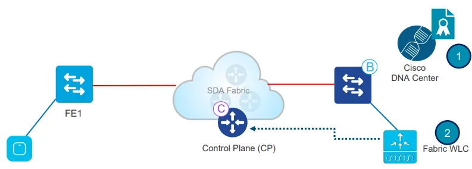

1. In Cisco DNAC, first provision the <Highlight color="#25c2a0">WLC</Highlight> and add it to the fabric domain
2. Fabric configuration is pushed to the WLC. The WLC becomes fabric aware. Most importantly, the WLC is configured with credentialsto established a secure connection to CP
3. The WLC is ready to participate in SD-Access Wireless

## Adding WLC to Fabric - Configuration Verification
<details>
  <summary><code>Verify</code> Adding WLC to the Fabric:</summary>
<Tabs>
  <TabItem value="gui" label="In GUI" default>
    
  </TabItem>
  <TabItem value="cli" label="In CLI">
    Using command: <CodeBlock language="bash">{`show wireless fabric summary`}</CodeBlock>
    Result: <br />
    
  </TabItem>
</Tabs>
</details>

## AP Join

### Configures AP Pools
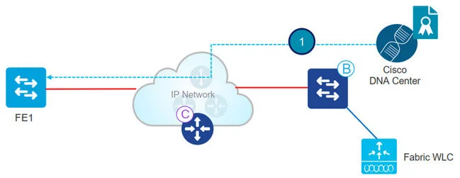
1. Admin configures AP pool in Cisco DNA Center in <Highlight color="#F1C93B">INFRA_VN</Highlight>. Cisco DNA Center preprovision a configuration on all the FEs to automatically onboard APs

### AP INFRA_VN
- **INFRA_VN** is introduced to easily onboard APs. APs are in the Fabric overlay but **INFRA_VN** is mapped to the global routing table. Only APs and Extended nodes can belong to INFRA_VN
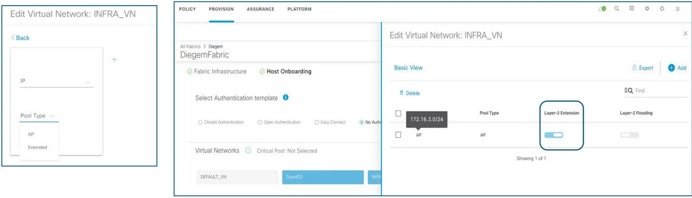
- "Layer 2 Extension" is automatically enabled and turn on L2 LISP service.

### WLC Configuration
- By choosing **Pool Type = AP** and **Layer-2 extension** to **ON**, DNA Center connects to the Wireless Controller and set the Fabric interface to VN_ID mapping for the AP subnet for both L2 & L3 VN_IDs
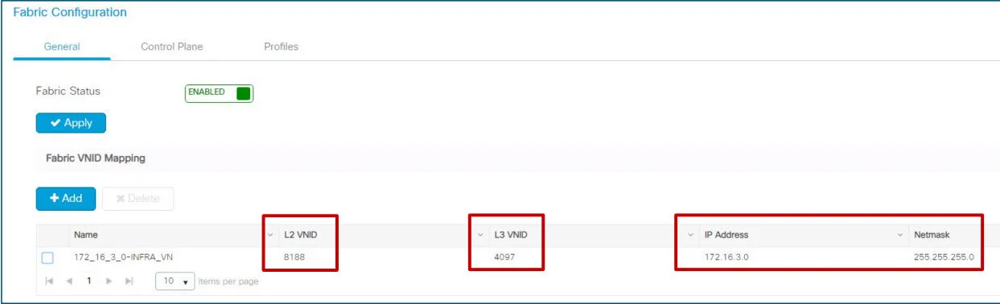
  - Using CLI: 
  ```bash
  show wireless fabric summary
  ```

### Automatic AP onboarding
- In Cisco DNA Center 1.2.x a **CDP macro** is pushed to all FEs for AP onboarding. This is done **only if** the switchport **No Authentication** template is selected:
- If any other switchport Authentication template is selected, then use static assignment to map the APs’ switch ports to the right IP pool or use MAB and ISE profiling to assign the port to the right pool
- In release 1.3 and above, Cisco DNA Center leverages **Interface Templates** (IBNS 2.0) and these are pushed also for dot1x/MAB authentication on the FE ports

<details>
  <summary>From Macros to Autoconf (IBNS2.0):</summary>
    
</details>

<details>
  <summary>Authentication Template with dot1x/MAB:</summary>
    
    
    - (*) MAB: MAC Authentication Bypass
      
</details>

<details>
  <summary>Authentication Template per site:</summary>
  - Authentication Template per site level <br />
  - Does not affect the global level Authentication Template parameters <br />
  - Settings will be applied to all FE ports unless overridden by static port assignment
</details>

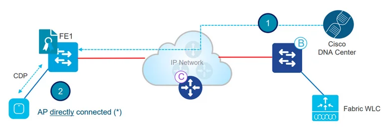

1. Admin configures AP pool in Cisco DNA Center in INFRA_VN. Cisco DNA Center pre-provision a configuration on all the FEs to automatically onboard APs 
2. AP is plugged in and powers up. FE discovers it’s an AP via [CDP](https://www.cisco.com/c/en/us/td/docs/cloud-systems-management/network-automation-and-management/dna-center/2-3-5/user_guide/b_cisco_dna_center_ug_2_3_5/b_cisco_dna_center_ug_2_3_5_chapter_010.html#task_sjb_pzg_2z:~:text=Network%20Using%20LLDP-,Discover%20Your%20Network%20Using%20CDP,-You%20can%20discover)and applies the marco( or the interface template) to assign the switch port to the right VLAN.
- (*) AP can be connectted also through an "Extended node" switch

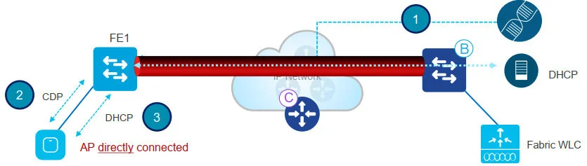

3. AP gets an IP address via DHCP in the overlay

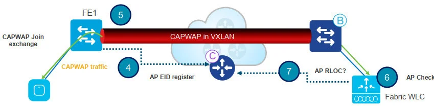

4. Fabric Edge registers AP’s IP address and MAC (EID) and updates the Control Plane (CP)
5. AP learns WLC’s IP using traditional methods and joins. Fabric AP joins in **Local mode**
6. WLC checks if AP is fabric-capable (Wave 1 APs and higher)
7. If AP is supported, WLC queries the CP to know if AP is connected to Fabric

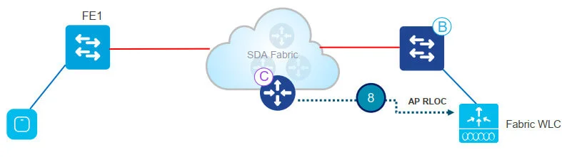

8. Control Plane (CP) replies to WLC with RLOC. This means AP is attached to Fabric and will be shown as “Fabric enabled”

#### AP Join - configuration verification
<details>
  <summary><code>Verify</code> AP join the Fabric:</summary>
<Tabs>
  <TabItem value="gui" label="In GUI" default>
    
  - If Fabric Status is not “Enabled”, check the communication between WLC and CP
  </TabItem>
  <TabItem value="cli" label="In CLI">
    Using command: <CodeBlock language="bash">{`show ...`}</CodeBlock>
    Result: updating...
  </TabItem>
</Tabs>
</details>

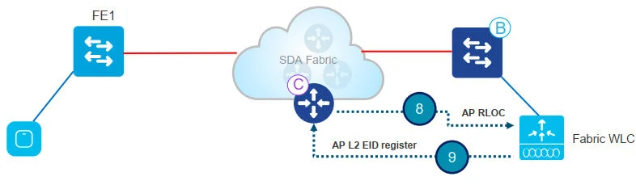

8. Control Plane (CP) replies to WLC with RLOC. This means AP is attached to Fabric and will be shown as “Fabric enabled”
9. WLC does a L2 LISP registration for the AP in CP (a.k.a. AP “special” secure client registration). This is used to pass important metadata information from WLC to the FE

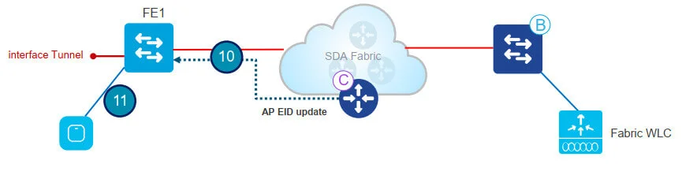

10. In response to this proxy registration, Control Plane (CP) notifies Fabric Edge and pass the metadata received from WLC (flag that says it’s an AP and the AP IP address)
11. Fabric Edge processes the information, it learns it’s an AP and creates a VXLAN tunnel interface to the specified IP (optimization: switch side is ready for clients to join)

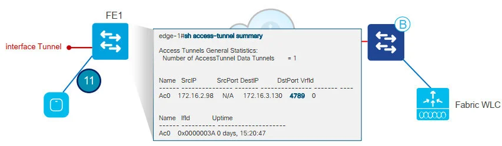
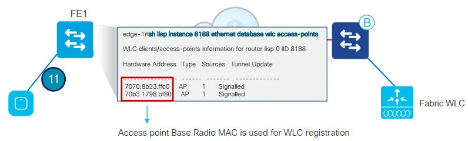

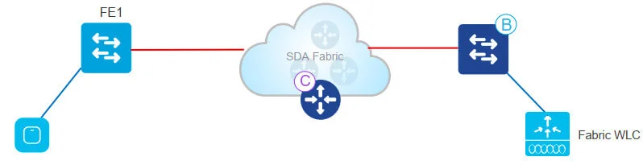

12. APs are now ready to be provisioned on Cisco DNA Center

### AP Provisioning
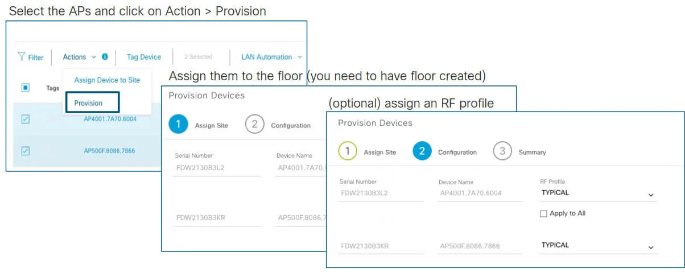
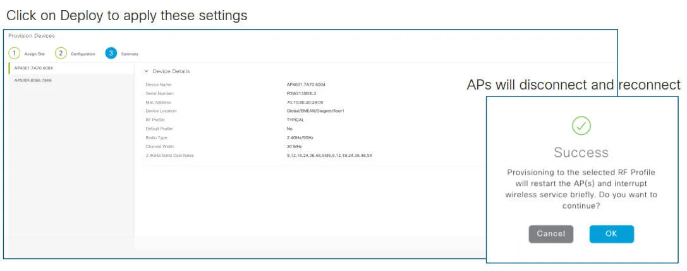

Note: with C9800, APs will not reboot but just do a CAPWAP restart. It takes **less than 30 sec!!**

<details>
  <summary>AP Provisioning - WLC config verification:</summary>
    - APs are configured with the Policy and Site tags for Fabric
    
    - For C9800, the Policy tag identifies which SSIDs are broadcasted by the AP and with what policy, the Site tag identifies the site characteristic. <br />
    - In AireOS, the APs are assigned to the AP Group 
</details>

## Client Onboarding flow
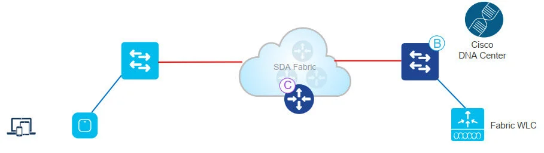

- Admin user defines a Pool for wireless clients in Cisco DNA Center Design phase. The pool is then associated to a VN during “Host Onboarding” phase. For a wireless pool, L2 LISP needs to be enabled. 
- As soon as the SSID is mapped to the client Pool, the WLAN will be enabled and clients will see the Fabric SSID
- Add the pool to Virtual Network and verify that Layer-2 Extension toggle is ON to enable L2 LISP and Layer 2 subnet extension on the client Pool/subnet. In DNA Center 1.3.x you cannot disable it
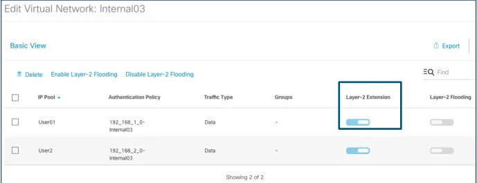
- When the pool is assigned to the Virtual Network, the correspondent Fabric interface to VNID mapping is pushed to the controller. Note: <Highlight color="#FF52A2">these are all L2 VNIDs</Highlight>
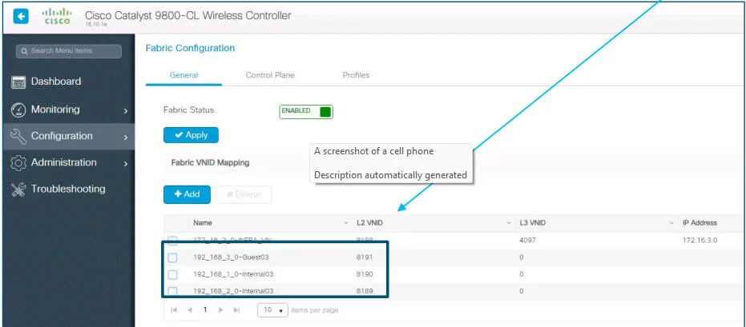
- WLANs are mapped to the pool in the respective Virtual Networks
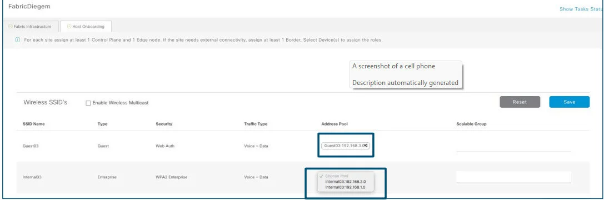

:::info
**IMPORTANT**: from 1.3.1.4 we need an extra step to have an Enable Wireless Pool, for the correspondent subnet to be available to be assigned to an SSID
:::

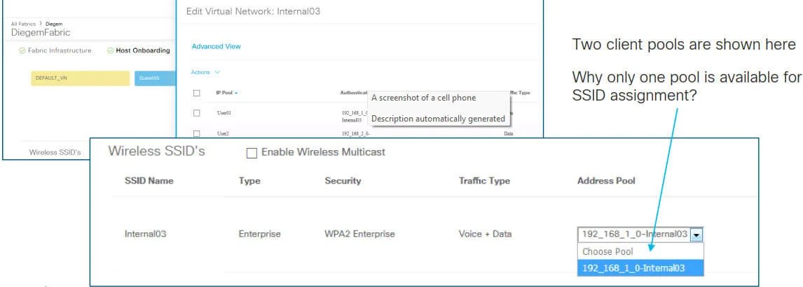

:::info
**IMPORTANT**: from 1.3.1.4 we need to Enable Wireless Pool in order for the subnet to be available and assigned to an SSID
:::

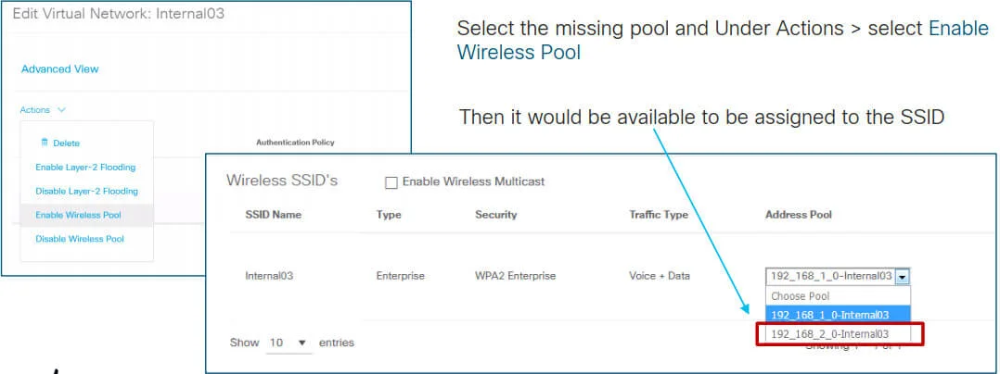

<details>
  <summary>WLC config verification:</summary>
    
    - The Fabric WLANs are now in enable state and clients can join
      
</details>

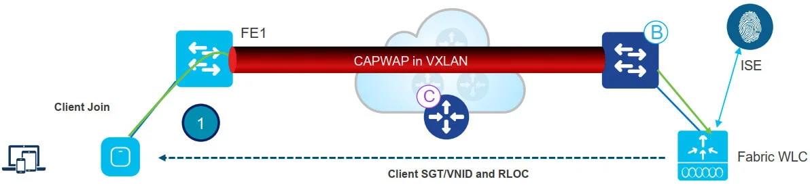

1. Client authenticates to a Fabric enabled WLAN. WLC gets SGT from ISE, updates AP with client L2VNID and SGT
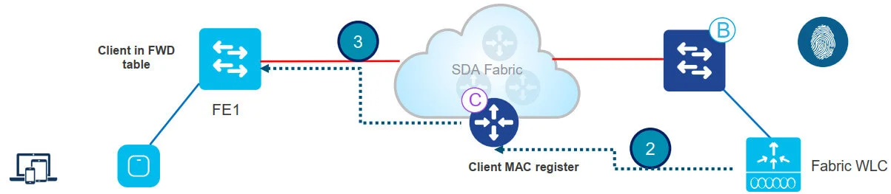

2. WLC knows RLOC of AP from internal DB . WLC proxy registers Client L2 info in CP; this is LISP modified message to pass additional info, like the client SGT
3. FE gets notified by CP and knows it’s a client; FE adds client MAC in L2 forwarding table and go and fetch the client policy from ISE based on the client SGT
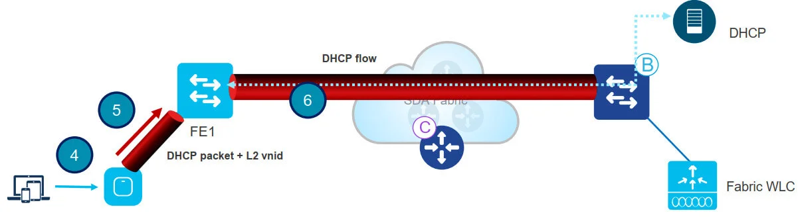

4. Client initiates DHCP Request
5. AP encapsulates it in VXLAN with L2 VNI info (and SGT)
6. Fabric Edge maps L2 VNID to the VLAN interface and forwards the DHCP packet in the overlay (same as for a wired Fabric client)
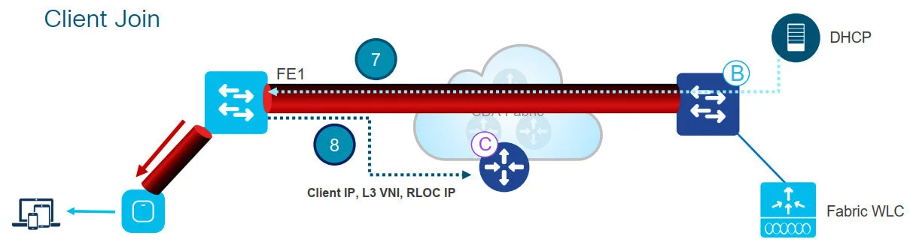

7. Client receives an IP address from DHCP
8. DHCP snooping triggers the client EID registration by the Fabric Edge to the CP. (If client has a static IP, then ARP or any other IP packet will trigger the registration)

**This completes Client onboarding process**

<details>
  <summary>Client Join - WLC config verification:</summary>
    
</details>

