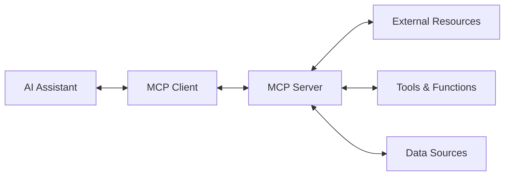

# MCP (Giao thức bối cảnh mô hình) Giới thiệu

** Giao thức bối cảnh mô hình (MCP) ** là một giao thức mở cho phép các trợ lý AI như Claude kết nối an toàn với các nguồn và công cụ dữ liệu bên ngoài, mở rộng khả năng của chúng ngoài dữ liệu đào tạo của họ.

## MCP là gì?

MCP cho phép các mô hình AI:
- ** Truy cập dữ liệu bên ngoài ** - Kết nối với cơ sở dữ liệu, API, hệ thống tệp
- ** Sử dụng các công cụ bên ngoài ** - Các lệnh thực thi, chạy tập lệnh, tương tác với các dịch vụ
- ** Duy trì bối cảnh ** - Theo dõi bối cảnh hội thoại trên các công cụ
- ** Bảo mật ** - quyền truy cập dựa trên quyền, được kiểm soát

## Kiến trúc MCP



### Thành phần

1.
2. ** Máy chủ MCP ** - Cung cấp các công cụ và tài nguyên cho máy khách
3. ** Lớp vận chuyển ** - Giao thức giao tiếp (STDIO, WebSocket, HTTP)
4. ** Tài nguyên ** - Nguồn dữ liệu bên ngoài (tệp, cơ sở dữ liệu, API)
5. ** Công cụ ** - Các chức năng và khả năng thực thi

## Bắt đầu

### Điều kiện tiên quyết
- ** Node.js 18+** hoặc ** Python 3.8+**
- Hiểu biết cơ bản về API và JSON
- Làm quen với các công cụ dòng lệnh

### Cài đặt

#### TypeScript/node.js
```bash
npm install @modelcontextprotocol/sdk
```

#### Python
```bash
pip install mcp
```

## 📦 Máy chủ MCP đầu tiên của bạn

### Máy chủ Echo đơn giản (TypeScript)

```typescript
import { Server } from '@modelcontextprotocol/sdk/server/index.js';
import { StdioServerTransport } from '@modelcontextprotocol/sdk/server/stdio.js';

const server = new Server({
  name: 'echo-server',
  version: '1.0.0'
}, {
  capabilities: {
    tools: {}
  }
});

// Define a simple echo tool
server.setRequestHandler('tools/list', async () => {
  return {
    tools: [{
      name: 'echo',
      description: 'Echoes back the provided text',
      inputSchema: {
        type: 'object',
        properties: {
          message: {
            type: 'string',
            description: 'The message to echo back'
          }
        },
        required: ['message']
      }
    }]
  };
});

server.setRequestHandler('tools/call', async (request) => {
  if (request.params.name === 'echo') {
    const message = request.params.arguments?.message;
    return {
      content: [{
        type: 'text',
        text: `Echo: ${message}`
      }]
    };
  }
  throw new Error('Unknown tool');
});

// Start the server
const transport = new StdioServerTransport();
await server.connect(transport);
```

### Máy chủ tệp đơn giản (Python)

```python
import asyncio
import json
from mcp.server import Server
from mcp.server.stdio import stdio_server
from mcp.types import Tool, TextContent

app = Server("file-server")

@app.list_tools()
async def list_tools() -> list[Tool]:
    return [
        Tool(
            name="read_file",
            description="Read contents of a file",
            inputSchema={
                "type": "object",
                "properties": {
                    "filepath": {
                        "type": "string",
                        "description": "Path to the file to read"
                    }
                },
                "required": ["filepath"]
            }
        )
    ]

@app.call_tool()
async def call_tool(name: str, arguments: dict) -> list[TextContent]:
    if name == "read_file":
        filepath = arguments["filepath"]
        try:
            with open(filepath, 'r') as file:
                content = file.read()
                return [TextContent(type="text", text=content)]
        except Exception as e:
            return [TextContent(type="text", text=f"Error: {str(e)}")]
    
    raise ValueError(f"Unknown tool: {name}")

if __name__ == "__main__":
    asyncio.run(stdio_server(app))
```

## Cấu hình máy chủ MCP

### Tích hợp máy tính để bàn Claude

Thêm vào `claude_desktop_config.json`:

```json
{
  "mcpServers": {
    "echo-server": {
      "command": "node",
      "args": ["path/to/your/echo-server.js"]
    },
    "file-server": {
      "command": "python", 
      "args": ["path/to/your/file-server.py"]
    }
  }
}
```

### Khả năng máy chủ

```typescript
const server = new Server({
  name: 'my-server',
  version: '1.0.0'
}, {
  capabilities: {
    tools: {},           // Provides executable tools
    resources: {},       // Provides data resources
    prompts: {},         // Provides prompt templates
    logging: {}          // Supports logging
  }
});
```

## Các tính năng nâng cao

### Nhà cung cấp tài nguyên

```typescript
// List available resources
server.setRequestHandler('resources/list', async () => {
  return {
    resources: [{
      uri: 'file://docs/readme.md',
      name: 'Project README',
      description: 'Main project documentation'
    }]
  };
});

// Read specific resource
server.setRequestHandler('resources/read', async (request) => {
  const uri = request.params.uri;
  // Implementation to read resource
  return {
    contents: [{
      uri: uri,
      mimeType: 'text/markdown',
      text: 'Resource content...'
    }]
  };
});
```

### Xử lý lỗi

```typescript
server.setRequestHandler('tools/call', async (request) => {
  try {
    // Tool implementation
    return { content: [{ type: 'text', text: 'Success!' }] };
  } catch (error) {
    return {
      content: [{
        type: 'text',
        text: `Error: ${error.message}`
      }],
      isError: true
    };
  }
});
```

## 📊 Kiểm tra máy chủ MCP của bạn

### Kiểm tra thủ công với Thanh tra MCP

```bash
npx @modelcontextprotocol/inspector
```

### Kiểm tra đơn vị

```typescript
import { describe, it, expect } from 'vitest';
import { MockTransport } from '@modelcontextprotocol/sdk/testing';

describe('Echo Server', () => {
  it('should echo messages correctly', async () => {
    const transport = new MockTransport();
    // Test implementation
  });
});
```

## 🎓 Thực hành tốt nhất

1. ** Bảo mật đầu tiên ** - Xác thực tất cả các đầu vào, giới hạn truy cập tệp
2. ** Xử lý lỗi ** - Cung cấp thông báo lỗi rõ ràng
3. ** Tài liệu ** - Các lược đồ công cụ được ghi chép rõ ràng
4. ** Hiệu suất ** - Hoạt động Async, Xử lý thời gian chờ
5. ** Ghi nhật ký ** - Ghi nhật ký toàn diện để gỡ lỗi

## 🎓 Các bước tiếp theo

-[Công cụ MCP nâng cao] (./ MCP-Advanced-Tools)
- [MCP Bảo mật thực hành tốt nhất] (./ MCP-Security)
-

---

*Mở rộng khả năng AI với MCP!🔌*